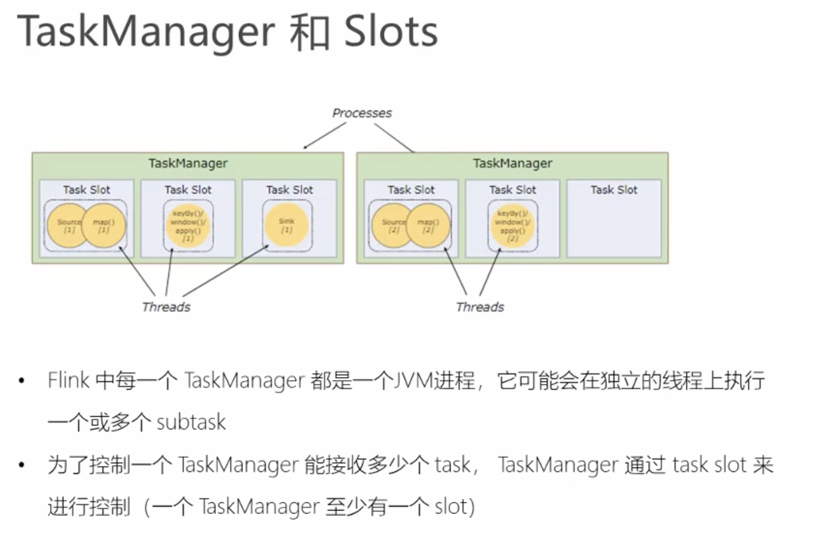

# 问题

### 什么是数据倾斜

[面试必问&数据倾斜](https://zhuanlan.zhihu.com/p/64240857)

>spark 程序发生数据倾斜的情况：
>
>根据**log**去定位
>
>出现数据倾斜的原因，基本**只可能**是因为发生了**shuffle操作**，在shuffle的过程中，出现了数据倾斜的问题。因为某个，或者某些key对应的数据，远远的高于其他的key。
>
>**1、**你在自己的程序里面**找找**，哪些地方用了会产生**shuffle**的算子，**groupByKey**、**countByKey**、**reduceByKey**、**join**
>
>**2、看log**
>
>log 一般会报是在你的哪一行代码，导致了OOM异常；或者呢，看log，看看是执行到了第几个stage！！！哪一个stage，task特别慢，就能够自己用肉眼去对你的spark代码进行stage的划分，就能够通过stage定位到你的代码，哪里发生了数据倾斜。去找找，代码那个地方，是哪个shuffle操作。
>
>**二、解决方法一：聚合数据源**
>
>**聚合数据源做法一：**
>
>groupByKey、reduceByKey；groupByKey，就是拿到每个key对应的values；reduceByKey，说白了，就是对每个key对应的values执行一定的计算。
>
>**聚合数据源做法二：**
>
>尽量去聚合，减少每个key对应的数量，也许聚合到比较粗的粒度之后，原先有10万数据量的key，现在只有1万数据量。**减轻数据倾斜的现象和问题。**
>
>**三、解决方法二：提高shuffle操作reduce并行度**
>
>如果第一种方法不适合做。那么采用第二种方法：**提高shuffle操作的reduce并行度**
>
>将**增加reduce task的数量**，就可以让每个 reduce task 分配到更少的数据量，这样的话，也许就可以缓解，或者甚至是基本解决掉数据倾斜的问题。
>
>**四、解决方法之三：随机key实现双重聚合**
>
>**将key加前缀打散后聚合计算，然后去掉前缀，继续聚合。**
>
>**五、解决方法之四：将reduce join** **转换为map join**
>
>通过将小表做成broadcast变量，直接去掉shuffle这一步，也就不会发生数据倾斜。
>
>**特别声明：**
>
>对于join这种操作，不光是考虑数据倾斜的问题；**即使是没有数据倾斜问题，也完全可以优先考虑，用我们讲的这种高级的 reduce join 转 map join 的技术**，不要用普通的join，去通过shuffle，进行数据的join；完全可以通过简单的map，使用map join的方式，牺牲一点内存资源；在可行的情况下，优先这么使用。**不走shuffle，直接走map**，性能肯定是提高很多的。
>
>**六、解决方法之五：sample采样倾斜key进行两次join**
>
>
>
>**方案的实现思路**：其实关键之处在于，将发生数据倾斜的key，单独拉出来，放到一个RDD中去；就用这个原本会倾斜的key RDD跟其他RDD，单独去join一下，这个时候，key对应的数据，可能就会分散到多个task中去进行join操作，最后将join后的表进行union操作。
>
>**七、解决方法之六：使用随机数以及扩容表进行join**
>
>**sample采样倾斜key并单独进行join**
>
>1、将key，从另外一个RDD中过滤出的数据，可能只有一条，或者几条，此时，咱们可以**任意进行扩容**，扩成**1000**倍。
>
>2、将从第一个RDD中拆分出来的那个**倾斜key RDD**，**打上1000以内的一个随机数**。
>
>3、join并且提供并行度。这样配合上，提升shuffle reduce并行度，**join(rdd, 1000)**。通常情况下，效果还是非常不错的。打散成100份，甚至1000份，2000份，去进行join，那么就肯定没有数据倾斜的问题了吧。
>
>**此方法局限性：**
>
>1、因为你的两个RDD都很大，所以你没有办法去将某一个RDD扩的特别大，**一般**咱们就是**扩10倍**。
>
>2、如果就是10倍的话，那么数据倾斜问题，的确是只能说是缓解和减轻，不能说彻底解决。
>
>《Stream Processing with Apache Flink》p.56: 基于信用的流量控制能在出现数据倾斜（data skew）时有效地分配网络资源，因为信用值授权是根据各发送端的数据积压来完成的。
>
>P108 分区策略：使用flink提供的或者自定义分区策略。
>

### [h3数据倾斜解决方案之将reduce join转换为map join](https://blog.csdn.net/qq_25617289/article/details/88704571)

>
>
>reduce join转换为map join，适合在什么样的情况下，可以来使用？ 如果两个RDD要进行join，其中一个RDD是比较小的。一个RDD是100万数据，一个RDD是1万数据。（一个RDD是1亿数据，一个RDD是100万数据） 其中一个RDD必须是比较小的，broadcast出去那个小RDD的数据以后，就会在每个executor的block manager中都驻留一份。要确保你的内存足够存放那个小RDD中的数据 这种方式下，根本不会发生shuffle操作，肯定也不会发生数据倾斜；从根本上杜绝了join操作可能导致的数据倾斜的问题； 对于join中有数据倾斜的情况，大家尽量第一时间先考虑这种方式，效果非常好；如果某个RDD比较小的情况下。 
>
>不适合的情况： 两个RDD都比较大，那么这个时候，你去将其中一个RDD做成broadcast，就很笨拙了。很可能导致内存不足。最终导致内存溢出，程序挂掉。 而且其中某些key（或者是某个key），还发生了数据倾斜；此时可以采用最后两种方式。
>
>对于join这种操作，不光是考虑数据倾斜的问题；即使是没有数据倾斜问题，也完全可以优先考虑，
>————————————————
>
>原文链接：https://blog.csdn.net/qq_25617289/article/details/88704571


### [Flink本地模式报错:Exception in thread main java.lang.NoClassDefFoundError](https://blog.csdn.net/qq_34321590/article/details/106991437)

### [解决flink启动后无法正常关闭](https://blog.csdn.net/qq_37135484/article/details/102474087)

>#### 为什么会无法正常关闭，还提示没有taskexecutor和standalonesession进程呢？
>
>我想起以前spark集群也出现过类似的问题，原因是spark启动是会把启动的进程的ID存到一个文件中，由于**配置不修改的话文件默认是保存到系统的/tmp目录下，由于是临时目录，会被系统清理，所以存放的ID就找不到了，也就没法关闭集群了。**
>
>去到/tmp目录下查看文件，果然发现了flink的PID文件
>
>这样一来就好办了，只要把这个配置项一改不就齐活了。
>配置pid的配置文件为 bin/conf.sh，其中显示pid文件默认位置在 /tmp 目录中。

### flink异步编程

mr任务异步编程案例：

https://gitlab.bigdata.letv.com/data-realtime/rdp.jobs.mob   中的 rdp.mob.ios.idfa 项目RedisRecordWriter。

### KeyedStream 和槽位？？


### flink中元素的序列化

 * 流中的元素不需要专门实现 Serializable 接口，Flink有一套类型处理系统，可以专门提取流中的元素类型，获取序列化器和反序列化器。
 * 但是从主线程向算子中传变量时，该变量需要实现 Serializable 接口，flink 没有对这种变量的序列化和反序列化做自动的处理。

### [为什么Flink中的函数需要序列化?](https://www.runexception.com/q/12332)

>考虑Flink中的FlatMapFunction。它的任何实现都必须是可序列化的。
>
>我想知道为什么会这样，有人能 explain一下吗？所有这些在 job管理器中创建的操作员实例是否都序列化并发送给任务管理器？
>
>答：
>
>> 所有这些在 job管理器中创建的操作员实例是否都序列化并发送给任务管理器？
>
>您已经回答了您的问题：）
>
>值得一提的是，它不仅适用于分布式 job，还用于容错。
>
>系统从 checkpoints恢复数据，然后重新部署整个分布式数据流，并向每个操作员提供作为 checkpoints一部分进行快照的状态。

### [a bit of background on serializability of functions in Apache Flink](https://stackoverflow.com/questions/34118469/flink-using-dagger-injections-not-serializable)

>Before diving into the specifics of the question, a bit of background on serializability of functions in Apache Flink:
>
>### Serializability
>
>**Apache Flink uses Java Serialization (java.io.Serializable) to ship the function objects (here the `MapFunction`) to the workers（工作进程） that execute them in parallel.** Because of that, the functions need to be serializable: The function may not contain any non-serializable fields, i.e. types that are not primitive (int, long, double, ...) and not implementing `java.io.Serializable`.
>
>The typical way to work with non-serializable constructs is to lazily initialize them.
>
>### Lazy Initialization
>
>One way to use non-serializable types in Flink functions is to lazily initialize them. The fields that hold these types are still `null` when the function is serialized to be shipped, and only set after the function has been deserialized by the workers.
>
>- In Scala, you can simply use lazy fields, for example `lazy val x = new NonSerializableType()`. The `NonSerializableType` type is actually only created upon first access to the variable `x`, which is usually on the worker. Consequently, the type can be non serializable, because `x` is null when the function is serialized to shipping to the workers.
>- In Java, you can initialize the non-serializable fields on the `open()` method of the function, if you make it a *Rich Function*. Rich functions (like `RichMapFunction`) are extended versions of basic functions (here `MapFunction`) and give you access to life-cycle methods like `open()` and `close()`.
>
>

# 测试环境


# 官网资料

https://ci.apache.org/projects/flink/flink-docs-release-1.11/dev/table/common.html#top

 Temporary tables are not dropped if their corresponding database is removed.

## Implicit Conversion for Scala

The Scala Table API features implicit conversions for the `DataSet`, `DataStream`, and `Table` classes. These conversions are enabled by importing the package `org.apache.flink.table.api.bridge.scala._` in addition to `org.apache.flink.api.scala._` for the Scala DataStream API.

#### Convert a Table into a DataStream

A `Table` that is the result of a streaming query will be updated dynamically, i.e., it is changing as new records arrive on the query’s input streams. Hence, the `DataStream` into which such a dynamic query is converted needs to encode the updates of the table.

There are two modes to convert a `Table` into a `DataStream`:

1. **Append Mode**: This mode can only be used if the dynamic `Table` is only modified by `INSERT` changes, i.e, it is append-only and previously emitted results are never updated.
2. **Retract Mode**: This mode can always be used. It encodes `INSERT` and `DELETE` changes with a `boolean` flag.

```java
// get StreamTableEnvironment. 
StreamTableEnvironment tableEnv = ...; // see "Create a TableEnvironment" section

// Table with two fields (String name, Integer age)
Table table = ...

// convert the Table into an append DataStream of Row by specifying the class
DataStream<Row> dsRow = tableEnv.toAppendStream(table, Row.class);

// convert the Table into an append DataStream of Tuple2<String, Integer> 
//   via a TypeInformation
TupleTypeInfo<Tuple2<String, Integer>> tupleType = new TupleTypeInfo<>(
  Types.STRING(),
  Types.INT());
DataStream<Tuple2<String, Integer>> dsTuple = 
  tableEnv.toAppendStream(table, tupleType);

// convert the Table into a retract DataStream of Row.
//   A retract stream of type X is a DataStream<Tuple2<Boolean, X>>. 
//   The boolean field indicates the type of the change. 
//   True is INSERT, false is DELETE.
DataStream<Tuple2<Boolean, Row>> retractStream = 
  tableEnv.toRetractStream(table, Row.class);
```

## [Data Types](https://ci.apache.org/projects/flink/flink-docs-release-1.11/dev/table/types.html)

#### Physical Hints

Physical hints are required at the edges of the table ecosystem where the SQL-based type system ends and programming-specific data types are required. Hints indicate the data format that an implementation expects.

For example, a data source could express that it produces values for logical `TIMESTAMP`s using a `java.sql.Timestamp` class instead of using `java.time.LocalDateTime` which would be the default. With this information, the runtime is able to convert the produced class into its internal data format. In return, a data sink can declare the data format it consumes from the runtime.

Here are some examples of how to declare a bridging conversion class:

```java
// tell the runtime to not produce or consume java.time.LocalDateTime instances
// but java.sql.Timestamp
DataType t = DataTypes.TIMESTAMP(3).bridgedTo(java.sql.Timestamp.class);

// tell the runtime to not produce or consume boxed integer arrays
// but primitive int arrays
DataType t = DataTypes.ARRAY(DataTypes.INT().notNull()).bridgedTo(int[].class);
```

## [Temporal Table Function](https://ci.apache.org/projects/flink/flink-docs-release-1.11/dev/table/streaming/temporal_tables.html#temporal-table-function)

>**Note**: Currently, Flink doesn’t support directly querying the temporal table functions with a constant time attribute parameter. At the moment, temporal table functions can only be used in joins. The example above was used to provide an intuition about what the function `Rates(timeAttribute)` returns.

## [Defining Temporal Table Function](https://ci.apache.org/projects/flink/flink-docs-release-1.11/dev/table/streaming/temporal_tables.html#temporal-table-function)

```java
import org.apache.flink.table.functions.TemporalTableFunction;
(...)

// Get the stream and table environments.
StreamExecutionEnvironment env = StreamExecutionEnvironment.getExecutionEnvironment();
StreamTableEnvironment tEnv = StreamTableEnvironment.create(env);

// Provide a static data set of the rates history table.
List<Tuple2<String, Long>> ratesHistoryData = new ArrayList<>();
ratesHistoryData.add(Tuple2.of("US Dollar", 102L));
ratesHistoryData.add(Tuple2.of("Euro", 114L));
ratesHistoryData.add(Tuple2.of("Yen", 1L));
ratesHistoryData.add(Tuple2.of("Euro", 116L));
ratesHistoryData.add(Tuple2.of("Euro", 119L));

// Create and register an example table using above data set.
// In the real setup, you should replace this with your own table.
DataStream<Tuple2<String, Long>> ratesHistoryStream = env.fromCollection(ratesHistoryData);
Table ratesHistory = tEnv.fromDataStream(ratesHistoryStream, $("r_currency"), $("r_rate"), $("r_proctime").proctime());

tEnv.createTemporaryView("RatesHistory", ratesHistory);

// Create and register a temporal table function.
// Define "r_proctime" as the time attribute and "r_currency" as the primary key.
TemporalTableFunction rates = ratesHistory.createTemporalTableFunction("r_proctime", "r_currency"); // <==== (1)
tEnv.registerFunction("Rates", rates); 
```


## Temporal Table

**Attention** This is only supported in Blink planner.

In order to access data in temporal table, currently one must define a `TableSource` with `LookupableTableSource`. Flink uses the SQL syntax of `FOR SYSTEM_TIME AS OF` to query temporal table, which is proposed in SQL:2011.

Assuming that we defined a temporal table called `LatestRates`, we can query such a table in the following way:

```sql
SELECT * FROM LatestRates FOR SYSTEM_TIME AS OF TIME '10:15';

currency   rate
======== ======
US Dollar   102
Euro        114
Yen           1

SELECT * FROM LatestRates FOR SYSTEM_TIME AS OF TIME '11:00';

currency   rate
======== ======
US Dollar   102
Euro        116
Yen           1
```

**Note**: Currently, Flink doesn’t support directly querying the temporal table with a constant time. At the moment, temporal table can only be used in joins. The example above is used to provide an intuition about what the temporal table `LatestRates` returns.

See also the page about [joins for continuous queries](https://ci.apache.org/projects/flink/flink-docs-release-1.11/dev/table/streaming/joins.html) for more information about how to join with a temporal table.

## [Event-time Temporal Joins](https://ci.apache.org/projects/flink/flink-docs-release-1.11/dev/table/streaming/joins.html) 不是特别理解

With an event-time time attribute (i.e., a rowtime attribute), it is possible to pass *past* time attributes to the temporal table function. This allows for joining the two tables at a common point in time.

Compared to processing-time temporal joins, the temporal table does not only keep the latest version (with respect to the defined primary key) of the build side records in the state but stores all versions (identified by time) since the last watermark.

For example, an incoming row with an event-time timestamp of `12:30:00` that is appended to the probe side table is joined with the version of the build side table at time `12:30:00` according to the [concept of temporal tables](https://ci.apache.org/projects/flink/flink-docs-release-1.11/dev/table/streaming/temporal_tables.html). Thus, the incoming row is only joined with rows that have a timestamp lower or equal to `12:30:00` with applied updates according to the primary key until this point in time.

By definition of event time, [watermarks](https://ci.apache.org/projects/flink/flink-docs-release-1.11/dev/event_time.html) allow the join operation to move forward in time and discard versions of the build table that are no longer necessary because no incoming row with lower or equal timestamp is expected.

## [Join with a Temporal Table](https://ci.apache.org/projects/flink/flink-docs-release-1.11/dev/table/streaming/joins.html)

Both [temporal table function join](https://ci.apache.org/projects/flink/flink-docs-release-1.11/dev/table/streaming/joins.html#join-with-a-temporal-table-function) and temporal table join come from the same motivation but have different SQL syntax and runtime implementations:

- The SQL syntax of the temporal table function join is a join UDTF, while the temporal table join uses the standard temporal table syntax introduced in SQL:2011.
- The implementation of temporal table function joins actually joins two streams and keeps them in state, while temporal table joins just receive the only input stream and look up the external database according to the key in the record.
- The temporal table function join is usually used to join a changelog stream, while the temporal table join is usually used to join an external table (i.e. dimension table).

Such behaviour makes a temporal table join a good candidate to express stream enrichment in relational terms.

In the future, the temporal table join will support the features of temporal table function joins, i.e. support to temporal join a changelog stream.

## [Usage](https://ci.apache.org/projects/flink/flink-docs-release-1.11/dev/table/streaming/joins.html)

The syntax of temporal table join is as follows:

```sql
SELECT [column_list]
FROM table1 [AS <alias1>]
[LEFT] JOIN table2 FOR SYSTEM_TIME AS OF table1.proctime [AS <alias2>]
ON table1.column-name1 = table2.column-name1
```

Currently, only support INNER JOIN and LEFT JOIN. The `FOR SYSTEM_TIME AS OF table1.proctime` should be followed after temporal table. `proctime` is a [processing time attribute](https://ci.apache.org/projects/flink/flink-docs-release-1.11/dev/table/streaming/time_attributes.html#processing-time) of `table1`. This means that it takes a snapshot of the temporal table at processing time when joining every record from left table.

For example, after [defining temporal table](https://ci.apache.org/projects/flink/flink-docs-release-1.11/dev/table/streaming/temporal_tables.html#defining-temporal-table), we can use it as following.

- [**SQL**](https://ci.apache.org/projects/flink/flink-docs-release-1.11/dev/table/streaming/joins.html#tab_SQL_1)

```sql
SELECT
  SUM(o_amount * r_rate) AS amount
FROM
  Orders
  JOIN LatestRates FOR SYSTEM_TIME AS OF o_proctime
  ON r_currency = o_currency
```

## [Table API Legacy Connectors](https://ci.apache.org/projects/flink/flink-docs-release-1.11/dev/table/connect.html#update-mode)

In order to declare time attributes in the schema, the following ways are supported:

```java
.withSchema(
  new Schema()
    .field("MyField1", DataTypes.TIMESTAMP(3))
      .proctime()      // optional: declares this field as a processing-time attribute
    .field("MyField2", DataTypes.TIMESTAMP(3))
      .rowtime(...)    // optional: declares this field as a event-time attribute
    .field("MyField3", DataTypes.BOOLEAN())
      .from("mf3")     // optional: original field in the input that is referenced/aliased by this field
)
```

Time attributes are essential when working with unbounded streaming tables. Therefore both processing-time and event-time (also known as “rowtime”) attributes can be defined as part of the schema.

## [Temporal Tables IN SQL](https://ci.apache.org/projects/flink/flink-docs-release-1.11/dev/table/sqlClient.html)

A [temporal table](https://ci.apache.org/projects/flink/flink-docs-release-1.11/dev/table/streaming/temporal_tables.html) allows for a (parameterized) view on a changing history table that returns the content of a table at a specific point in time. This is especially useful for joining a table with the content of another table at a particular timestamp. More information can be found in the [temporal table joins](https://ci.apache.org/projects/flink/flink-docs-release-1.11/dev/table/streaming/joins.html#join-with-a-temporal-table) page.

The following example shows how to define a temporal table `SourceTemporalTable`:

```
tables:

  # Define the table source (or view) that contains updates to a temporal table
  - name: HistorySource
    type: source-table
    update-mode: append
    connector: # ...
    format: # ...
    schema:
      - name: integerField
        data-type: INT
      - name: stringField
        data-type: STRING
      - name: rowtimeField
        data-type: TIMESTAMP(3)
        rowtime:
          timestamps:
            type: from-field
            from: rowtimeField
          watermarks:
            type: from-source

  # Define a temporal table over the changing history table with time attribute and primary key
  - name: SourceTemporalTable
    type: temporal-table
    history-table: HistorySource
    primary-key: integerField
    time-attribute: rowtimeField  # could also be a proctime field
```

As shown in the example, definitions of table sources, views, and temporal tables can be mixed with each other. They are registered in the order in which they are defined in the environment file. For example, a temporal table can reference a view which can depend on another view or table source.

## [阿里flinksql文档](https://help.aliyun.com/document_detail/111864.html?spm=a2c4g.11174283.2.2.45a573d5JNr5qu)

## [Jobs and Scheduling](https://ci.apache.org/projects/flink/flink-docs-release-1.12/internals/job_scheduling.html)（重要）

>## JobManager Data Structures
>
>During job execution, the JobManager keeps track of distributed tasks, decides when to schedule the next task (or set of tasks), and reacts to finished tasks or execution failures.
>
>The JobManager receives the [JobGraph](https://github.com/apache/flink/blob/master//flink-runtime/src/main/java/org/apache/flink/runtime/jobgraph/), which is a representation of the data flow consisting of operators ([JobVertex](https://github.com/apache/flink/blob/master//flink-runtime/src/main/java/org/apache/flink/runtime/jobgraph/JobVertex.java)) and intermediate results ([IntermediateDataSet](https://github.com/apache/flink/blob/master//flink-runtime/src/main/java/org/apache/flink/runtime/jobgraph/IntermediateDataSet.java)). Each operator has properties, like the parallelism and the code that it executes. In addition, the JobGraph has a set of attached libraries, that are necessary to execute the code of the operators.
>
>**The JobManager transforms the JobGraph into an** [ExecutionGraph](https://github.com/apache/flink/blob/master//flink-runtime/src/main/java/org/apache/flink/runtime/executiongraph/). The ExecutionGraph is a parallel version of the JobGraph: For each JobVertex, it contains an [ExecutionVertex](https://github.com/apache/flink/blob/master//flink-runtime/src/main/java/org/apache/flink/runtime/executiongraph/ExecutionVertex.java) per parallel subtask. An operator with a parallelism of 100 will have one JobVertex and 100 ExecutionVertices. The ExecutionVertex tracks the state of execution of a particular subtask. All ExecutionVertices from one JobVertex are held in an [ExecutionJobVertex](https://github.com/apache/flink/blob/master//flink-runtime/src/main/java/org/apache/flink/runtime/executiongraph/ExecutionJobVertex.java), which tracks the status of the operator as a whole. Besides the vertices, the ExecutionGraph also contains the [IntermediateResult](https://github.com/apache/flink/blob/master//flink-runtime/src/main/java/org/apache/flink/runtime/executiongraph/IntermediateResult.java) and the [IntermediateResultPartition](https://github.com/apache/flink/blob/master//flink-runtime/src/main/java/org/apache/flink/runtime/executiongraph/IntermediateResultPartition.java). The former tracks the state of the *IntermediateDataSet*, the latter the state of each of its partitions.
>
>
>
>Each ExecutionGraph has a job status associated with it. This job status indicates the current state of the job execution.

## Monitoring Back Pressure

https://nightlies.apache.org/flink/flink-docs-release-1.12/ops/monitoring/back_pressure.html

**Back Pressure**

If you see a **back pressure warning** (e.g. `High`) for a task, this means that it is producing data faster than the downstream operators can consume. Records in your job flow downstream (e.g. from sources to sinks) and back pressure is propagated in the opposite direction, up the stream.

Take a simple `Source -> Sink` job as an example. If you see a warning for `Source`, this means that `Sink` is consuming data slower than `Source` is producing. `Sink` is back pressuring the upstream operator `Source`.

**Sampling Back Pressure**

Back pressure monitoring works by repeatedly taking back pressure samples of your running tasks. The JobManager triggers repeated calls to `Task.isBackPressured()` for the tasks of your job.


Internally, back pressure is judged based on the availability of output buffers. If there is no available buffer (at least one) for output, then it indicates that there is back pressure for the task.

By default, the job manager triggers 100 samples every 50ms for each task in order to determine back pressure. The ratio you see in the web interface tells you how many of these samples were indicating back pressure, e.g. `0.01` indicates that only 1 in 100 was back pressured.

- **OK**: 0 <= Ratio <= 0.10
- **LOW**: 0.10 < Ratio <= 0.5
- **HIGH**: 0.5 < Ratio <= 1

In order to not overload the task managers with back pressure samples, the web interface refreshes samples only after 60 seconds.

**Configuration**

You can configure the number of samples for the job manager with the following configuration keys:

- `web.backpressure.refresh-interval`: Time after which available stats are deprecated and need to be refreshed (DEFAULT: 60000, 1 min).
- `web.backpressure.num-samples`: Number of samples to take to determine back pressure (DEFAULT: 100).
- `web.backpressure.delay-between-samples`: Delay between samples to determine back pressure (DEFAULT: 50, 50 ms).

## 分布式运行时环境

>本文档是 Apache Flink 的旧版本。建议访问 [最新的稳定版本](https://ci.apache.org/projects/flink/flink-docs-stable/zh)。**
>
>- [任务和算子链](https://nightlies.apache.org/flink/flink-docs-release-1.9/zh/concepts/runtime.html#任务和算子链)
>- [Job Managers、Task Managers、客户端（Clients）](https://nightlies.apache.org/flink/flink-docs-release-1.9/zh/concepts/runtime.html#job-managerstask-managers客户端clients)
>- [Task Slots 和资源](https://nightlies.apache.org/flink/flink-docs-release-1.9/zh/concepts/runtime.html#task-slots-和资源)
>- [State Backends](https://nightlies.apache.org/flink/flink-docs-release-1.9/zh/concepts/runtime.html#state-backends)
>- [Savepoints](https://nightlies.apache.org/flink/flink-docs-release-1.9/zh/concepts/runtime.html#savepoints)
>
>## 任务和算子链
>
>分布式计算中，Flink 将算子（operator）的 subtask *链接（chain）*成 task。每个 task 由一个线程执行。把算子链接成 tasks 能够减少线程间切换和缓冲的开销，在降低延迟的同时提高了整体吞吐量。链接操作的配置详情可参考：[chaining docs](https://nightlies.apache.org/flink/flink-docs-release-1.9/zh/dev/stream/operators/#task-chaining-and-resource-groups)
>
>下图的 dataflow 由五个 subtasks 执行，因此具有五个并行线程。
>
>
>
>[ Back to top](https://nightlies.apache.org/flink/flink-docs-release-1.9/zh/concepts/runtime.html#top)
>
>## Job Managers、Task Managers、客户端（Clients）
>
>Flink 运行时包含两类进程：
>
>- **JobManagers** （也称为 *masters*）协调分布式计算。它们负责调度任务、协调 checkpoints、协调故障恢复等。
>
>  每个 Job 至少会有一个 JobManager。高可用部署下会有多个 JobManagers，其中一个作为 *leader*，其余处于 *standby* 状态。
>
>- **TaskManagers**（也称为 *workers*）执行 dataflow 中的 *tasks*（准确来说是 subtasks ），并且缓存和交换数据 *streams*。
>
>  每个 Job 至少会有一个 TaskManager。
>
>JobManagers 和 TaskManagers 有多种启动方式：直接在机器上启动（该集群称为 [standalone cluster](https://nightlies.apache.org/flink/flink-docs-release-1.9/zh/ops/deployment/cluster_setup.html)），在容器或资源管理框架，如 [YARN](https://nightlies.apache.org/flink/flink-docs-release-1.9/zh/ops/deployment/yarn_setup.html) 或 [Mesos](https://nightlies.apache.org/flink/flink-docs-release-1.9/zh/ops/deployment/mesos.html)，中启动。TaskManagers 连接到 JobManagers，通知后者自己可用，然后开始接手被分配的工作。
>
>**客户端**虽然不是运行时（runtime）和作业执行时的一部分，但它是被用作准备和提交 dataflow 到 JobManager 的。提交完成之后，客户端可以断开连接，也可以保持连接来接收进度报告。客户端既可以作为触发执行的 Java / Scala 程序的一部分，也可以在命令行进程中运行`./bin/flink run ...`。
>
>
>
>[ Back to top](https://nightlies.apache.org/flink/flink-docs-release-1.9/zh/concepts/runtime.html#top)
>
>## Task Slots 和资源
>
>每个 worker（TaskManager）都是一个 *JVM 进程*，并且可以在不同的线程中执行一个或多个 subtasks。为了控制 worker 接收 task 的数量，worker 拥有所谓的 **task slots** （至少一个）。
>
>每个 *task slots* 代表 TaskManager 的一份固定资源子集。例如，具有三个 slots 的 TaskManager 会将其管理的内存资源分成三等份给每个 slot。 划分资源意味着 subtask 之间不会竞争资源，但是也意味着它们只拥有固定的资源。注意这里并没有 CPU 隔离，当前 slots 之间只是划分任务的内存资源。
>
>通过调整 slot 的数量，用户可以决定 subtasks 的隔离方式。每个 TaskManager 有一个 slot 意味着每组 task 在一个单独的 JVM 中运行（例如，在一个单独的容器中启动）。拥有多个 slots 意味着多个 subtasks 共享同一个 JVM。 Tasks 在同一个 JVM 中共享 TCP 连接（通过多路复用技术）和心跳信息（heartbeat messages）。它们还可能共享数据集和数据结构，从而降低每个 task 的开销。
>
>
>
>默认情况下，Flink 允许 subtasks 共享 slots，即使它们是不同 tasks 的 subtasks，只要它们来自同一个 job。因此，一个 slot 可能会负责这个 job 的整个管道（pipeline）。允许 *slot sharing* 有两个好处：
>
>- Flink 集群需要与 job 中使用的最高并行度一样多的 slots。这样不需要计算作业总共包含多少个 tasks（具有不同并行度）。
>- 更好的资源利用率。在没有 slot sharing 的情况下，简单的 subtasks（*source/map()*）将会占用和复杂的 subtasks （*window*）一样多的资源。通过 slot sharing，将示例中的并行度从 2 增加到 6 可以充分利用 slot 的资源，同时确保繁重的 subtask 在 TaskManagers 之间公平地获取资源。
>
>
>
>APIs 还包含了 *[resource group](https://nightlies.apache.org/flink/flink-docs-release-1.9/zh/dev/stream/operators/#task-chaining-and-resource-groups)* 机制，它可以用来防止不必要的 slot sharing。
>
>根据经验，合理的 slots 数量应该和 CPU 核数相同。在使用超线程（hyper-threading）时，每个 slot 将会占用 2 个或更多的硬件线程上下文（hardware thread contexts）。
>
>[ Back to top](https://nightlies.apache.org/flink/flink-docs-release-1.9/zh/concepts/runtime.html#top)
>
>## State Backends
>
>key/values 索引存储的数据结构取决于 [state backend](https://nightlies.apache.org/flink/flink-docs-release-1.9/zh/ops/state/state_backends.html) 的选择。一类 state backend 将数据存储在内存的哈希映射中，另一类 state backend 使用 [RocksDB](http://rocksdb.org/) 作为键/值存储。除了定义保存状态（state）的数据结构之外， state backend 还实现了获取键/值状态的时间点快照的逻辑，并将该快照存储为 checkpoint 的一部分。
>
>
>
>[ Back to top](https://nightlies.apache.org/flink/flink-docs-release-1.9/zh/concepts/runtime.html#top)
>
>## Savepoints
>
>用 Data Stream API 编写的程序可以从 **savepoint** 继续执行。Savepoints 允许在不丢失任何状态的情况下升级程序和 Flink 集群。
>
>[Savepoints](https://nightlies.apache.org/flink/flink-docs-release-1.9/zh/ops/state/savepoints.html) 是**手动触发的 checkpoints**，它依靠常规的 checkpoint 机制获取程序的快照并将其写入 state backend。在执行期间，程序会定期在 worker 节点上创建快照并生成 checkpoints。对于恢复，Flink 仅需要最后完成的 checkpoint，而一旦完成了新的 checkpoint，旧的就可以被丢弃。
>
>Savepoints 类似于这些定期的 checkpoints，除了它们是**由用户触发**并且在新的 checkpoint 完成时**不会自动过期**。你可以通过[命令行](https://nightlies.apache.org/flink/flink-docs-release-1.9/zh/ops/cli.html#savepoints) 或在取消一个 job 时通过 [REST API](https://nightlies.apache.org/flink/flink-docs-release-1.9/zh/monitoring/rest_api.html#cancel-job-with-savepoint) 来创建 Savepoints。

## [Checkpointing under backpressure](https://nightlies.apache.org/flink/flink-docs-release-1.14/docs/ops/state/checkpointing_under_backpressure/)

>## Buffer debloating [#](https://nightlies.apache.org/flink/flink-docs-release-1.14/docs/ops/state/checkpointing_under_backpressure/#buffer-debloating)
>
>Flink 1.14 introduced a new tool to automatically control the amount of buffered in-flight data between Flink operators/subtasks. The buffer debloating mechanism can be enabled by setting the property `taskmanager.network.memory.buffer-debloat.enabled` to `true`.
>
>This feature works with both aligned and unaligned checkpoints and can improve checkpointing times in both cases, but the effect of the debloating is most visible with aligned checkpoints. When using buffer debloating with unaligned checkpoints, the added benefit will be smaller checkpoint sizes and quicker recovery times (there will be less in-flight data to persist and recover).
>
>For more information on how the buffer debloating feature works and how to configure it, please refer to the [network memory tuning guide](https://nightlies.apache.org/flink/flink-docs-release-1.14/docs/deployment/memory/network_mem_tuning/). Keep in mind that you can also manually reduce the amount of buffered in-flight data which is also described in the aforementioned tuning guide.
>
>## Unaligned checkpoints [#](https://nightlies.apache.org/flink/flink-docs-release-1.14/docs/ops/state/checkpointing_under_backpressure/#unaligned-checkpoints)
>
>Starting with Flink 1.11, checkpoints can be unaligned. [Unaligned checkpoints](https://nightlies.apache.org/flink/flink-docs-release-1.14/docs/concepts/stateful-stream-processing/#unaligned-checkpointing) contain in-flight data (i.e., data stored in buffers) as part of the checkpoint state, allowing checkpoint barriers to overtake these buffers. Thus, the checkpoint duration becomes independent of the current throughput as checkpoint barriers are effectively not embedded into the stream of data anymore.
>
>You should use unaligned checkpoints if your checkpointing durations are very high due to backpressure. Then, checkpointing time becomes mostly independent of the end-to-end latency. Be aware unaligned checkpointing adds to I/O to the state storage, so you shouldn’t use it when the I/O to the state storage is actually the bottleneck during checkpointing.
>
>

# 学习文章

## [Flink新特性之非对齐检查点（unaligned checkpoint）简介](https://blog.csdn.net/nazeniwaresakini/article/details/107954076)

>非对齐检查点
>顾名思义，非对齐检查点取消了屏障对齐操作。其流程图示如下。
>
>
>简单解说：
>
>a) 当算子的所有输入流中的第一个屏障到达算子的输入缓冲区时，立即将这个屏障发往下游（输出缓冲区）。
>
>b) 由于第一个屏障没有被阻塞，它的步调会比较快，超过一部分缓冲区中的数据。算子会标记两部分数据：一是屏障首先到达的那条流中被超过的数据，二是其他流中位于当前检查点屏障之前的所有数据（当然也包括进入了输入缓冲区的数据），如下图中标黄的部分所示。
>
>
>c) 将上述两部分数据连同算子的状态一起做异步快照。
>
>由此可见，非对齐检查点的机制与原生C-L算法更为相似一些（即需要由算子来记录输入流的状态）。它与对齐检查点的区别主要有三：
>
>对齐检查点在最后一个屏障到达算子时触发，非对齐检查点在第一个屏障到达算子时就触发。
>
>对齐检查点在第一个屏障到最后一个屏障到达的区间内是阻塞的，而非对齐检查点不需要阻塞。
>
>显然，即使再考虑反压的情况，屏障也不会因为输入流速度变慢而堵在各个算子的入口处，而是能比较顺畅地由Source端直达Sink端，从而缓解检查点失败超时的现象。
>
>对齐检查点能够保持快照N~N + 1之间的边界，但非对齐检查点模糊了这个边界。
>既然不同检查点的数据都混在一起了，非对齐检查点还能保证exactly once语义吗？答案是肯定的。当任务从非对齐检查点恢复时，除了对齐检查点也会涉及到的Source端重放和算子的计算状态恢复之外，未对齐的流数据也会被恢复到各个链路，三者合并起来就是能够保证exactly once的完整现场了。
>
>非对齐检查点目前仍然作为试验性的功能存在，并且它也不是十全十美的（所谓优秀的implementation往往都要考虑trade-off），主要缺点有二：
>
>需要额外保存数据流的现场，总的状态大小可能会有比较明显的膨胀（文档中说可能会达到a couple of GB per task），磁盘压力大。当集群本身就具有I/O bound的特点时，该缺点的影响更明显。
>
>从状态恢复时也需要额外恢复数据流的现场，作业重新拉起的耗时可能会很长。特别地，如果第一次恢复失败，有可能触发death spiral（死亡螺旋）使得作业永远无法恢复。
>
>所以，官方当前推荐仅将它应用于那些容易产生反压且I/O压力较小（比如原始状态不太大）的作业中。随着后续版本的打磨，非对齐检查点肯定会更加好用。
>————————————————
>版权声明：本文为CSDN博主「LittleMagics」的原创文章，遵循CC 4.0 BY-SA版权协议，转载请附上原文出处链接及本声明。
>原文链接：https://blog.csdn.net/nazeniwaresakini/article/details/107954076

## [深度解读：Flink 1.11 SQL流批一体的增强与完善](https://cloud.tencent.com/developer/news/661653)

## [Flink算子使用方法及实例演示：keyBy、reduce和aggregations](https://zhuanlan.zhihu.com/p/98975650)

>`keyBy`算子将`DataStream`转换成一个`KeyedStream`。`KeyedStream`是一种特殊的`DataStream`，事实上，`KeyedStream`继承了`DataStream`，`DataStream`的各元素随机分布在各Task Slot中，`KeyedStream`的各元素按照Key分组，分配到各Task Slot中。我们需要向`keyBy`算子传递一个参数，以告知Flink以什么字段作为Key进行分组。
>
>其实，这些aggregation操作里已经封装了状态数据，比如，`sum`算子内部记录了当前的和，`max`算子内部记录了当前的最大值。由于内部封装了状态数据，而且状态数据并不会被清理，因此一定要避免在一个无限数据流上使用aggregation。
>
>注意，**对于一个`KeyedStream`,一次只能使用一个aggregation操作，无法链式使用多个。**

## [Apache Flink 漫谈系列 - 双流JOIN](https://mp.weixin.qq.com/s/BiO4Ba6wRH4tlTdT2w7fzw)

## [Flink算子使用方法及实例演示：union和connect](https://juejin.im/post/6844904031677218829)

>对于`ConnectedStreams`，我们需要重写`CoMapFunction`或`CoFlatMapFunction`。这两个接口都提供了三个泛型，这三个泛型分别对应第一个输入流的数据类型、第二个输入流的数据类型和输出流的数据类型。在重写函数时，对于`CoMapFunction`，`map1`处理第一个流的数据，`map2`处理第二个流的数据；对于`CoFlatMapFunction`，**`flatMap1`处理第一个流的数据，`flatMap2`处理第二个流的数据。Flink并不能保证两个函数调用顺序，两个函数的调用依赖于两个数据流数据的流入先后顺序，即第一个数据流有数据到达时，`map1`或`flatMap1`会被调用，第二个数据流有数据到达时，`map2`或`flatMap2`会被调用。**

## [Flink Table & SQL Catalog 及DataStream、Table相互转换](https://blog.csdn.net/wangpei1949/article/details/103216738)

>Catalog维护了Flink Table和SQL中的元数据，如`Database`、`Table`、`View`、`UDF`等。
>
>Catalog类型
>
>- GenericInMemoryCatalog: 内置Catalog。名为`default_catalog`,默认数据库名为`default_database`。默认，如用`TableEnvironment#registerTable`注册的表，均会注册到这个Catalog中。
>- User-Defined Catalog: 用户自定义`Catalog`。如`flink-connector-hive`中的`HiveCatalog`。
>
>注意:
>
>1. GenericInMemoryCatalog 中的元数据对象名区分大小写。HiveCatalog 以小写存储所有元数据对象名。
>
>2. 默认使用的Catalog: `default_catalog`，Database: `default_database`。
>
>   查询某个Table
>
>   默认，Flink在当前Catalog的Database中查找表，可用全路径`catalog.database.table`指定某个表名。如下:
>
>   ```java
>  tableEnv.sqlQuery("select * from default_catalog.default_database.t_userInfo")
>   ```
> 
>   Table 转换为 DataStream
>
>   可将Table转换为Row、Tuple、POJO、Case Class等数据类型的DataStream。
>
>   Table转换为DataStream有两种模式：Append模式和Retract模式。
>
>   - Append模式: 当Table仅通过INSERT修改时使用此模式。
>  - Retract模式: 一般都可使用此模式。通过一个Boolean类型标记当前操作类型。True代表Add(添加)，False代表Retract(撤回)。

## [Flink 原理与实现：Window 机制](http://wuchong.me/blog/2016/05/25/flink-internals-window-mechanism/)

>翻滚计数窗口并不带evictor，只注册了一个trigger。该trigger是带purge功能的 CountTrigger。也就是说每当窗口中的元素数量达到了 window-size，trigger就会返回fire+purge，窗口就会执行计算并清空窗口中的所有元素，再接着储备新的元素。从而实现了tumbling的窗口之间无重叠。
>
>滑动计数窗口的各窗口之间是有重叠的，但我们用的 GlobalWindows assinger 从始至终只有一个窗口，不像 sliding time assigner 可以同时存在多个窗口。所以trigger结果不能带purge，也就是说计算完窗口后窗口中的数据要保留下来（供下个滑窗使用）。另外，trigger的间隔是slide-size，evictor的保留的元素个数是window-size。也就是说，每个滑动间隔就触发一次窗口计算，并保留下最新进入窗口的window-size个元素，剔除旧元素。

## [Flink dynamic table转成stream实战](https://www.jianshu.com/p/c352d0c4a458)

>## Append-only stream
>
>## Retract stream
>
>## Upsert stream
>
>## Upsert stream番外篇??
>
>以上所讲的内容全部都是来自于flink官网，只是附上了与其对应的样例，可以让读者更直观的感受每种模式的输出效果。网上也有很多对官方文档的翻译，但是几乎没有文章或者样例说明在使用`UpsertStreamTableSink`的时候什么情况下返回值`Tuple2`第一个元素是`false`？话不多说直接上样例，只要把上面的例子中的sql改为如下
>
>```java
>String sql = "SELECT user, cnt " +
>        "FROM (" +
>               "SELECT user,COUNT(url) as cnt FROM clicks GROUP BY user" +
>                   ")" +
>             "ORDER BY cnt LIMIT 2";
>     ```
>     
>返回结果：
>
>
>
>```shell
>send message:(true,(Mary,1))
>send message:(true,(Bob,1))
>send message:(false,(Mary,1))
>send message:(true,(Bob,1))
>send message:(true,(Mary,2))
>send message:(true,(Liz,1))
>send message:(false,(Liz,1))
>send message:(true,(Mary,2))
>send message:(false,(Mary,2))
>send message:(true,(Liz,2))
>```
>
>具体的原理可以查看源码，`org.apache.flink.table.planner.plan.nodes.physical.stream.StreamExecRank`和`org.apache.flink.table.planner.plan.nodes.physical.stream.StreamExecSortLimit`
>解析sql的时候通过下面的方法得到不同的strategy，由此影响是否需要删除原有数据的行为。
>
> 
>
>```scala
>def getStrategy(forceRecompute: Boolean = false): RankProcessStrategy = {
>if (strategy == null || forceRecompute) {
>   strategy = RankProcessStrategy.analyzeRankProcessStrategy(
>       inputRel, ImmutableBitSet.of(), sortCollation, cluster.getMetadataQuery)
>     }
>     strategy
>    }
>    ```
>  
>知道什么时候会产生false属性的数据，对于理解`JDBCUpsertTableSink`和`HBaseUpsertTableSink`的使用会有很大的帮助。


## [Dynamic Tables](https://ci.apache.org/projects/flink/flink-docs-release-1.11/dev/table/streaming/dynamic_tables.html#table-to-stream-conversion)

## [Time Attributes](https://ci.apache.org/projects/flink/flink-docs-release-1.11/dev/table/streaming/time_attributes.html#using-a-tablesource-1)


## [flink教程-聊聊 flink 1.11 中新的水印策略](https://blog.csdn.net/zhangjun5965/article/details/107304278?utm_medium=distribute.pc_relevant.none-task-blog-searchFromBaidu-1.control&depth_1-utm_source=distribute.pc_relevant.none-task-blog-searchFromBaidu-1.control)

># 背景
>
>在flink 1.11之前的版本中，提供了两种生成水印（Watermark）的策略，分别是AssignerWithPunctuatedWatermarks和AssignerWithPeriodicWatermarks，这两个接口都继承自TimestampAssigner接口。
>
>**用户想使用不同的水印生成方式，则需要实现不同的接口，但是这样引发了一个问题，对于想给水印添加一些通用的、公共的功能则变得复杂，因为我们需要给这两个接口都同时添加新的功能，这样还造成了代码的重复。**
>
>所以为了避免代码的重复，在flink 1.11 中对flink的水印生成接口进行了重构.
>
># 新的水印生成接口
>
>当我们构建了一个DataStream之后，使用assignTimestampsAndWatermarks方法来构造水印，新的接口需要传入一个WatermarkStrategy对象。
>
>```java
>DataStream#assignTimestampsAndWatermarks(WatermarkStrategy<T>)
>1
>```
>
>WatermarkStrategy 这个接口是做什么的呢？这里面提供了很多静态的方法和带有缺省实现的方法，只有一个方法是非default和没有缺省实现的，就是下面的这个方法。
>
>```java
>	/**
>	 * Instantiates a WatermarkGenerator that generates watermarks according to this strategy.
>	 */
>	@Override
>	WatermarkGenerator<T> createWatermarkGenerator(WatermarkGeneratorSupplier.Context context);
>
>```
>
># 处理空闲数据源
>
>在某些情况下，由于数据产生的比较少，导致一段时间内没有数据产生，进而就没有水印的生成，导致下游依赖水印的一些操作就会出现问题，比如某一个算子的上游有多个算子，这种情况下，水印是取其上游两个算子的较小值，如果上游某一个算子因为缺少数据迟迟没有生成水印，就会出现eventtime倾斜问题，导致下游没法触发计算。
>
>**所以filnk通过WatermarkStrategy.withIdleness()方法允许用户在配置的时间内（即超时时间内）没有记录到达时将一个流标记为空闲。这样就意味着下游的数据不需要等待这个空闲流的水印的到来。**
>
>当下次有水印生成并发射到下游的时候，这个数据流重新变成活跃状态。
>
>通过下面的代码来实现对于空闲数据流的处理
>
>```java
>WatermarkStrategy
>        .<Tuple2<Long, String>>forBoundedOutOfOrderness(Duration.ofSeconds(20))
>        .withIdleness(Duration.ofMinutes(1));
>```


## [Flink Window & Time详解](https://blog.csdn.net/weixin_44519468/article/details/105983367)

>整个流程还有一个问题需要讨论：Window 中的状态存储。我们知道 Flink 是支持
>Exactly Once 处理语义的，那么 Window 中的状态存储和普通的状态存储又有什么不
>一样的地方呢？
>首先给出具体的答案：从接口上可以认为没有区别，但是每个 Window 会属于不同的
>namespace，而非 Window 场景下，则都属于 VoidNamespace ，最终由
>State/Checkpoint 来保证数据的 Exactly Once 语义，下面我们从
>org.apache.flink.streaming.runtime.operators.windowing.WindowOperator 摘取一段
>代码进行阐述
>
>

## [Flink重启策略/配置重启策略](https://blog.csdn.net/qq_33982605/article/details/106207065)

># 重启策略
>
>1. Flink何时才会重启？
>     一个拥有检查点的应用如果出现问题，他会经过一些列步骤来进行重启。
>2. 重启过程中可能会出现的问题?
>     **有些时候，应用可能会被相同的故障不断“杀死”**
>     `举例：`
>       当我处理数据的时候程序出现了Bug，导致处理算子出现异常，此时程序就会陷入一个循环中：
>       启动任务、恢复状态、继续处理。
>     在继续处理的时候，由于这个Bug没有被修复，然后
>       启动任务、恢复状态、继续处理。
>     类似于这样周而复始
>
># 配置重启策略
>
>Flink 为我们提供了三种重启策略来解决上一节所讲到的这种周而复始问题分别是：
>
>1. fixed-delay：
>     如下代表的是如果失败了只重启3次，每次间隔20S
>     // 配置重启策略
>     streamLocal.setRestartStrategy(
>     RestartStrategies.fixedDelayRestart(
>     3,
>     Time.of(20,TimeUnit.SECONDS)
>     )
>     )
>2. no-restart:
>     代表程序如果失败了不重启，直接退出
>     streamLocal.setRestartStrategy(RestartStrategies.noRestart())
>3. failure-rate:
>     代表的是过去某段时间内，如果失败的次数没超过某次，就可以一直重启
>     不常用

## [Flink检查点/保存点提交](https://blog.csdn.net/qq_33982605/article/details/106206977)

># 检查点生成多个
>
>  Flink的检查点默认是生成一个，想要生成多个可以在conf/flink-conf.yaml中添加如下的参数，在这里我设置的是让其生成2个：`state.checkpoints.num-retained: 2`
>
>如何通过检查点重新提交? 
>
>  保存点和检查点内部的生成算法是一致的，工作方式也一致，但保存点相比较检查点有什么不同呢？
>
>  保存点与检查点有什么不同？
>
>1. 生成逻辑不同
>     a) 检查点：通过代码进行生成
>     b) 保存点：由用户通过flink命令行或者web控制台进行手动触发
>2. 存储的信息不同
>     保存点相比较检查点来说存储了更为详细的一些元数据信息。
>
>检查点在什么情况下触发？
> 例如我在另一篇博文中所描述的“[重启策略](https://blog.csdn.net/qq_33982605/article/details/106207065)”中的例子，检查点在作业意外失败后会自动重启，并能够从保存的检查点路径中自动恢复状态，且不影响作业逻辑的准确性。
>
>Q：由于作业重启失败，程序退出，我此时修改完BUG后，想要让我的程序接着当初失败的地方重新运行，那么我应如何启动程序呢？
>
>A：读取失败的检查点，然后依托它重新运行即可
>sudo
>-u hdfs /myflink/flink-1.7.2/bin/flink run -s
>hdfs://master:8020/flink/checkpoint0/61c58bf29cbcabb8c2e3146ff4eb24b9/chk-15
>-m yarn-cluster
>-c flink.ceshi /opt/flink_path/sbt-solr-assembly.jar
>`(-s后面表示的是我检查点的路径，该命令代表的是从我当初检查点处“继续”运行)`
>此时可以看到我该目录下面有2个检查点了，
>  “0b3f0bcca83ed8c7176a8eed06296c1a”
>该检查点是依托
>  “61c58bf29cbcabb8c2e3146ff4eb24b9”
>检查点的状态生成的新检查点
>
>* **保存点在什么情况下触发？**
>
> 保存点侧重的是维护，即flink作业需要在人工干预的情况下进行重启或升级，维护完毕后再从保存点恢复到升级后的状态。

## [探究 Flink on YARN 模式下 TaskManager 的内存分配](https://blog.csdn.net/magic_kid_2010/article/details/108075383?utm_medium=distribute.pc_relevant.none-task-blog-OPENSEARCH-3.control&depth_1-utm_source=distribute.pc_relevant.none-task-blog-OPENSEARCH-3.control)（重要）

>
>
>- 网络缓存（Network Buffer）：用于网络传输及与网络相关的动作（shuffle、广播等）的内存块，由MemorySegment组成。从Flink 1.5版本之后，网络缓存固定分配在堆外，这样可以充分利用零拷贝等技术。与它相关的三个参数及我们的设定值如下：
>
>```shel
># 网络缓存占TM内存的默认比例，默认0.1
>taskmanager.network.memory.fraction: 0.1
># 网络缓存的最小值和最大值 ，默认64MB和1GB
>taskmanager.network.memory.min: 64mb
>taskmanager.network.memory.max: 1gb
>```
>
>- 托管内存（Flink Managed Memory）：**用于所有Flink内部算子逻辑的内存分配，以及中间数据的存储，同样由MemorySegment组成，并通过Flink的MemoryManager组件管理。**它默认在堆内分配，如果开启堆外内存分配的开关，也可以在堆内、堆外同时分配。与它相关的两个参数如下：
>
>```
># 堆内托管内存占TM堆内内存的比例，默认0.7
>taskmanager.memory.fraction: 0.7
># 是否允许分配堆外托管内存，默认不允许
>taskmanager.memory.off-heap: false
>```
>
>- 空闲内存（Free）：虽然名为空闲，但实际上是存储用户代码和数据结构的，固定在堆内，可以理解为堆内内存除去托管内存后剩下的那部分。
>

## h3 [flink的 memorysegment](https://blog.csdn.net/zhoucs86/article/details/91049219)（全面、重要）

> ## 积极的内存管理
>
> **Flink 并不是将大量对象存在堆上，而是将对象都序列化到一个预分配的内存块上，这个内存块叫做 `MemorySegment`，它代表了一段固定长度的内存（默认大小为 32KB），也是 Flink 中最小的内存分配单元，并且提供了非常高效的读写方法。** 你可以把 MemorySegment 想象成是为 Flink 定制的 `java.nio.ByteBuffer`。它的底层可以是一个普通的 Java 字节数组（`byte[]`），也可以是一个申请在堆外的 `ByteBuffer`。每条记录都会以序列化的形式存储在一个或多个`MemorySegment`中。
>
> Flink 中的 Worker 名叫 TaskManager，是用来运行用户代码的 JVM 进程。TaskManager 的堆内存主要被分成了三个部分：
>
> 
>
> - **Network Buffers:** 一定数量的32KB大小的 buffer，**主要用于数据的网络传输。**在 TaskManager 启动的时候就会分配。默认数量是 2048 个，可以通过 `taskmanager.network.numberOfBuffers` 来配置。（阅读[这篇文章](http://wuchong.me/blog/2016/04/26/flink-internals-how-to-handle-backpressure/#网络传输中的内存管理)了解更多Network Buffer的管理）
> - **Memory Manager Pool:** 这是一个由 `MemoryManager` 管理的，由众多`MemorySegment`组成的超大集合。**Flink 中的算法（如 sort/shuffle/join）会向这个内存池申请 MemorySegment，将序列化后的数据存于其中，使用完后释放回内存池。**默认情况下，池子占了堆内存的 70% 的大小。
> - **Remaining (Free) Heap:** 这部分的内存是留给用户代码以及 TaskManager 的数据结构使用的。因为这些数据结构一般都很小，所以基本上这些内存都是给用户代码使用的。从GC的角度来看，可以把这里看成的新生代，也就是说这里主要都是由用户代码生成的短期对象。
>
> 从上面我们能够得出 Flink 积极的内存管理以及直接操作二进制数据有以下几点好处：
>
> 1. **减少GC压力。**显而易见，因为所有常驻型数据都以二进制的形式存在 Flink 的`MemoryManager`中，**这些`MemorySegment`一直呆在老年代而不会被GC回收。其他的数据对象基本上是由用户代码生成的短生命周期对象，这部分对象可以被 Minor GC 快速回收。只要用户不去创建大量类似缓存的常驻型对象，那么老年代的大小是不会变的，Major GC也就永远不会发生。从而有效地降低了垃圾回收的压力。另外，这里的内存块还可以是堆外内存，这可以使得 JVM 内存更小，从而加速垃圾回收。**
> 2. **避免了OOM。**所有的运行时数据结构和算法**只能通过内存池申请内存，保证了其使用的内存大小是固定的，不会因为运行时数据结构和算法而发生OOM。**在内存吃紧的情况下，算法（sort/join等）会高效地将一大批内存块写到磁盘，之后再读回来。因此，`OutOfMemoryErrors`可以有效地被避免。
> 3. **节省内存空间。**Java 对象在存储上有很多额外的消耗（如上一节所谈）。如果只存储实际数据的二进制内容，就可以避免这部分消耗。
> 4. **高效的二进制操作 & 缓存友好的计算。**二进制数据以定义好的格式存储，可以高效地比较与操作。另外，该二进制形式可以把相关的值，以及hash值，键值和指针等相邻地放进内存中。这使得数据结构可以对高速缓存更友好，可以从 L1/L2/L3 缓存获得性能的提升（下文会详细解释）。
>
> ## 为 Flink 量身定制的序列化框架
>
> 目前 Java 生态圈提供了众多的序列化框架：Java serialization, Kryo, Apache Avro 等等。但是 Flink 实现了自己的序列化框架。因为在 Flink 中处理的数据流通常是同一类型，**由于数据集对象的类型固定，对于数据集可以只保存一份对象Schema信息，节省大量的存储空间。同时，对于固定大小的类型，也可通过固定的偏移位置存取。当我们需要访问某个对象成员变量的时候，通过定制的序列化工具，并不需要反序列化整个Java对象，而是可以直接通过偏移量，只是反序列化特定的对象成员变量。**如果对象的成员变量较多时，能够大大减少Java对象的创建开销，以及内存数据的拷贝大小。
>
> **对于可以用作key的数据类型，Flink还同时自动生成TypeComparator，用来辅助直接对序列化后的二进制数据进行compare、hash等操作。对于 Tuple、CaseClass、POJO 等组合类型，其TypeSerializer和TypeComparator也是组合的，序列化和比较时会委托给对应的serializers和comparators。**如下图展示 一个内嵌型的Tuple3<Integer,Double,Person> 对象的序列化过程。
>
> 
>
> 可以看出这种序列化方式存储密度是相当紧凑的。其中 int 占4字节，double 占8字节，POJO多个一个字节的header，PojoSerializer只负责将header序列化进去，并委托每个字段对应的serializer对字段进行序列化。
>
> **Flink 的类型系统可以很轻松地扩展出自定义的TypeInformation、Serializer以及Comparator，来提升数据类型在序列化和比较时的性能。**
>
> ## Flink 如何直接操作二进制数据
>
> Flink 提供了如 group、sort、join 等操作，这些操作都需要访问海量数据。这里，我们以sort为例，这是一个在 Flink 中使用非常频繁的操作。
>
> 首先，Flink 会从 MemoryManager 中申请一批 MemorySegment，我们把这批 MemorySegment 称作 sort buffer，用来存放排序的数据。
>
> 
>
> 我们会把 sort buffer 分成两块区域。一个区域是用来存放所有对象完整的二进制数据。另一个区域用来存放指向完整二进制数据的指针以及定长的序列化后的key（key+pointer）。如果需要序列化的key是个变长类型，如String，则会取其前缀序列化。如上图所示，当一个对象要加到 sort buffer 中时，它的二进制数据会被加到第一个区域，指针（可能还有key）会被加到第二个区域。
>
> 将实际的数据和指针加定长key分开存放有两个目的。第一，交换定长块（key+pointer）更高效，不用交换真实的数据也不用移动其他key和pointer。第二，这样做是缓存友好的，因为key都是连续存储在内存中的，可以大大减少 cache miss（后面会详细解释）。
>
> 排序的关键是比大小和交换。Flink 中，会先用 key 比大小，这样就可以直接用二进制的key比较而不需要反序列化出整个对象。因为key是定长的，所以如果key相同（或者没有提供二进制key），那就必须将真实的二进制数据反序列化出来，然后再做比较。之后，只需要交换key+pointer就可以达到排序的效果，真实的数据不用移动。
>
> 
>
> 最后，访问排序后的数据，可以沿着排好序的key+pointer区域顺序访问，通过pointer找到对应的真实数据，并写到内存或外部（更多细节可以看这篇文章 [Joins in Flink](http://flink.apache.org/news/2015/03/13/peeking-into-Apache-Flinks-Engine-Room.html)）。
>
> ## 缓存友好的数据结构和算法
>
> 随着磁盘IO和网络IO越来越快，CPU逐渐成为了大数据领域的瓶颈。从 L1/L2/L3 缓存读取数据的速度比从主内存读取数据的速度快好几个量级。
>
> Flink 通过定制的**序列化框架将算法中需要操作的数据（如sort中的key）连续存储**，而完整数据存储在其他地方。**因为对于完整的数据来说，key+pointer更容易装进缓存，这大大提高了缓存命中率，从而提高了基础算法的效率。**这对于上层应用是完全透明的，可以充分享受缓存友好带来的性能提升。
>
> ## 走向堆外内存
>
> Flink 基于堆内存的内存管理机制已经可以解决很多JVM现存问题了，为什么还要引入堆外内存？
>
> 1. **启动超大内存（上百GB）的JVM需要很长时间，GC停留时间也会很长（分钟级）**。使**用堆外内存的话，可以极大地减小堆内存（只需要分配Remaining Heap那一块），使得 TaskManager 扩展到上百GB内存不是问题。**
> 2. **高效的 IO 操作。**堆外内存在写磁盘或网络传输时是 zero-copy，而堆内存的话，至少需要 copy 一次。
> 3. **堆外内存是进程间共享的。**也就是说，即使JVM进程崩溃也不会丢失数据。这可以用来做故障恢复（Flink暂时没有利用起这个，不过未来很可能会去做）。
>
> 但是强大的东西总是会有其负面的一面，不然为何大家不都用堆外内存呢。
>
> 1. 堆内存的使用、监控、调试都要简单很多。堆外内存意味着更复杂更麻烦。
> 2. Flink 有时需要分配短生命周期的 `MemorySegment`，这个申请在堆上会更廉价。
> 3. 有些操作在堆内存上会快一点点。
>
> Flink用通过`ByteBuffer.allocateDirect(numBytes)`来申请堆外内存，用 `sun.misc.Unsafe` 来操作堆外内存。
>
> 基于 Flink 优秀的设计，实现堆外内存是很方便的。**Flink 将原来的 `MemorySegment` 变成了抽象类，并生成了两个子类。`HeapMemorySegment` 和 `HybridMemorySegment`。**从字面意思上也很容易理解，前者是用来分配堆内存的，后者是用来分配堆外内存**和堆内存**的。是的，你没有看错，后者既可以分配堆外内存又可以分配堆内存。为什么要这样设计呢？
>
> Flink 使用了两种方案：
>
> **方案1：只能有一种 MemorySegment 实现被加载**
>
> 代码中所有的短生命周期和长生命周期的MemorySegment都实例化其中一个子类，另一个子类根本没有实例化过（使用工厂模式来控制）。那么运行一段时间后，JIT 会意识到所有调用的方法都是确定的，然后会做优化。
>
> **方案2：提供一种实现能同时处理堆内存和堆外内存**
>
> 这就是 `HybridMemorySegment` 了，能同时处理堆与堆外内存，这样就不需要子类了。这里 Flink 优雅地实现了一份代码能同时操作堆和堆外内存。这主要归功于 `sun.misc.Unsafe`提供的一系列方法，如getLong方法：
>
> ```java
> sun.misc.Unsafe.getLong(Object reference, long offset) 
> ```
>
> - **如果reference不为空，则会取该对象的地址，加上后面的offset，从相对地址处取出8字节并得到 long。这对应了堆内存的场景。**
> - **如果reference为空，则offset就是要操作的绝对地址，从该地址处取出数据。这对应了堆外内存的场景。**

## [Flink Timer（定时器）机制与其具体实现](https://www.jianshu.com/p/9ae1d2974304?utm_campaign=hugo)（重要）

>org.apache.flink.streaming.api.TimerService
>
>org.apache.flink.streaming.api.operators.InternalTimerService
>
>org.apache.flink.streaming.api.operators.InternalTimeServiceManagerImpl
>
>中使用一个hashmap管理 Timer 的实现 InternalTimerServiceImpl
>
>```java
>
>	private final Map<String, InternalTimerServiceImpl<K, ?>> timerServices;
>
>	private final boolean useLegacySynchronousSnapshots;
>
>	private InternalTimeServiceManagerImpl(
>		KeyGroupRange localKeyGroupRange,
>		KeyContext keyContext,
>		PriorityQueueSetFactory priorityQueueSetFactory,
>		ProcessingTimeService processingTimeService, boolean useLegacySynchronousSnapshots) {
>
>		this.localKeyGroupRange = Preconditions.checkNotNull(localKeyGroupRange);
>		this.priorityQueueSetFactory = Preconditions.checkNotNull(priorityQueueSetFactory);
>		this.keyContext = Preconditions.checkNotNull(keyContext);
>		this.processingTimeService = Preconditions.checkNotNull(processingTimeService);
>		this.useLegacySynchronousSnapshots = useLegacySynchronousSnapshots;
>
>		this.timerServices = new HashMap<>();
>	}
>```
>
>org.apache.flink.streaming.api.operators.InternalTimerServiceImpl
>
>取出比水位线小到所有计时器，并触发。
>
>```java
>public void advanceWatermark(long time) throws Exception {
>		currentWatermark = time;
>
>		InternalTimer<K, N> timer;
>
>		while ((timer = eventTimeTimersQueue.peek()) != null && timer.getTimestamp() <= time) {
>			eventTimeTimersQueue.poll();
>			keyContext.setCurrentKey(timer.getKey());
>			triggerTarget.onEventTime(timer);  // timer是在堆内存中存放的，onEventTime方法中使用完后如果没有引用指向它会被自动回收
>		}
>	}
>```
>
>**最需要注意的是，Timer是维护在JVM堆内存中的，如果频繁注册大量Timer，或者同时触发大量Timer，也是一笔不小的开销。**
>
>从上面的代码可以得知：
>
>- Flink中InternalTimerService的最终实现实际上是InternalTimerServiceImpl类，而InternalTimer的最终实现是TimerHeapInternalTimer类。
>- InternalTimeServiceManager会用HashMap维护一个特定键类型K下所有InternalTimerService的名称与实例映射。如果名称已经存在，就会直接返回，不会重新创建。
>- 初始化InternalTimerServiceImpl时，会同时创建两个包含TimerHeapInternalTimer的优先队列（该优先队列是Flink自己实现的），分别用于维护事件时间和处理时间的Timer。
>
>TimerHeapInternalTimer的实现比较简单，主要就是4个字段和1个方法。为了少打点字，把注释也弄过来。
>
>```java
>  /**
>   * The key for which the timer is scoped.
>   */
>  @Nonnull
>  private final K key;
>  /**
>   * The namespace for which the timer is scoped.
>   */
>  @Nonnull
>  private final N namespace;
>  /**
>   * The expiration timestamp.
>   */
>  private final long timestamp;
>  /**
>   * This field holds the current physical index of this timer when it is managed by a timer heap so that we can
>   * support fast deletes.
>   */
>  private transient int timerHeapIndex;
>
>  @Override
>  public int comparePriorityTo(@Nonnull InternalTimer<?, ?> other) {
>      return Long.compare(timestamp, other.getTimestamp());
>  }
>}
>```
>
>可见，Timer的scope有两个，一是数据的key，二是命名空间。但是用户不会感知到命名空间的存在，所以我们可以简单地认为Timer是以key级别注册的（Timer四大特点之1）。正确估计key的量可以帮助我们控制Timer的量。
>
>timerHeapIndex是这个Timer在优先队列里存储的下标。优先队列通常用二叉堆实现，而二叉堆可以直接用数组存储（科普文见[这里](https://www.jianshu.com/p/7e8ff8675639)），所以让Timer持有其对应的下标可以较快地从队列里删除它。
>
>comparePriorityTo()方法则用于确定Timer的优先级，显然Timer的优先队列是一个按Timer时间戳为关键字排序的最小堆。
>
>再来看事件时间的情况。事件时间与内部时间戳无关，而与水印有关。以下是InternalTimerServiceImpl.advanceWatermark() 方法的代码。
>
>```java
>  public void advanceWatermark(long time) throws Exception {
>      currentWatermark = time;
>      InternalTimer<K, N> timer;
>
>      while ((timer = eventTimeTimersQueue.peek()) != null && timer.getTimestamp() <= time) {
>          eventTimeTimersQueue.poll();
>          keyContext.setCurrentKey(timer.getKey());
>          triggerTarget.onEventTime(timer);
>      }
>  }
>```
>
>该逻辑与处理时间相似，只不过从回调onProcessingTime()变成了回调onEventTime()而已。然后追踪它的调用链，回到InternalTimeServiceManager的同名方法,用户自定义的onTimer()逻辑也就被执行了。
>
>最后来到ProcessingTimeService的实现类SystemProcessingTimeService，它是用调度线程池实现回调的。相关的代码如下。**(核心：处理时间注册计时器时是用的 ScheduledThreadPoolExecutor )**
>
>
>
>```java
>package org.apache.flink.streaming.runtime.tasks;
>
>/**
>* A {@link TimerService} which assigns as current processing time the result of calling
>* {@link System#currentTimeMillis()} and registers timers using a {@link ScheduledThreadPoolExecutor}.
>*/
>@Internal
>public class SystemProcessingTimeService implements TimerService {
>
>	private static final Logger LOG = LoggerFactory.getLogger(SystemProcessingTimeService.class);
>
>	private static final int STATUS_ALIVE = 0;
>	private static final int STATUS_QUIESCED = 1;
>	private static final int STATUS_SHUTDOWN = 2;
>
>	// ------------------------------------------------------------------------
>
>	/** The executor service that schedules and calls the triggers of this task. */
>	private final ScheduledThreadPoolExecutor timerService;
>
> ......
> ......
> ......
> ......
>@Override
>	public ScheduledFuture<?> registerTimer(long timestamp, ProcessingTimeCallback callback) {
>
>		long delay = ProcessingTimeServiceUtil.getProcessingTimeDelay(timestamp, getCurrentProcessingTime());
>
>		// we directly try to register the timer and only react to the status on exception
>		// that way we save unnecessary volatile accesses for each timer
>		try {
>			return timerService.schedule(wrapOnTimerCallback(callback, timestamp), delay, TimeUnit.MILLISECONDS);
>		}
>		catch (RejectedExecutionException e) {
>			final int status = this.status.get();
>			if (status == STATUS_QUIESCED) {
>				return new NeverCompleteFuture(delay);
>			}
>			else if (status == STATUS_SHUTDOWN) {
>				throw new IllegalStateException("Timer service is shut down");
>			}
>			else {
>				// something else happened, so propagate the exception
>				throw e;
>			}
>		}
>	}
>```
>
>
>
>
>
>```java
>  public void advanceWatermark(Watermark watermark) throws Exception {
>      for (InternalTimerServiceImpl<?, ?> service : timerServices.values()) {
>          service.advanceWatermark(watermark.getTimestamp());
>      }
>  }
>```
>
>继续向上追溯，到达终点：算子基类AbstractStreamOperator中处理水印的方法processWatermark()。当水印到来时，就会按着上述调用链流转到InternalTimerServiceImpl中，并触发所有早于水印时间戳的Timer了。
>
>```java
>  public void processWatermark(Watermark mark) throws Exception {
>      if (timeServiceManager != null) {
>          timeServiceManager.advanceWatermark(mark);
>      }
>      output.emitWatermark(mark);
>  }
>```
>
>**（重要）所以，时间时间中，触发timer的方式是当数据流中收到 Watermark后，每个时间服务都会检查 计时器队列，将timestamp小于 Watermark 的计时器都触发**
>
>至此，我们算是基本打通了 Flink Timer 机制的实现细节，well done

## Flink Timer（定时器）机制（自我总结）

1. 负责实际执行KeyedProcessFunction的算子是KeyedProcessOperator，KeyedProcessOperator中的 timerService 具体实现是InternalTimerService。

```java
@Override
	public void open() throws Exception {
		super.open();
		collector = new TimestampedCollector<>(output);

		InternalTimerService<VoidNamespace> internalTimerService =
				getInternalTimerService("user-timers", VoidNamespaceSerializer.INSTANCE, this);

		TimerService timerService = new SimpleTimerService(internalTimerService);

		context = new ContextImpl(userFunction, timerService);
		onTimerContext = new OnTimerContextImpl(userFunction, timerService);
	}
```

2. org.apache.flink.streaming.api.operators.AbstractStreamOperator#getInternalTimerService

   getInternalTimerService 方法中是通过 InternalTimeServiceManager 获取 InternalTimerService  的。

```java
public <K, N> InternalTimerService<N> getInternalTimerService(
			String name,
			TypeSerializer<N> namespaceSerializer,
			Triggerable<K, N> triggerable) {
		if (timeServiceManager == null) {
			throw new RuntimeException("The timer service has not been initialized.");
		}
		@SuppressWarnings("unchecked")
		InternalTimeServiceManager<K> keyedTimeServiceHandler = (InternalTimeServiceManager<K>) timeServiceManager;
  // InternalTimerService 对象初始化
  /**
	 * Starts the local {@link InternalTimerServiceImpl} by:
	 * <ol>
	 *     <li>Setting the {@code keySerialized} and {@code namespaceSerializer} for the timers it will contain.</li>
	 *     <li>Setting the {@code triggerTarget} which contains the action to be performed when a timer fires.</li>
	 *     <li>Re-registering timers that were retrieved after recovering from a node failure, if any.</li>
	 * </ol>
	 * This method can be called multiple times, as long as it is called with the same serializers.
	 */
		return keyedTimeServiceHandler.getInternalTimerService(
			name,
			namespaceSerializer,
			triggerable,
			stateHandler.getKeyedStateBackend());
	}
```

3. org.apache.flink.streaming.api.operators.InternalTimeServiceManager#getInternalTimerService(java.lang.String, org.apache.flink.api.common.typeutils.TypeSerializer<N>, org.apache.flink.streaming.api.operators.Triggerable<K,N>, org.apache.flink.runtime.state.KeyedStateBackend<K>)

InternalTimeServiceManager 中的 getInternalTimerService 方法注册并获取具体的 InternalTimerServiceImpl， 由代码可见 timeService 是存在 HashMap 类型的数据结构中。

```java
private final Map<String, InternalTimerServiceImpl<K, ?>> timerServices;
...
// 构造方法中
this.timerServices = new HashMap<>();
...
@SuppressWarnings("unchecked")
	<N> InternalTimerServiceImpl<K, N> registerOrGetTimerService(String name, TimerSerializer<K, N> timerSerializer) {
		InternalTimerServiceImpl<K, N> timerService = (InternalTimerServiceImpl<K, N>) timerServices.get(name);
		if (timerService == null) {

			timerService = new InternalTimerServiceImpl<>(
				localKeyGroupRange,
				keyContext,
				processingTimeService,
				createTimerPriorityQueue(PROCESSING_TIMER_PREFIX + name, timerSerializer),
				createTimerPriorityQueue(EVENT_TIMER_PREFIX + name, timerSerializer));

			timerServices.put(name, timerService);
		}
		return timerService;
	}
```

4. timeService 注册计时器其实就是向 org.apache.flink.streaming.api.operators.InternalTimerServiceImpl 中的优先队列添加 Timer, 删除 同理。

```java
/**
	 * Processing time timers that are currently in-flight.
	 */
	private final KeyGroupedInternalPriorityQueue<TimerHeapInternalTimer<K, N>> processingTimeTimersQueue;

	/**
	 * Event time timers that are currently in-flight.
	 */
	private final KeyGroupedInternalPriorityQueue<TimerHeapInternalTimer<K, N>> eventTimeTimersQueue;

...
  
@Override
	public void registerProcessingTimeTimer(N namespace, long time) {
		InternalTimer<K, N> oldHead = processingTimeTimersQueue.peek();
		if (processingTimeTimersQueue.add(new TimerHeapInternalTimer<>(time, (K) keyContext.getCurrentKey(), namespace))) {
			long nextTriggerTime = oldHead != null ? oldHead.getTimestamp() : Long.MAX_VALUE;
			// check if we need to re-schedule our timer to earlier
			if (time < nextTriggerTime) {
				if (nextTimer != null) {
					nextTimer.cancel(false);
				}
				nextTimer = processingTimeService.registerTimer(time, this::onProcessingTime);
			}
		}
	}

	@Override
	public void registerEventTimeTimer(N namespace, long time) {
		eventTimeTimersQueue.add(new TimerHeapInternalTimer<>(time, (K) keyContext.getCurrentKey(), namespace));
	}

	@Override
	public void deleteProcessingTimeTimer(N namespace, long time) {
		processingTimeTimersQueue.remove(new TimerHeapInternalTimer<>(time, (K) keyContext.getCurrentKey(), namespace));
	}

	@Override
	public void deleteEventTimeTimer(N namespace, long time) {
		eventTimeTimersQueue.remove(new TimerHeapInternalTimer<>(time, (K) keyContext.getCurrentKey(), namespace));
	}
```

5. 触发机制。

```java
// 处理时间  org.apache.flink.streaming.api.operators.InternalTimerServiceImpl#onProcessingTime
private void onProcessingTime(long time) throws Exception {
		// null out the timer in case the Triggerable calls registerProcessingTimeTimer()
		// inside the callback.
		nextTimer = null;

		InternalTimer<K, N> timer;

  // 当前 所有 注册时间小于 处理时间的 timer 都从队列中取出，并触发，最终剩下的是 timestamp 大于处理时间的timer，不会进入到循环中，进入下面的if判断
		while ((timer = processingTimeTimersQueue.peek()) != null && timer.getTimestamp() <= time) {
			processingTimeTimersQueue.poll();
			keyContext.setCurrentKey(timer.getKey());
      // 执行触发器的具体内容
			triggerTarget.onProcessingTime(timer);
		}

		if (timer != null && nextTimer == null) {
      // 注册到 ScheduledThreadPoolExecutor 中
			nextTimer = processingTimeService.registerTimer(timer.getTimestamp(), this::onProcessingTime);
		}
	}

// org.apache.flink.streaming.api.operators.InternalTimerServiceImpl#advanceWatermark
// 事件时间
	public void advanceWatermark(long time) throws Exception {
		currentWatermark = time;

		InternalTimer<K, N> timer;

		while ((timer = eventTimeTimersQueue.peek()) != null && timer.getTimestamp() <= time) {
			eventTimeTimersQueue.poll();
			keyContext.setCurrentKey(timer.getKey());
			triggerTarget.onEventTime(timer);
		}
	}
```

不断上溯，发现 org.apache.flink.streaming.api.operators.InternalTimerServiceImpl#advanceWatermark 是在 

AbstractInput 中触发的，每收到一条 水位线 就触发一次。

```java
/**
 * Base abstract implementation of {@link Input} interface intended to be used when extending
 * {@link AbstractStreamOperatorV2}.
 */
@Experimental
public abstract class AbstractInput<IN, OUT> implements Input<IN> {
	...
  ...
@Override
	public void processWatermark(Watermark mark) throws Exception {
		owner.reportWatermark(mark, inputId);
	}
```

## [Flink系列之Metrics, 指标监控](https://zhuanlan.zhihu.com/p/50686853) 写得很好，能明白基本原理

>Flink Metrics指任务在flink集群中运行过程中的各项指标，包括机器系统指标：Hostname，CPU，Memory，Thread，GC，NetWork，IO 和 任务运行组件指标：JobManager，TaskManager，Job, Task，Operater相关指标。Flink提供metrics的目的有两点：第一，实时采集metrics的数据供flink UI进行数据展示，用户可以在页面上看到自己提交任务的状态，延迟等信息。第二，对外提供metrics收集接口，用户可以将整个fllink集群的metrics通过MetricsReport上报至第三方系统进行存储，展示和监控。第二种对大型的互联网公司很有用，一般他们的集群规模比较大，不可能通过flink UI进行所有任务的展示，所以就通过metrics上报的方式进行dashboard的展示，同时存储下来的metrics可以用于监控报警，更进一步来说，可以用历史数据进行数据挖掘产生更大的价值。Flink原生的提供了几种主流的第三方上报方式：JMXReporter，GangliaReport，GraphiteReport等，用户可以直接配置使用。
>
>Flink Metrics是通过引入com.codahale.metrics包实现的，它将收集的metrics分为四大类：Counter，Gauge，Histogram和Meter下面分别说明：
>
>- Counter 计数器 ，用来统计一个metrics的总量。拿flink中的指标来举例，像Task/Operator中的numRecordsIn（此task或者operator接收到的record总量）和numRecordsOut（此task或者operator发送的record总量）就属于 Counter。
>- Gauge 指标值 ， 用来记录一个metrics的瞬间值。拿flink中的指标举例，像JobManager或者TaskManager中的JVM.Heap.Used就属于Gauge，记录某个时刻JobManager或者TaskManager所在机器的JVM堆使用量。
>- Histogram 直方图， 有的时候我们不满足于只拿到metrics的总量或者瞬时值，当想得到metrics的最大值，最小值，中位数等信息时，我们就能用到Histogram了。Flink中属于Histogram的指标很少，但是最重要的一个是属于operator的latency。此项指标会记录数据处理的延迟信息，对任务监控起到很重要的作用。
>- Meter 平均值， 用来记录一个metrics某个时间段内平均值。flink中类似指标有task/operator中的numRecordsInPerSecond，字面意思就可以理解，指的是此task或者operator每秒接收的记录数。
>
>**Metrics代码解析**
>那Flink代码中是怎样对metrics进行收集的呢（具体代码在flink-runtime的metrics包里）。下面我们就来按步骤说明：
>
>1. flink中先会定义好ScopeFormat，scopeFormat定义了各类组件metrics_group的范围，然后各个组件（JobManager，TaskManager，Operator等）都会继承ScopeFormat类进行各自的format实现。
>2. 而后开始定义各个组件的metricsGroup。每个group中定义属于这个组件中所有的metrics。比如TaskIOMetricGroup类，就定义了task执行过程中有关IO的metrics。
>3. 定义好各个metricsGroup后，在初始化各个组件的时候，会将相应的metricsGroup当做参数放入构造函数中进行初始化。我们拿JobManager为例来说：
>
>```text
>  class JobManager(protected val flinkConfiguration: Configuration,
>   protected val futureExecutor: ScheduledExecutorService,
>    protected val ioExecutor: Executor,
>    protected val instanceManager: InstanceManager,
>    protected val scheduler: FlinkScheduler,
>    protected val blobServer: BlobServer,
>    protected val libraryCacheManager: BlobLibraryCacheManager,
>    protected val archive: ActorRef,
>    protected val restartStrategyFactory: RestartStrategyFactory,
>    protected val timeout: FiniteDuration,
>    protected val leaderElectionService: LeaderElectionService,
>    protected val submittedJobGraphs : SubmittedJobGraphStore,
>    protected val checkpointRecoveryFactory : CheckpointRecoveryFactory,
>    protected val jobRecoveryTimeout: FiniteDuration,
>    protected val jobManagerMetricGroup: JobManagerMetricGroup,
>    protected val optRestAddress: Option[String])
>```
>
>初始化JobManager的时候带上了JobManagerMetricGroup，后面此类在preStart()方法中调用了instantiateMetrics(jobManagerMetricGroup)，我们再看instantiateMetrics方法内容：
>
>```text
> jobManagerMetricGroup.gauge[Long, Gauge[Long]]("taskSlotsAvailable", new Gauge[Long] {
>    override def getValue: Long = JobManager.this.instanceManager.getNumberOfAvailableSlots
>  })
>  jobManagerMetricGroup.gauge[Long, Gauge[Long]]("taskSlotsTotal", new Gauge[Long] {
>    override def getValue: Long = JobManager.this.instanceManager.getTotalNumberOfSlots
>  })
>  jobManagerMetricGroup.gauge[Long, Gauge[Long]]("numRegisteredTaskManagers", new Gauge[Long] {
>    override def getValue: Long
>    = JobManager.this.instanceManager.getNumberOfRegisteredTaskManagers
>  })
>  jobManagerMetricGroup.gauge[Long, Gauge[Long]]("numRunningJobs", new Gauge[Long] {
>    override def getValue: Long = JobManager.this.currentJobs.size
>  })
>}   在instantiateMetrics方法内，把相应的metrics都加入到了jobManagerMetricGroup中，这样就建立了metrics和metrics_group的映射关系。
>```
>
>1. 随后，在各个组件中实例化MetricRegistryImpl，然后利用MetricRegistry的startQueryService方法启动metrics查询服务（本质上是启动相应的Akka Actor）
>2. 最后，利用flink的原生reporter（主要是上文介绍的三种方式）和MetricRegistry建立联系，这样report里就可以拿出所有采集到的metrics，进而将metrics发往第三方系统。
>
>**Metrics配置**
>当我们了解了flink metrics的具体实现步骤后，那就是上手操作了，怎样配置才能让metrics生效呢？接下来就介绍一下配置步骤：
>
>- flink目录下有一个conf的文件夹，conf下有一个flink-conf.yaml文件，所有的flink有关配置都在这里进行。
>- 配置metrics_scope，metrics_scope指定metrics上报时的组合方式。一共有6个scope需要配置：
>
>```text
>  metrics.scope.jm      配置JobManager相关metrics，默认格式为 <host>.jobmanager                                                   metrics.scope.jm.job   配置JobManager上Job的相关metrics，默认格式为 <host>.jobmanager.<job_name>
>  metrics.scope.tm         配置TaskManager上相关metrics，默认格式为  <host>.taskmanager.<tm_id>     
>  metrics.scope.tm.job   配置TaskManager上Job相关metrics，默认格式为 <host>.taskmanager.<tm_id>.<job_name>
>  metrics.scope.task   配置Task相关metrics，默认为 <host>.taskmanager.<tm_id>.<job_name>.<task_name>.<subtask_index>
>  metrics.scope.operator  配置Operator相关metrics，默认格式 为 <host>.taskmanager.<tm_id>.<job_name>.            <operator_name>.<subtask_index>
>```
>
>以上6种scope可以根据用户意愿改变组合方式，例如 metrics.scope.operator，我可以改成 <host>.<job_name>.<task_name>.<operator_name>.<subtask_index>，修改后，接收到的operator的metrics就会是如下格式：<host>.<job_name>.<task_name>.<operator_name>.<subtask_index>.xxx = xxxx（如果全部用默认，则可以不需要在文件里配置，源码里已经指定了默认值）
>
>- 配置Report，Report相关配置根据其不同的实现类有所不同，我就用项目目前使用的GraphiteReport为例来说明：
>
>```text
> metrics.reporters: grph
>          metrics.reporter.grph.class: org.apache.flink.metrics.graphite.GraphiteReporter
>          metrics.reporter.grph.host: xxx
>          metrics.reporter.grph.port: xxx
>          metrics.reporter.grph.protocol: TCP/UDP
>```
>
>metrics.reporters指定report的名称，metrics.reporter.grph.class指定具体的MetricsReport实现类，metrics.reporter.grph.host指定远端graphite主机ip，metrics.reporter.grph.port指定远端graphite监听端口，metrics.reporter.grph.protocol指定graphite利用的协议。
>
>- 最后保存文件，重启flink集群即可生效s
>
>如果我们不使用flink原生的MetricsReport，想自己实现定制的Report可以吗？答案是肯定的，用户可以参照GraphiteReporter类，自定义类继承 ScheduledDropwizardReporter类，重写report方法即可。我们现在除了利用GraphiteReport，也自己定义了KafkaReport上报定制的metrics来满足更多的用户需求。

## [Flink Metrics, 官网](https://ci.apache.org/projects/flink/flink-docs-stable/ops/metrics.html#metrics)

>## Latency tracking
>
>Note that the latency markers are not accounting for the time user records spend in operators as they are bypassing them. In particular the markers are not accounting for the time records spend for example in window buffers. Only if operators are not able to accept new records, thus they are queuing up, the latency measured using the markers will reflect that.

## [flink任务性能优化](https://www.cnblogs.com/luxiaoxun/p/12114728.html)

>**一、Operator Chain(任务链接)**
>
>为了更高效地分布式执行，Flink 会尽可能地将 operator 的 subtask 链接（chain）在一起形成 task，每个 task 在一个线程中执行。将 operators 链接成 task 是非常有效的优化：它能减少线程之间的切换，减少消息的序列化/反序列化，减少数据在缓冲区的交换，减少了延迟的同时提高整体的吞吐量。
>
>Flink 会在生成 JobGraph 阶段，将代码中可以优化的算子优化成一个算子链（Operator Chains）以放到一个 task（一个线程）中执行，以减少线程之间的切换和缓冲的开销，提高整体的吞吐量和延迟。
>
>**二、Slot Sharing（槽位共享）**
>
>Slot Sharing 是指，来自同一个 Job 且拥有相同 slotSharingGroup（默认：default）名称的不同 Task 的 SubTask 之间**可以共享一个 Slot**，这使得一个 Slot 有机会持有 Job 的一整条 Pipeline，这也是上文提到的**在默认 slotSharing 的条件下 Job 启动所需的 Slot 数和 Job 中 Operator 的最大 parallelism 相等的原因**。通过 Slot Sharing 机制可以更进一步提高 Job 运行性能，在 Slot 数不变的情况下增加了 Operator 可设置的最大的并行度，让类似 window 这种消耗资源的 Task 以最大的并行度分布在不同 TM 上，同时像 map、filter 这种较简单的操作也不会独占 Slot 资源，降低资源浪费的可能性。
>
>**三、Flink 异步 IO**
>
>流式计算中，常常需要与外部系统进行交互，而往往一次连接中你那个获取连接等待通信的耗时会占比较高。下图是两种方式对比示例：
>
>
>
>图中棕色的长条表示等待时间，可以发现网络等待时间极大地阻碍了吞吐和延迟。为了解决同步访问的问题，异步模式可以并发地处理多个请求和回复。也就是说，你可以连续地向数据库发送用户 a、b、c 等的请求，与此同时，哪个请求的回复先返回了就处理哪个回复，从而连续的请求之间不需要阻塞等待，如上图右边所示。这也正是 Async I/O 的实现原理。
>
>**四、Checkpoint 优化**
>
>使用 checkpoint 的使用建议
>
>■ Checkpoint 间隔不要太短
>
>虽然理论上 Flink 支持很短的 checkpoint 间隔，但是在实际生产中，过短的间隔对于底层分布式文件系统而言，会带来很大的压力。另一方面，由于检查点的语义，所以实际上 Flink 作业处理 record 与执行 checkpoint 存在互斥锁，过于频繁的 checkpoint，可能会影响整体的性能。当然，这个建议的出发点是底层分布式文件系统的压力考虑。
>
>■ 合理设置超时时间
>
>默认的超时时间是 10min，如果 state 规模大，则需要合理配置。最坏情况是分布式地创建速度大于单点（job master 端）的删除速度，导致整体存储集群可用空间压力较大。建议当检查点频繁因为超时而失败时，增大超时时间。
>
>**五、资源配置**
>
>1、并行度（parallelism）：保证足够的并行度，并行度也不是越大越好，太多会加重数据在多个solt/task manager之间数据传输压力，包括序列化和反序列化带来的压力。
>
>2、CPU：CPU资源是task manager上的solt共享的，注意监控CPU的使用。
>
>3、内存：内存是分solt隔离使用的，注意存储大state的时候，内存要足够。
>
>4、网络：大数据处理，flink节点之间数据传输会很多，服务器网卡尽量使用万兆网卡。
>
>**总结**
>
>**Operator Chain 是将多个 Operator 链接在一起放置在一个 Task 中，只针对 Operator。Slot Sharing 是在一个 Slot 中执行多个 Task，针对的是 Operator Chain 之后的 Task。**这两种优化都充分利用了计算资源，减少了不必要的开销，提升了 Job 的运行性能。异步IO能解决需要高效访问其他系统的问题，提升任务执行的性能。Checkpoint优化是集群配置上的优化，提升集群本身的处理能力。

### [Flink流计算编程--Flink扩容、程序升级前后的思考](https://blog.csdn.net/lmalds/article/details/73457767)(很全面)

>**对于operator的增删，需要注意**：
>
>添加或删除无状态的operator：没有什么问题
>
>添加一个有状态的operator：初始化时就用默认的状态，通常是空或初始值，除非此operator还引用了别的operator
>
>删除一个有状态的operator：状态丢了，这时会报出找不到operator的错误，你要通过-n(--allowNonRestoredState)来指定跳过这个operator的状态恢复
>
>输入或输出类型的改变：你得确保有状态的operator的内部状态没有被修改才行。
>
>更改operator chaining：通过对operator设置chaning可以提高性能。但是不同的Flink版本在升级后可能会打破这种chaining，所以，所有的operator最好添加uid。

### 聊聊flink的ParameterTool

https://cloud.tencent.com/developer/article/1398203

>## **小结**
>
>- ParameterTool提供了fromPropertiesFile、fromArgs、fromSystemProperties、fromMap静态方法用于创建ParameterTool
>- ParameterTool提供了get、getRequired、getInt、getLong、getFloat、getDouble、getBoolean、getShort、getByte等方法，每种类型的get均提供了一个支持defaultValue的方法
>- ParameterTool继承了ExecutionConfig.GlobalJobParameters，其toMap方法返回的是data属性；使用env.getConfig().setGlobalJobParameters可以将ParameterTool的访问范围设置为global
>
>## **doc**
>
>- Parsing command line arguments and passing them around in your Flink application

# sgg_flink 学习笔记

## Flink 简介


第二代数据处理系统，两套系统：1. 低延迟但可靠性也低的流处理系统   2. 高延迟但是可靠性高的批处理系统.


## flink架构：运行时的组件和基本原理


## flink架构：slot和并行度




P52 TaskManager 会在同一个JVM进程内部以多线程的方式执行任务。通信开销低，但是无法将任务彼此隔离，因此，只要有一个任务执行失败，就有可能杀死整个TaskManager进程，导致上面运行的所有任务都失败。可以将每个TaskManager配置成只有一个处理槽，可以限制应用在TaskManager级别进行隔离。

## flink运行架构：程序和数据流


## 并行度的概念


## flink DataStream API：基本转换算子

### flatMap

将每个元素打散之后再合并到一起


### Filter


### KeyBy


通过做keyby 将原始的数据做分区，便于在分布式环境下并行执行。

### 滚动聚合算子

只能针对 KeyedStream 做操作。


### flink DataStream API：聚合算子

reduce((x,y)->)


### [Flink DataStream API（六）多流转换算子](https://www.bilibili.com/video/av77403752?p=20)


### Connect 和 map

缺点：一次只能合并两条流


### Union


# 基于Apache Flink的流处理

## P53 高可用设置

* TaskManager故障

没有足够的处理槽，无法重启应用。

*  JobManager故障

JobManager 用于控制流式应用执行以及保存该过程中的元数据（如已完成检查点的存储路径）。如果JobManager消失，流式应用就无法继续处理数据。**flink使用zk提供高可用模式**。

**zk在Flink中主要用于 leader 选举以及持久化且高可用的数据存储。**

**在高可用模式下，所有用于故障恢复的数据都是在远程存储上面，而zk持有这些存储位置的路径。**

JobManager 发生故障时，其下的所有任务都会取消，新接手的JobManager 会执行一下步骤：

1、向zk请求存储位置，以获取 JobGraph、JAR 文件 以及 应用最新检查点在远程存储的状态句柄（存储位置）。

2、向ResourceManager 申请处理槽来继续执行应用。

3、重启应用并利用最近一次检查点重置任务状态。


## P61 水位线传播和事件时间

**event time 才需要水位线。**

任务内部的时间（time service）会维护一些计时器，它们依靠水位线来激活。

水位线--更新--》分区水位线----最小值更新----》事件时间时钟

P63： 不同输入流的事件时间应该对齐。

```java
/**
 * 任务内部的时间服务（time service）会维护一些计时器（timer），他们依靠接收到的水位线来激活。
 * 1. 基于水位线记录的时间戳更新内部时间时钟。
 * 2. 任务的时间服务会找到所有触发时间小于更新后事件时间时钟的计时器。对于每个到期的计时器，调用回调函数（onEventTime 或者 onProcessingTime），利用它来执行计算或发出记录。
 * 3. 任务根据更新后事件时间时钟，将水位线发出。
 * @param time
 * @param window
 * @param ctx
 * @return
 * @throws Exception
 */
@Override
public TriggerResult onEventTime(long time, TimeWindow window, TriggerContext ctx) throws Exception 
```

## P68 状态后端

状态的存储、访问和维护。

本地状态管理和将状态以检查点的形式写入远程存储。

## P74 Flink检查点算法的原理

检查点分割符，每个检查点分割符会有一个检查点编号。

流程：

1. JobManager 向每个数据源任务发送一个检查点编号，以此启动检查点生成流程。

2. 数据源任务暂停发出记录，利用状态后端触发生成本地状态检查点，把检查点分割符和检查点编号广播到所有的数据流分区。

3. 状态后端存储状态完成后通知数据源任务。

4. 数据源任务给JobManager发送确认消息。

5. 数据源任务在将所有的分割符发出后，恢复正常工作。

6. P77  下游任务收到一个新检查点分隔符时，会继续等待其他输入分区也发来这个检查点的分割符。

   等待过程中，**继续处理还没发来分隔符分区发来的数据，对于已经提供分割符的数据，新到来的数据会被缓存起来，不能处理。  这个过程称为 分隔符对齐。**

7. 下游任务收齐所有的分区分隔符后，通知状态后端生成检查点，并把检查点分隔符广播到下游任务。


## P80 保存点

故障恢复是在完全相同的集群上，以完全相同的配置，运行完全相同的应用。保存点可以做更多的事情。

保存点的状态副本会按照 **算子标识和状态名称** 进行组织，该算子标识和状态名称需要能将保存点的状态数据映射到应用启动后的算子状态上。

建议手工指定算子标识，而不要依赖Flink的默认分配机制。

## P101 滚动聚合

作用于Keystream上，滚动聚合会为每个处理过的键值维护一个状态，这些状态不会自动清理，所以滚动聚合算子**只能用于键值域有限的流**。

## P112 类型信息

Flink有类型提取系统，可以分析函数的输入和输出类型来自动获取类型信息，继而得到相应的序列化器和反序列化器，但是如果使用了 Lamda函数或者泛型信息类型，必须显式指定类型信息才能启动应用或提高性能。

Flink 中一个名为类型提取器的组件会分析所有函数的泛型类型及返回类型，以获取相应的 TypeInformation对象，如果在一些类型提取器失灵的情况下，你需要为特定的数据类型生成 TypeInformation。

java 使用Types类。

## P123 富函数

Rich开头，有open() 和 close() 方法, getRuntimeContext() 获取 RuntimeContext, 通过 RuntimeContext 获取函数并行度，子任务编号，执行函数的任务名称，访问分区状态的方法。

## P129 分配时间戳和水位线

**水位线用于告知算子不必再等那些时间戳小于或等于水位线的事件。**

生成watermark的方式主要有2大类：

```latex
(1):With Periodic Watermarks, 这种情况下，可以定义一个最大允许乱序的时间，这种情况应用较多。
(2):With Punctuated Watermarks
```

## P60 水位线的基本属性

1. 水位线单调递增。确保任务中的事件时钟正确前进，不会倒退。
2. 和记录的时间戳存在联系。一个时间戳为T的水位线表示，接下来所有记录的时间戳一定都大于T。

水位线的基本属性可能被打破。

## P133 水位线、延迟和完整性问题

水位线过于宽松，需要缓存更多数据，状态大小也增加，延迟增加。

水位线过于紧迫，需要缓存更少数据，结果不完整，低延迟。

## P136 时间服务和计时器

处理时间计时器

事件时间计时器

## P159 窗口分配器 WindowAssigner、触发器 trigger、移除器 evictor

### WindowAssigner

窗口会在 WindowAssigner 首次向他分配元素的时候创建。所以，每个窗口都至少有一个元素。

窗口算子会在窗口结束时间到达时删除窗口。

窗口删除时，窗口算子会自动清理窗口内容，并丢弃窗口对象。自定义的触发器状态和触发器中注册的计时器将不会被清除，因为这些状态对窗口算子而言是不可见的。

### trigger

触发器用于定义何时对窗口进行计算并发出结果，触发条件可以是时间、特定的数据条件，默认的触发器是处理时间或者水位线超过了窗口结束边界的时间戳时触发。

```java
/**
 * A {@code WindowAssigner} assigns zero or more {@link Window Windows} to an element.
 * <p>In a window operation, elements are grouped by their key (if available) and by the windows to
 * which it was assigned. The set of elements with the same key and window is called a pane.
 * When a {@link Trigger} decides that a certain pane should fire the
 * {@link org.apache.flink.streaming.api.functions.windowing.WindowFunction} is applied
 * to produce output elements for that pane.
 *
 * @param <T> The type of elements that this WindowAssigner can assign windows to.
 * @param <W> The type of {@code Window} that this assigner assigns.
 */
@PublicEvolving
public abstract class WindowAssigner<T, W extends Window> implements Serializable 
```

任务内部的时间服务（time service）会维护一些计时器（timer），他们依靠接收到的水位线来激活。

 * 1. 基于水位线记录的时间戳更新内部时间时钟。
 * 2. 任务的时间服务会找到所有触发时间小于更新后事件时间时钟的计时器。对于每个到期的计时器，调用回调函数（onEventTime 或者 onProcessingTime，onTimer等等），利用它来执行计算或发出记录。
 * 3. 任务根据更新后事件时间时钟，将水位线发出。

## P187 使用 CheckedpointedFunction 接口

* initializeState()
* snapshotSate()

## P66 状态

根据作用域不同，算子可以分为两类。

### 算子状态

算子状态的作用域是某个算子任务，同一个并行任务内的记录都能访问到相同的状态。算子状态不能通过其他任务访问，无论该任务是否来自相同算子。

####    列表状态 （list state）

####    联合列表状态 （union list state）

####    广播状态 （broadcost state）

### 键值分区状态

键控状态是根据输入数据流中定义的键（key）来维护和访问的。Flink 为每个键值维护一个状态实例，并将具有相同键的所有数据，都分区到同一个算子任务中，**这个任务会维护和处理这个key 对应的状态。当任务处理一条数据时，它会自动将状态的访问范围限定为当前数据的 key。**因此，具有相同 key 的所有数据都会访问相同的状态。Keyed State 很类似于一个分布式的key-value map 数据结构，只能用于 KeyedStream（ keyBy 算子处理之后）。

#### 单值状态 （value state）

#### 列表状态 （list state）

#### 映射状态（map state）

### 状态后端

本地状态的管理   和   将状态以检查点的形式写入远程存储。

#### 状态后端类别

- MemoryStateBackend

  - 内存级别的状态后端，会将键控状态作为内存中的对象进行管理，将它们存在TaskManager 的 JVM 堆上，而将 checkpoint 存储在JobManager 的内存中。
  - 快速访问，低延迟，容错率低

- FsStateBackend

  - 本地状态跟MemoryStateBackend一样会存储到TaskManager 的 JVM 堆上, 
  - checkpoint数据持久化到文件系统（FileSystem）中.
  - 有着内存级别的快速访问和文件系统存储的安全性，能够更好的容错。

- RocksDBStateBackend

  - 将所有状态序列化后存入本地的 RocksDB 中存储
  - RocksDBStateBackend 可以将 checkpoint 存储在远程持久化系统
  - RocksDB 的支持并不直接包含在 flink 中，需要引入依赖

  

  FileSystem state backend与RocksDB state backend支持异步做检查点。当一个检查点被触发时，state backend在本地创建一个检查点的副本。在本地副本创建完成后，task继续它的正常处理。一个后端线程会异步地复制本地快照到远端存储，并在它完成检查点后提醒task。异步检查点可以显著地降低一个task从暂停到继续处理数据，这中间的时间。另外，RocksDB state backend也有增量检查点的功能，可以减少数据的传输量。

## P68 对有状态算子的扩缩容

保存点、算子标识、最大并行度

## p190 确保有状态应用的可维护性

唯一标识和最大并行度会被固化到保存点中，不可更改，如果这两个参数发生变化，则无法从之前的保存点中启动。

## P195 防止状态泄露

**因为对状态的处理会直接影响算子语义，所以Flink无法通过自动清理状态来释放资源，所有有状态算子，都要控制自身状态大小，确保他们不会无限制增长。**

如果你的应用需要用到键值域不断变化的键值分区状态，那么必须确保那些无用的状态能够被删除。该工作可以通过注册一个针对未来某个时间点的timer来完成。**和状态类似，计时器也会注册在当前活动键值的上下文中。Timer在触发时，会调用回调方法，并加载计时器键值的上下文。因此，在回调方法中可以获取到当前键值状态的完整访问权限，并将其删除。

只有窗口的 Trigger 接口和 Process 函数才支持注册计时器。

## P198 更新有状态应用

保存点 中的状态都可以利用一个复合标识进行定位，该标识包含了一个**唯一算子标识和一个由状态描述符声明的状态名称**。

改变内置有状态算子（如窗口聚合、基于时间的join或异步函数）的输入数据类型通常使他们的内部状态类型发生变化，因此会破坏保存点的兼容。

## P200 删除状态

Flink 默认情况下不允许那些无法将保存点中的状态全部恢复的应用启动，但是可以禁用这一安全检查。

## P210 应用的一致性保障

Flink 的检查点和恢复机制结合可重置的数据源连接器能够保证应用不会丢失数据，但可能发出重复的数据。若想提供端到端的一致性保障，需要特殊的数据汇连接器实现。数据汇连接器需要实现两种技术：**幂等性写和事务性写**。

Flink 提供了两个构件来实现**事务性**的数据汇连接器：一个通用性的 WAL（write ahead log，写前日志）数据汇和一个2PC（two-phase commit，两阶段提交）数据汇。

## P221 读写kafka连接器，自定义分区和写入消息时间戳

Kafka数据汇允许你自定义分区器，默认的分区器会将每个数据汇任务映射到一个单独的Kafka分区。如果任务数多余分区数，则每个分区会包含多个任务发来的记录，如果分区数多于任务数，就会导致有些分区收不到数据。如果恰好有使用了事件时间的Flink应用消费了该主题，那么可能会导致问题。

## P239 事务性数据汇连接器

由于事务性数据汇连接器可能只会在检查点完成后才将数据写入外部系统，所以他需要与Flink的检查点机制进行良好的集成。

为简化事务性数据汇的实现，Flink DataStream API 提供了两个魔板，可供其他累继承以实现自定义数据汇算子。

* GenerticWriteAheadSink

每个检查点周期内所有需要写出的记录先存到算子状态中，该状态会被写出到检查点，并在故障时进行恢复。当一个任务接收到检查点完成通知时，会将此次检查点周期内所有记录写入外部系统。

* TwoPhaseCommitSinkFunction

每个检查点都会开启一个新的事务，并以当前事务为上下文将所有后续记录写入数据汇系统。数据汇在接收到对应检查点完成通知后才会提交事务。

## P253 部署模式

* 本地机器
* 独立集群
* Hadoop YARN 集群

**作业模式（Per-Job）**

Flink 集群启动后只会运行单个作业，一旦作业结束，集群就会停止。

**会话模式（Session）**

系统会启动一个长时间运行的Flink集群，该集群需要运行多个作业，需要手动停止。

* Kubernetes 集群

## 284 保存点

保存点和检查点的本质相同，都是应用状态的一致性完整快照。但他们的生命周期有所差异，检查点会自动创建，在发生故障时自动加载并由Flink自动删除（取决于应用具体配置）。此外，除非指定要保留检查点，否则他们会在应用取消时自动删除。

保存点相反，需要手动触发，也需要手动手动删除，永远不会被Flink自动删除。

每个保存点对应一个持久化存储上的一个目录。


