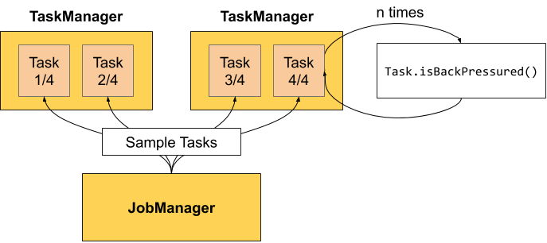
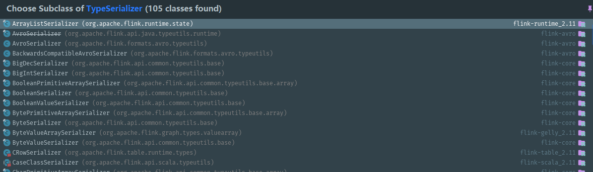

# 问题

## Flink 消费 Kafka 分区顺序性问题

># 1、kafka 分区数据顺序性
>
>**kafka 具有分区内数据有序的特点，可以通过将数据指定到特定的分区来实现数据的顺序性。**
>
>kafka 分区逻辑代码如下：如果指定了分区号生产，则发送到指定分区；否则调用分区器计算方法 partitioner.partition()
>
>**partitioner.partition**
>
>```java
>private int partition(ProducerRecord<K, V> record, byte[] serializedKey, byte[] serializedValue, Cluster cluster) {
>    Integer partition = record.partition();
>    return partition != null ?
>            partition :
>            partitioner.partition(
>                    record.topic(), record.key(), serializedKey, record.value(), serializedValue, cluster);
>}
>```
>
>一共三个分区器实现了 Partitioner类的 partition()方法：
>
>1.  **DefaultPartitioner**
>     **指定分区则使用；否则如果存在 key 则根据 key 去 hash；否则 batch 满了切换分区。**
>2.  **RoundRobinPartitioner**
>     没指定分区则平均分配循环写入分区。
>3.  **UniformStickyPartitioner**
>     和默认相比去除掉 key 取 hash 相关的规则。
>
>综上，我们想实现数据顺序入 kafka，可以指定分区写或者通过设置 key 值相同保证数据入同一个分区。但是要注意避免全部数据入同一分区的场景，最好将数据分组即保证组内数据有序而不是全局有序。
>
>如果采用设置 key 值相同方式进行组内数据入同一分区，则计算分区方式如下：
>
>**partition**
>
>```java
>public int partition(String topic, Object key, byte[] keyBytes, Object value, byte[] valueBytes, Cluster cluster) {
>    //key为null等同于UniformStickyPartitioner分区器
>    if (keyBytes == null) {
>        return stickyPartitionCache.partition(topic, cluster);
>    }
>    List<PartitionInfo> partitions = cluster.partitionsForTopic(topic);
>    int numPartitions = partitions.size();
>    // key取hash后再取正值(并非绝对值)再对分区数量取余
>    return Utils.toPositive(Utils.murmur2(keyBytes)) % numPartitions;
>}
>```
>
>经测试尽量保证key的前缀多样化来保证数据的均匀分布，可以对自己的数据进行测试来敲定key的定义方式。
>
>2、Flink 消费 kafka 的顺序性
>
>https://www.jianshu.com/p/666ee37357df

### 背感压力，Flink背压你了解多少？

https://www.51cto.com/article/686096.html

>### 解决背压
>
>Flink 不需要一个特殊的机制来处理背压，因为Flink中的数据传输相当于已经提供了应对背压的机制。所以只有从代码上与资源上去做一些调整。
>
>(1)背压部分原因可能是由于数据倾斜造成的，我们可以通过 Web UI 各个 SubTask 的 指标值来确认。Checkpoint detail 里不同 SubTask 的 State size 也是一个分析数据倾斜的有用指标。解决方式把数据分组的 key 预聚合来消除数据倾斜。
>
>(2)代码的执行效率问题，阻塞或者性能问题。
>
>(3)TaskManager 的内存大小导致背压。

## 腾讯云-flink 事件与诊断

### 快照失败事件

https://cloud.tencent.com/document/product/849/64491

>查日志、查监控。

### TaskManager 背压较高/严重事件

https://cloud.tencent.com/document/product/849/65095

>系统每5分钟会检测一次 Flink 作业的算子背压情况。如果发现某个算子的背压值（如果算子有多个并行度，则取最大值）高于50%，则继续向下查找，直到遇到第一个背压值（图中的 Backpressured）低于阈值，但是繁忙度（图中的 Busy）高于50% 的算子，该算子通常是处理速度较慢、引起背压的根源。此时如果 [查看 Flink Web UI](https://cloud.tencent.com/document/product/849/48292)，可以看到一系列的灰色算子后紧跟着一个红色算子，如下图：
>
>
>
>收到该事件推送后，我们建议立刻  [查看 Flink Web UI](https://cloud.tencent.com/document/product/849/48292)，分析当前的运行图。如果可以找到引发背压的根源算子，则建议使用 Flink UI 内置的 [火焰图功能](https://nightlies.apache.org/flink/flink-docs-release-1.13/docs/ops/debugging/flame_graphs/) 分析 CPU 调用热点，即占用 CPU 时间片较多的方法（首先需要在作业的 [高级参数](https://cloud.tencent.com/document/product/849/53391) 选项中，加入 `rest.flamegraph.enabled: true` 参数，并重新发布作业版本，才可使用火焰图绘制功能）。
>
>
>
>此外，我们建议增加作业的 [资源配置](https://cloud.tencent.com/document/product/849/57772)，例如调大 TaskManager 的规格（提升 TaskManager 的 CPU 配额，可以有更多的 CPU 资源来处理数据），提升作业的算子并行度（降低单个 TaskManager 的数据处理量，减少 CPU 计算压力）等，令数据能够更有效地处理。

### TaskManager Pod 异常退出事件

https://cloud.tencent.com/document/product/849/64500

Flink 作业的 TaskManager 运行在 Kubernetes Pod 中，当 Pod 终止时，我们可以监测到该事件，并根据返回码、状态信息等维度，判断 Pod 是否发生了异常。

## 如何分析及处理 Flink 反压？

https://developer.aliyun.com/article/727389

>### 反压的影响
>
>是因为 Flink 的 checkpoint 机制，反压还会影响到两项指标: checkpoint 时长和 state 大小。
>
>- 前者是因为 checkpoint barrier 是不会越过普通数据的，数据处理被阻塞也会导致 checkpoint barrier 流经整个数据管道的时长变长，因而 checkpoint 总体时间（End to End Duration）变长。
>- 后者是因为为保证 EOS（Exactly-Once-Semantics，准确一次），对于有两个以上输入管道的 Operator，checkpoint barrier 需要对齐（Alignment），接受到较快的输入管道的 barrier 后，它后面数据会被缓存起来但不处理，直到较慢的输入管道的 barrier 也到达，这些被缓存的数据会被放到state 里面，导致 checkpoint 变大。
>
>如果处于反压状态，那么有两种可能性：
>
>1. 该节点的发送速率跟不上它的产生数据速率。这一般会发生在一条输入多条输出的 Operator（比如 flatmap）。
>2. 下游的节点接受速率较慢，通过反压机制限制了该节点的发送速率。
>
>**值得注意的是，反压的根源节点并不一定会在反压面板体现出高反压**，因为反压面板监控的是发送端，如果某个节点是性能瓶颈并不会导致它本身出现高反压，而是导致它的上游出现高反压。总体来看，**如果我们找到第一个出现反压的节点，那么反压根源要么是就这个节点，要么是它紧接着的下游节点。**
>
>那么如果区分这两种状态呢？很遗憾只通过反压面板是无法直接判断的，我们还需要结合 Metrics 或者其他监控手段来定位。此外如果作业的节点数很多或者并行度很大，由于要采集所有 Task 的栈信息，反压面板的压力也会很大甚至不可用。
>
>首先我们简单回顾下 Flink 1.5 以后的网路栈，熟悉的读者可以直接跳过。
>
>**TaskManager 传输数据时**，不同的 TaskManager 上的两个 Subtask 间通常根据 key 的数量有多个 Channel，**这些 Channel 会复用同一个 TaskManager 级别的 TCP 链接，并且共享接收端 Subtask 级别的 Buffer Pool。**
>
>**在接收端**，每个 Channel 在初始阶段会被分配固定数量的 Exclusive Buffer，这些 Buffer 会被用于存储接受到的数据，交给 Operator 使用后再次被释放。Channel 接收端空闲的 Buffer 数量称为 Credit，Credit 会被定时同步给发送端被后者用于决定发送多少个 Buffer 的数据。
>
>**在流量较大时，Channel 的 Exclusive Buffer 可能会被写满，此时 Flink 会向 Buffer Pool 申请剩余的 Floating Buffer。这些 Floating Buffer 属于备用 Buffer，哪个 Channel 需要就去哪里。**而在 **Channel 发送端，一个 Subtask 所有的 Channel 会共享同一个 Buffer Pool，这边就没有区分 Exclusive Buffer 和 Floating Buffer。**
>
>**分析具体原因及处理**
>
>定位到反压节点后，分析造成原因的办法和我们分析一个普通程序的性能瓶颈的办法是十分类似的，可能还要更简单一点，因为我们要观察的主要是 Task Thread。
>
>**在实践中，很多情况下的反压是由于数据倾斜造成的**，这点我们可以通过 Web UI 各个 **SubTask 的 Records Sent 和 Record Received 来确认，另外 Checkpoint detail 里不同 SubTask 的 State size 也是一个分析数据倾斜的有用指标。**
>
>**此外，最常见的问题可能是用户代码的执行效率问题（频繁被阻塞或者性能问题）**。最有用的办法就是对 TaskManager 进行 CPU profile，从中我们可以分析到 Task Thread 是否跑满一个 CPU 核：如果是的话要分析 CPU 主要花费在哪些函数里面，比如我们生产环境中就偶尔遇到卡在 Regex 的用户函数（ReDoS）；如果不是的话要看 Task Thread 阻塞在哪里，可能是用户函数本身有些同步的调用，可能是 checkpoint 或者 GC 等系统活动导致的暂时系统暂停。
>
>当然，性能分析的结果也可能是正常的，只是作业申请的资源不足而导致了反压，这就通常要求拓展并行度。值得一提的，在未来的版本 **Flink 将会直接在 WebUI 提供 JVM 的 CPU 火焰图**[5]，这将大大简化性能瓶颈的分析。
>
>**另外 TaskManager 的内存以及 GC 问题也可能会导致反压**，包括 TaskManager JVM 各区内存不合理导致的频繁 Full GC 甚至失联。推荐可以通过给 TaskManager 启用 G1 垃圾回收器来优化 GC，并加上 -XX:+PrintGCDetails 来打印 GC 日志的方式来观察 GC 的问题。
>
>


### ["Buffer pool is destroyed" issue found in Apache Flink flapMap Operator](https://stackoverflow.com/questions/55468495/buffer-pool-is-destroyed-issue-found-in-apache-flink-flapmap-operator)

>> What is a Buffer pool?
>
>Buffer pool is a fixed size pool of memory segments instances for the network stack, which means that you put segments into it when you send data and fetch segments from it when you receive across the network.
>
>> Why is it destroyed?
>
>The buffer pool is destroyd because the network environment shuts down.
>
>> Why does NetworkEnvironment shut down?
>
>It may be a specific circumtances which I'm not very sure. I suggest you read more logs above this buffer pool exception.
>
>

### [Non Serializable object in Apache Flink](https://stackoverflow.com/questions/59713451/non-serializable-object-in-apache-flink)

>Using `open` is usually the right place to load external lookup sources. The timeout is a bit odd, maybe there is a configuration around it.
>
>**However, if it's huge using a static loader (either static class as you did or singleton) has the benefit that you only need to load it once for all parallel instances of the task on the same task manager. Hence, you save memory and CPU time. This is especially true for you, as you use the same data structure in two separate tasks. Further, the static loader can be lazily initialized when it's used for the first time to avoid the timeout in `open`.**
>
>The clear downside of this approach is that the testability of your code suffers. There are some ways around that, which I could expand if there is interest.
>
>I don't see a benefit of using the proxy serializer pattern. It's unnecessarily complex (custom serialization in Java) and offers little benefit.

### Funtion 中的局部变量是如何处理的？？

[Difference between Flink state and ordinary class variables](https://stackoverflow.com/questions/60143785/difference-between-flink-state-and-ordinary-class-variables)

>Failure recovery, redeployments, and rescaling are some of the big differences.
>
>Flink takes periodic checkpoints of the state it is managing. In the event of a failure, your job can automatically recover using the latest checkpoint, and resume processing. You can also manually trigger a state snapshot (called a savepoint in this case) and use it to restart after a redeployment. While you are at it, you can also rescale the cluster up or down.
>
>You can also choose where your Flink state lives -- **either as objects on the heap, or as serialized bytes on disk.** Thus it is possible to have much more state than can fit in memory.
>
>From an operational perspective, this is more like having your data in a database, than in memory. But from a performance perspective, it's more like using variables: the state is always local, available with high throughput and low latency.
>
>In addition to what David wrote, ValueState is scoped to the key while a regular field is scoped to **the operator instance.** 

## 什么是数据倾斜

[面试必问&数据倾斜](https://zhuanlan.zhihu.com/p/64240857)

>spark 程序发生数据倾斜的情况：
>
>根据**log**去定位
>
>出现数据倾斜的原因，基本**只可能**是因为发生了**shuffle操作**，在shuffle的过程中，出现了数据倾斜的问题。因为某个，或者某些key对应的数据，远远的高于其他的key。
>
>**1、**你在自己的程序里面**找找**，哪些地方用了会产生**shuffle**的算子，**groupByKey**、**countByKey**、**reduceByKey**、**join**
>
>**2、看log**
>
>log 一般会报是在你的哪一行代码，导致了OOM异常；或者呢，看log，看看是执行到了第几个stage！！！哪一个stage，task特别慢，就能够自己用肉眼去对你的spark代码进行stage的划分，就能够通过stage定位到你的代码，哪里发生了数据倾斜。去找找，代码那个地方，是哪个shuffle操作。
>
>**二、解决方法一：聚合数据源**
>
>**聚合数据源做法一：**
>
>groupByKey、reduceByKey；groupByKey，就是拿到每个key对应的values；reduceByKey，说白了，就是对每个key对应的values执行一定的计算。
>
>**聚合数据源做法二：**
>
>尽量去聚合，减少每个key对应的数量，也许聚合到比较粗的粒度之后，原先有10万数据量的key，现在只有1万数据量。**减轻数据倾斜的现象和问题。**
>
>**三、解决方法二：提高shuffle操作reduce并行度**
>
>如果第一种方法不适合做。那么采用第二种方法：**提高shuffle操作的reduce并行度**
>
>将**增加reduce task的数量**，就可以让每个 reduce task 分配到更少的数据量，这样的话，也许就可以缓解，或者甚至是基本解决掉数据倾斜的问题。
>
>**四、解决方法之三：随机key实现双重聚合**
>
>**将key加前缀打散后聚合计算，然后去掉前缀，继续聚合。**
>
>**五、解决方法之四：将reduce join** **转换为map join**
>
>通过将小表做成broadcast变量，直接去掉shuffle这一步，也就不会发生数据倾斜。
>
>**特别声明：**
>
>对于join这种操作，不光是考虑数据倾斜的问题；**即使是没有数据倾斜问题，也完全可以优先考虑，用我们讲的这种高级的 reduce join 转 map join 的技术**，不要用普通的join，去通过shuffle，进行数据的join；完全可以通过简单的map，使用map join的方式，牺牲一点内存资源；在可行的情况下，优先这么使用。**不走shuffle，直接走map**，性能肯定是提高很多的。
>
>**六、解决方法之五：sample采样倾斜key进行两次join**
>
>
>
>**方案的实现思路**：其实关键之处在于，将发生数据倾斜的key，单独拉出来，放到一个RDD中去；就用这个原本会倾斜的key RDD跟其他RDD，单独去join一下，这个时候，key对应的数据，可能就会分散到多个task中去进行join操作，最后将join后的表进行union操作。
>
>**七、解决方法之六：使用随机数以及扩容表进行join**
>
>**sample采样倾斜key并单独进行join**
>
>1、将key，从另外一个RDD中过滤出的数据，可能只有一条，或者几条，此时，咱们可以**任意进行扩容**，扩成**1000**倍。
>
>2、将从第一个RDD中拆分出来的那个**倾斜key RDD**，**打上1000以内的一个随机数**。
>
>3、join并且提供并行度。这样配合上，提升shuffle reduce并行度，**join(rdd, 1000)**。通常情况下，效果还是非常不错的。打散成100份，甚至1000份，2000份，去进行join，那么就肯定没有数据倾斜的问题了吧。
>
>**此方法局限性：**
>
>1、因为你的两个RDD都很大，所以你没有办法去将某一个RDD扩的特别大，**一般**咱们就是**扩10倍**。
>
>2、如果就是10倍的话，那么数据倾斜问题，的确是只能说是缓解和减轻，不能说彻底解决。
>
>《Stream Processing with Apache Flink》p.56: 基于信用的流量控制能在出现数据倾斜（data skew）时有效地分配网络资源，因为信用值授权是根据各发送端的数据积压来完成的。
>
>P108 分区策略：使用flink提供的或者自定义分区策略。
>

### [h3数据倾斜解决方案之将reduce join转换为map join](https://blog.csdn.net/qq_25617289/article/details/88704571)

>
>
>reduce join转换为map join，适合在什么样的情况下，可以来使用？ 如果两个RDD要进行join，其中一个RDD是比较小的。一个RDD是100万数据，一个RDD是1万数据。（一个RDD是1亿数据，一个RDD是100万数据） 其中一个RDD必须是比较小的，broadcast出去那个小RDD的数据以后，就会在每个executor的block manager中都驻留一份。要确保你的内存足够存放那个小RDD中的数据 这种方式下，根本不会发生shuffle操作，肯定也不会发生数据倾斜；从根本上杜绝了join操作可能导致的数据倾斜的问题； 对于join中有数据倾斜的情况，大家尽量第一时间先考虑这种方式，效果非常好；如果某个RDD比较小的情况下。 
>
>不适合的情况： 两个RDD都比较大，那么这个时候，你去将其中一个RDD做成broadcast，就很笨拙了。很可能导致内存不足。最终导致内存溢出，程序挂掉。 而且其中某些key（或者是某个key），还发生了数据倾斜；此时可以采用最后两种方式。
>
>对于join这种操作，不光是考虑数据倾斜的问题；即使是没有数据倾斜问题，也完全可以优先考虑，
>————————————————
>
>原文链接：https://blog.csdn.net/qq_25617289/article/details/88704571


### [Flink本地模式报错:Exception in thread main java.lang.NoClassDefFoundError](https://blog.csdn.net/qq_34321590/article/details/106991437)

### [解决flink启动后无法正常关闭](https://blog.csdn.net/qq_37135484/article/details/102474087)

>#### 为什么会无法正常关闭，还提示没有taskexecutor和standalonesession进程呢？
>
>我想起以前spark集群也出现过类似的问题，原因是spark启动是会把启动的进程的ID存到一个文件中，由于**配置不修改的话文件默认是保存到系统的/tmp目录下，由于是临时目录，会被系统清理，所以存放的ID就找不到了，也就没法关闭集群了。**
>
>去到/tmp目录下查看文件，果然发现了flink的PID文件
>
>这样一来就好办了，只要把这个配置项一改不就齐活了。
>配置pid的配置文件为 bin/conf.sh，其中显示pid文件默认位置在 /tmp 目录中。

### flink异步编程

mr任务异步编程案例：

https://gitlab.bigdata.letv.com/data-realtime/rdp.jobs.mob   中的 rdp.mob.ios.idfa 项目RedisRecordWriter。

### KeyedStream 和槽位？？


### flink中元素的序列化

 * **流中的元素不需要专门实现 Serializable 接口**，Flink有一套类型处理系统，可以专门**提取流中的元素类型**，获取序列化器和反序列化器。
 * 但是从**主线程向算子中传变量时，该变量需要实现 Serializable 接口，flink 没有对这种变量的序列化和反序列化做自动的处理。**

### [为什么Flink中的函数需要序列化?](https://www.runexception.com/q/12332)

>考虑Flink中的FlatMapFunction。它的任何实现都必须是可序列化的。
>
>我想知道为什么会这样，有人能 explain一下吗？所有这些在 job管理器中创建的操作员实例是否都序列化并发送给任务管理器？
>
>答：
>
>> 所有这些在 job管理器中创建的操作员实例是否都序列化并发送给任务管理器？
>
>您已经回答了您的问题：）
>
>值得一提的是，它不仅适用于分布式 job，还用于容错。
>
>系统从 checkpoints恢复数据，然后重新部署整个分布式数据流，并向每个操作员提供作为 checkpoints一部分进行快照的状态。

### [a bit of background on serializability of functions in Apache Flink](https://stackoverflow.com/questions/34118469/flink-using-dagger-injections-not-serializable)

>Before diving into the specifics of the question, a bit of background on serializability of functions in Apache Flink:
>
>### Serializability
>
>**Apache Flink uses Java Serialization (java.io.Serializable) to ship the function objects (here the `MapFunction`) to the workers（工作进程） that execute them in parallel.** Because of that, the functions need to be serializable: The function may not contain any non-serializable fields, i.e. types that are not primitive (int, long, double, ...) and not implementing `java.io.Serializable`.
>
>The typical way to work with non-serializable constructs is to lazily initialize them.
>
>### Lazy Initialization
>
>One way to use non-serializable types in Flink functions is to lazily initialize them. The fields that hold these types are still `null` when the function is serialized to be shipped, and **only set after the function has been deserialized by the workers.**
>
>- In Scala, you can simply use lazy fields, for example `lazy val x = new NonSerializableType()`. The `NonSerializableType` type is actually only created upon first access to the variable `x`, which is usually on the worker. Consequently, the type can be non serializable, because `x` is null when the function is serialized to shipping to the workers.
>- **In Java, you can initialize the non-serializable fields on the `open()` method of the function, if you make it a *Rich Function*.** Rich functions (like `RichMapFunction`) are extended versions of basic functions (here `MapFunction`) and give you access to life-cycle methods like `open()` and `close()`.
>
>


# 官网资料

## Flame Graphs

https://nightlies.apache.org/flink/flink-docs-release-1.13/docs/ops/debugging/flame_graphs/

[Flame Graphs](http://www.brendangregg.com/flamegraphs.html) are a visualization that effectively surfaces answers to questions like:

- Which methods are currently consuming CPU resources?
- How does consumption by one method compare to the others?
- Which series of calls on the stack led to executing a particular method?


Flame Graphs are constructed by sampling stack traces a number of times. **Each method call is presented by a bar, where the length of the bar is proportional to the number of times it is present in the samples.**


## table api 之 hive

https://nightlies.apache.org/flink/flink-docs-master/zh/docs/connectors/table/hive/overview/

Flink 与 Hive 的集成包含两个层面。

一是**利用了 Hive 的 MetaStore 作为持久化的 Catalog，用户可通过`HiveCatalog`将不同会话中的 Flink 元数据存储到 Hive Metastore 中。** 例如，用户可以使用`HiveCatalog`将其 Kafka 表或 Elasticsearch 表存储在 Hive Metastore 中，并后续在 SQL 查询中重新使用它们。

二是**利用 Flink 来读写 Hive 的表。**

`HiveCatalog`的设计提供了与 Hive 良好的兼容性，用户可以"开箱即用"的访问其已有的 Hive 数仓。 您不需要修改现有的 Hive Metastore，也不需要更改表的数据位置或分区。

## 【Hive】Hive MetaStore 3.1.x 元数据管理库表结构介绍及特色功能

https://blog.csdn.net/m0_54252387/article/details/125756999

>
>
>
>
>
>
>
>
>


## hive 方言

- Hive 方言主要是在批模式下使用的，某些 Hive 的语法([Sort/Cluster/Distributed BY](https://nightlies.apache.org/flink/flink-docs-master/zh/docs/dev/table/hive-compatibility/hive-dialect/queries/sort-cluster-distribute-by/), [Transform](https://nightlies.apache.org/flink/flink-docs-master/zh/docs/dev/table/hive-compatibility/hive-dialect/queries/transform/), 等)还没有在流模式下支持。

### Table API [#](https://nightlies.apache.org/flink/flink-docs-master/zh/docs/dev/table/hive-compatibility/hive-dialect/overview/#table-api)

你可以使用 Table API 为 TableEnvironment 设置方言。

Java

```java
EnvironmentSettings settings = EnvironmentSettings.inStreamingMode();
TableEnvironment tableEnv = TableEnvironment.create(settings);

// to use hive dialect
tableEnv.getConfig().setSqlDialect(SqlDialect.HIVE);

// to use default dialect
tableEnv.getConfig().setSqlDialect(SqlDialect.DEFAULT);
```

## Hive Catalog

**Hive Metastore has evolved into the de facto metadata hub over the years in Hadoop ecosystem. Many companies have a single Hive Metastore service instance in their production to manage all of their metadata, either Hive metadata or non-Hive metadata, as the source of truth.**

For users who have both Hive and Flink deployments, **`HiveCatalog` enables them to use Hive Metastore to manage Flink’s metadata.**

For users who have just Flink deployment, `HiveCatalog` is the only persistent catalog provided out-of-box by Flink. **Without a persistent catalog, users using [Flink SQL CREATE DDL](https://nightlies.apache.org/flink/flink-docs-master/zh/docs/dev/table/sql/create/) have to repeatedly create meta-objects like a Kafka table in each session, which wastes a lot of time. `HiveCatalog` fills this gap by empowering users to create tables and other meta-objects only once, and reference and manage them with convenience later on across sessions.**

## [How to use HiveCatalog](https://nightlies.apache.org/flink/flink-docs-master/zh/docs/connectors/table/hive/hive_catalog/)

`HiveCatalog` can be used to handle two kinds of tables: **Hive-compatible tables and generic tables.** Hive-compatible tables are those stored in a Hive-compatible way, in terms of **both metadata and data in the storage layer**. Therefore, **Hive-compatible tables created via Flink can be queried from Hive side.**

**Generic tables, on the other hand, are specific to Flink. When creating generic tables with `HiveCatalog`, we’re just using HMS to persist the metadata. While these tables are visible to Hive, it’s unlikely Hive is able to understand the metadata. And therefore using such tables in Hive leads to undefined behavior.**

#### step 1: set up a Hive Metastore

#### step 2: start SQL Client, and create a Hive catalog with Flink SQL DDL

Add all Hive dependencies to `/lib` dir in Flink distribution, and create a Hive catalog in Flink SQL CLI as following:

```sql
Flink SQL> CREATE CATALOG myhive WITH (
  'type' = 'hive',
  'hive-conf-dir' = '/opt/hive-conf'
);
```

#### step 3: set up a Kafka cluster

Bootstrap a local Kafka cluster with a topic named “test”, and produce some simple data to the topic as tuple of name and age.

#### step 4: create a Kafka table with Flink SQL DDL

**Create a simple Kafka table with Flink SQL DDL, and verify its schema.**

```sql
Flink SQL> USE CATALOG myhive;

Flink SQL> CREATE TABLE mykafka (name String, age Int) WITH (
   'connector.type' = 'kafka',
   'connector.version' = 'universal',
   'connector.topic' = 'test',
   'connector.properties.bootstrap.servers' = 'localhost:9092',
   'format.type' = 'csv',
   'update-mode' = 'append'
);
[INFO] Table has been created.

Flink SQL> DESCRIBE mykafka;
root
 |-- name: STRING
 |-- age: INT
```

Verify the table is also visible to Hive via Hive Cli:

```bash
hive> show tables;
OK
mykafka
Time taken: 0.038 seconds, Fetched: 1 row(s)
```

#### step 5: run Flink SQL to query the Kafka table 

Run a simple select query from Flink SQL Client in a Flink cluster, either standalone or yarn-session.

```bash
Flink SQL> select * from mykafka;
```


## [Hive 读 & 写](https://nightlies.apache.org/flink/flink-docs-master/zh/docs/connectors/table/hive/hive_read_write/)

通过使用 `HiveCatalog`，Apache Flink 可以对 Apache Hive 表做统一的批和流处理。这意味着 **Flink 可以成为 Hive 批处理引擎的一个性能更好的选择，或者连续读写 Hive 表中的数据以支持实时数据仓库应用。**

## hive 读

Flink 支持以批和流两种模式从 Hive 表中读取数据。**批读的时候，Flink 会基于执行查询时表的状态进行查询。流读时将持续监控表，并在表中新数据可用时进行增量获取，默认情况下，Flink 将以批模式读取数据。**

**流读支持消费分区表和非分区表。**对于分区表，**Flink 会监控新分区的生成，并且在数据可用的情况下增量获取数据。对于非分区表，Flink 将监控文件夹中新文件的生成，并增量地读取新文件。**


| 键                                    | 默认值         | 类型     | 描述                                                         |
| :------------------------------------ | :------------- | :------- | :----------------------------------------------------------- |
| streaming-source.enable               | false          | Boolean  | 是否启动流读。注意：请确保每个分区/文件都应该原子地写入，否则读取不到完整的数据。 |
| streaming-source.partition.include    | all            | String   | **选择读取的分区，可选项为 `all` 和 `latest`，`all` 读取所有分区；`latest` 读取按照 'streaming-source.partition.order' 排序后的最新分区，`latest` 仅在流模式的 Hive 源表作为时态表时有效。**默认的选项是 `all`。在开启 'streaming-source.enable' 并设置 'streaming-source.partition.include' 为 'latest' 时，Flink 支持 temporal join 最新的 Hive 分区，同时，用户可以通过配置分区相关的选项来配置分区比较顺序和数据更新时间间隔。 |
| streaming-source.monitor-interval     | None           | Duration | **连续监控分区/文件的时间间隔。** 注意: 默认情况下，流式读 Hive 的间隔为 '1 min'，但流读 Hive 的 temporal join 的默认时间间隔是 '60 min'，这是因为当前流读 Hive 的 temporal join 实现上有一个框架限制，即每个 TM 都要访问 Hive metastore，这可能会对 metastore 产生压力，这个问题将在未来得到改善。 |
| streaming-source.partition-order      | partition-name | String   | **streaming source 分区排序，支持 create-time， partition-time 和 partition-name。** create-time 比较分区/文件创建时间， 这不是 Hive metastore 中创建分区的时间，而是文件夹/文件在文件系统的修改时间，如果分区文件夹以某种方式更新，比如添加在文件夹里新增了一个文件，它会影响到数据的使用。partition-time 从分区名称中抽取时间进行比较。partition-name 会比较分区名称的字典顺序。**对于非分区的表，总是会比较 'create-time'。对于分区表默认值是 'partition-name'。该选项与已经弃用的 'streaming-source.consume-order' 的选项相同。** |
| streaming-source.consume-start-offset | None           | String   | **流模式起始消费偏移量。**如何解析和比较偏移量取决于你指定的顺序。对于 create-time 和 partition-time，会比较时间戳 (yyyy-[m]m-[d]d [hh:mm:ss])。对于 partition-time，**将使用分区时间提取器从分区名字中提取的时间。** 对于 partition-name，是字符串类型的分区名称(比如 pt_year=2020/pt_mon=10/pt_day=01)。 |

[SQL Hints](https://nightlies.apache.org/flink/flink-docs-master/zh/docs/dev/table/sql/queries/hints/) 可以在不改变 Hive metastore 的情况下配置 Hive table 的属性。

```sql
SELECT * 
FROM hive_table 
/*+ OPTIONS('streaming-source.enable'='true', 'streaming-source.consume-start-offset'='2020-05-20') */;
```

**注意**

- **监控策略是扫描当前位置路径中的所有目录/文件，分区太多可能导致性能下降。**
- 流读非分区表时要求每个文件应原子地写入目标目录。
- **流读分区表要求每个分区应该被原子地添加进 Hive metastore 中。如果不是的话，只有添加到现有分区的新数据会被消费。**
- 流读 Hive 表不支持 Flink DDL 的 watermark 语法。这些表不能被用于窗口算子。

### 读取 Hive Views [#](https://nightlies.apache.org/flink/flink-docs-master/zh/docs/connectors/table/hive/hive_read_write/#读取-hive-views)

Flink 能够读取 Hive 中已经定义的视图。但是也有一些限制：

1. Hive catalog 必须设置成当前的 catalog 才能查询视图。在 Table API 中使用 `tableEnv.useCatalog(...)`，或者在 SQL 客户端使用 `USE CATALOG ...` 来改变当前 catalog。
2. Hive 和 Flink SQL 的语法不同, 比如不同的关键字和字面值。请确保对视图的查询语法与 Flink 语法兼容。

### Source 并发推断 [#](https://nightlies.apache.org/flink/flink-docs-master/zh/docs/connectors/table/hive/hive_read_write/#source-并发推断)

默认情况下，Flink 会基于文件的数量，以及每个文件中块的数量推断出读取 Hive 的最佳并行度。

Flink 允许你灵活的配置并发推断策略。你可以在 `TableConfig` 中配置以下参数(注意这些参数会影响当前作业的所有 source)：

| 键                                           | 默认值 | 类型    | 描述                                                         |
| :------------------------------------------- | :----- | :------ | :----------------------------------------------------------- |
| table.exec.hive.infer-source-parallelism     | true   | Boolean | 如果是 true，会根据 split 的数量推断 source 的并发度。如果是 false，source 的并发度由配置决定。 |
| table.exec.hive.infer-source-parallelism.max | 1000   | Integer | 设置 source operator 推断的最大并发度。                      |

### 加载分区切片 [#](https://nightlies.apache.org/flink/flink-docs-master/zh/docs/connectors/table/hive/hive_read_write/#加载分区切片)

**Flink 使用多个线程并发将 Hive 分区切分成多个 split 进行读取。**你可以使用 `table.exec.hive.load-partition-splits.thread-num` 去配置线程数。默认值是3，你配置的值应该大于0。

### 读取带有子目录的分区 [#](https://nightlies.apache.org/flink/flink-docs-master/zh/docs/connectors/table/hive/hive_read_write/#读取带有子目录的分区)

在某些情况下，你或许会创建一个引用其他表的外部表，但是该表的分区列是另一张表分区字段的子集。 比如，你创建了一个分区表 `fact_tz`，分区字段是 `day` 和 `hour`：

```sql
CREATE TABLE fact_tz(x int) PARTITIONED BY (day STRING, hour STRING);
```

然后你基于 `fact_tz` 表创建了一个外部表 `fact_daily`，并使用了一个粗粒度的分区字段 `day`：

```sql
CREATE EXTERNAL TABLE fact_daily(x int) PARTITIONED BY (ds STRING) LOCATION '/path/to/fact_tz';
```

当读取外部表 `fact_daily` 时，该表的分区目录下存在子目录(`hour=1` 到 `hour=24`)。

默认情况下，可以将带有子目录的分区添加到外部表中。Flink SQL 会递归扫描所有的子目录，并获取所有子目录中数据。

```sql
ALTER TABLE fact_daily ADD PARTITION (ds='2022-07-07') location '/path/to/fact_tz/ds=2022-07-07';
```

你可以设置作业属性 `table.exec.hive.read-partition-with-subdirectory.enabled` (默认为 `true`) 为 `false` 以禁止 Flink 读取子目录。 如果你设置成 `false` 并且分区目录下不包含任何子目录，Flink 会抛出 `java.io.IOException: Not a file: /path/to/data/*` 异常。

## 时态表 Join [#](https://nightlies.apache.org/flink/flink-docs-master/zh/docs/connectors/table/hive/hive_read_write/#时态表-join)

你可以使用 Hive 表作为时态表，然后一个数据流就可以使用 temporal join 关联 Hive 表。 请参照 [temporal join](https://nightlies.apache.org/flink/flink-docs-master/zh/docs/dev/table/sql/queries/joins/#temporal-joins) 获取更多关于 temporal join 的信息。

Flink 支持 processing-time temporal join Hive 表，processing-time temporal join 总是关联最新版本的时态表。 Flink 支持 temporal join Hive 的分区表和非分区表，对于分区表，Flink 支持自动跟踪 Hive 表的最新分区。

**注意: Flink 还不支持 event-time temporal join Hive 表。**

### Temporal Join 最新的分区 [#](https://nightlies.apache.org/flink/flink-docs-master/zh/docs/connectors/table/hive/hive_read_write/#temporal-join-最新的分区)

**对于随时变化的分区表，我们可以把它看作是一个无界流进行读取，如果每个分区包含完整数据，则分区可以作为时态表的一个版本，时态表的版本保存分区的数据。**

**Flink 支持在使用 processing time temporal join 时自动追踪最新的分区（版本），通过 `streaming-source.partition-order` 定义最新的分区（版本）。 用户最常使用的案例就是在 Flink 流作业中使用 Hive 表作为维度表。**

**注意:** 该特性仅支持 Flink 流模式。

下面的案例演示了经典的业务 pipeline，**使用 Hive 中的表作为维度表，它们由每天一次的批任务或者 Flink 任务来更新。 Kafka 数据流来自实时在线业务数据或者日志，该流需要关联维度表以丰富数据流。**

```sql
-- 假设 Hive 表中的数据每天更新, 每天包含最新和完整的维度数据
SET table.sql-dialect=hive;
CREATE TABLE dimension_table (
  product_id STRING,
  product_name STRING,
  unit_price DECIMAL(10, 4),
  pv_count BIGINT,
  like_count BIGINT,
  comment_count BIGINT,
  update_time TIMESTAMP(3),
  update_user STRING,
  ...
) PARTITIONED BY (pt_year STRING, pt_month STRING, pt_day STRING) TBLPROPERTIES (
  -- using default partition-name order to load the latest partition every 12h (the most recommended and convenient way)
  'streaming-source.enable' = 'true',
  'streaming-source.partition.include' = 'latest',
  'streaming-source.monitor-interval' = '12 h',
  'streaming-source.partition-order' = 'partition-name',  -- 有默认的配置项，可以不填。

  -- using partition file create-time order to load the latest partition every 12h
  'streaming-source.enable' = 'true',
  'streaming-source.partition.include' = 'latest',
  'streaming-source.partition-order' = 'create-time',
  'streaming-source.monitor-interval' = '12 h'

  -- using partition-time order to load the latest partition every 12h
  'streaming-source.enable' = 'true',
  'streaming-source.partition.include' = 'latest',
  'streaming-source.monitor-interval' = '12 h',
  'streaming-source.partition-order' = 'partition-time',
  'partition.time-extractor.kind' = 'default',
  'partition.time-extractor.timestamp-pattern' = '$pt_year-$pt_month-$pt_day 00:00:00' 
);

SET table.sql-dialect=default;
CREATE TABLE orders_table (
  order_id STRING,
  order_amount DOUBLE,
  product_id STRING,
  log_ts TIMESTAMP(3),
  proctime as PROCTIME()
) WITH (...);


-- streaming sql, kafka temporal join Hive 维度表. Flink 将在 'streaming-source.monitor-interval' 的间隔内自动加载最新分区的数据。

SELECT * FROM orders_table AS o 
JOIN dimension_table FOR SYSTEM_TIME AS OF o.proctime AS dim
ON o.product_id = dim.product_id;
```

### Temporal Join 最新的表 [#](https://nightlies.apache.org/flink/flink-docs-master/zh/docs/connectors/table/hive/hive_read_write/#temporal-join-最新的表)

对于 Hive 表，我们可以把它看作是一个无界流进行读取，在这个案例中，当我们查询时只能去追踪最新的版本。 最新版本的表保留了 Hive 表的所有数据。

**当 temporal join 最新的 Hive 表，Hive 表会缓存到 Slot 内存中，并且数据流中的每条记录通过 key 去关联表找到对应的匹配项。 使用最新的 Hive 表作为时态表不需要额外的配置。作为可选项，您可以使用以下配置项配置 Hive 表缓存的 TTL。当缓存失效，Hive 表会重新扫描并加载最新的数据。**

| 键                    | 默认值 | 类型     | 描述                                                         |
| :-------------------- | :----- | :------- | :----------------------------------------------------------- |
| lookup.join.cache.ttl | 60 min | Duration | 在 lookup join 时构建表缓存的 TTL (例如 10min)。默认的 TTL 是60分钟。注意: 该选项仅在 lookup 表为有界的 Hive 表时有效，如果你使用流式的 Hive 表作为时态表，请使用 'streaming-source.monitor-interval' 去配置数据更新的间隔。 |

下面的案例演示加载 Hive 表的所有数据作为时态表。

```sql
-- 假设 Hive 表中的数据被批处理 pipeline 覆盖。
SET table.sql-dialect=hive;
CREATE TABLE dimension_table (
  product_id STRING,
  product_name STRING,
  unit_price DECIMAL(10, 4),
  pv_count BIGINT,
  like_count BIGINT,
  comment_count BIGINT,
  update_time TIMESTAMP(3),
  update_user STRING,
  ...
) TBLPROPERTIES (
  'streaming-source.enable' = 'false',           -- 有默认的配置项，可以不填。
  'streaming-source.partition.include' = 'all',  -- 有默认的配置项，可以不填。
  'lookup.join.cache.ttl' = '12 h'
);

SET table.sql-dialect=default;
CREATE TABLE orders_table (
  order_id STRING,
  order_amount DOUBLE,
  product_id STRING,
  log_ts TIMESTAMP(3),
  proctime as PROCTIME()
) WITH (...);


-- streaming sql, kafka join Hive 维度表. 当缓存失效时 Flink 会加载维度表的所有数据。

SELECT * FROM orders_table AS o 
JOIN dimension_table FOR SYSTEM_TIME AS OF o.proctime AS dim
ON o.product_id = dim.product_id;
```

注意:

1. **每个参与 join 的 subtask 需要在他们的缓存中保留 Hive 表。请确保 Hive 表可以放到 TM task slot 中。**
2. 建议把这两个选项配置成较大的值 `streaming-source.monitor-interval`(最新的分区作为时态表) 和 `lookup.join.cache.ttl`(所有的分区作为时态表)。否则，**任务会频繁更新和加载表，容易出现性能问题。**
3. 目前，**缓存刷新的时候会重新加载整个 Hive 表，所以没有办法区分数据是新数据还是旧数据。**

## hive写 [#](https://nightlies.apache.org/flink/flink-docs-master/zh/docs/connectors/table/hive/hive_read_write/#写)

Flink 支持批和流两种模式往 Hive 中写入数据，当作为批程序，只有当作业完成时，Flink 写入 Hive 表的数据才能被看见。批模式写入支持追加到现有的表或者覆盖现有的表。

```sql
# ------ INSERT INTO 将追加到表或者分区，保证数据的完整性 ------ 
Flink SQL> INSERT INTO mytable SELECT 'Tom', 25;

# ------ INSERT OVERWRITE 将覆盖表或者分区中所有已经存在的数据 ------ 
Flink SQL> INSERT OVERWRITE mytable SELECT 'Tom', 25;
```

还可以将数据插入到特定的分区中。

```sql
# ------ 插入静态分区 ------ 
Flink SQL> INSERT OVERWRITE myparttable PARTITION (my_type='type_1', my_date='2019-08-08') SELECT 'Tom', 25;

# ------ 插入动态分区 ------ 
Flink SQL> INSERT OVERWRITE myparttable SELECT 'Tom', 25, 'type_1', '2019-08-08';

# ------ 插入静态(my_type)和动态(my_date)分区 ------ 
Flink SQL> INSERT OVERWRITE myparttable PARTITION (my_type='type_1') SELECT 'Tom', 25, '2019-08-08';
```

流写会不断的往 Hive 中添加新数据，提交记录使它们可见。用户可以通过几个属性控制如何触发提交。**流写不支持 `Insert overwrite` 。**

下面的案例演示如何流式地从 Kafka 写入 Hive 表并执行分区提交，然后运行一个批处理查询将数据读出来。

请参阅 [streaming sink](https://nightlies.apache.org/flink/flink-docs-master/zh/docs/connectors/table/filesystem/#streaming-sink) 获取可用配置的完整列表。

```sql
SET table.sql-dialect=hive;
CREATE TABLE hive_table (
  user_id STRING,
  order_amount DOUBLE
) PARTITIONED BY (dt STRING, hr STRING) STORED AS parquet TBLPROPERTIES (
  'partition.time-extractor.timestamp-pattern'='$dt $hr:00:00',
  'sink.partition-commit.trigger'='partition-time',
  'sink.partition-commit.delay'='1 h',
  'sink.partition-commit.policy.kind'='metastore,success-file'
);

SET table.sql-dialect=default;
CREATE TABLE kafka_table (
  user_id STRING,
  order_amount DOUBLE,
  log_ts TIMESTAMP(3),
  WATERMARK FOR log_ts AS log_ts - INTERVAL '5' SECOND -- 在 TIMESTAMP 列声明 watermark。
) WITH (...);

-- streaming sql, insert into hive table
INSERT INTO TABLE hive_table 
SELECT user_id, order_amount, DATE_FORMAT(log_ts, 'yyyy-MM-dd'), DATE_FORMAT(log_ts, 'HH')
FROM kafka_table;

-- batch sql, select with partition pruning
SELECT * FROM hive_table WHERE dt='2020-05-20' and hr='12';
```

**如果在 TIMESTAMP_LTZ 列定义了 watermark 并且使用 `partition-time` 提交，需要对 `sink.partition-commit.watermark-time-zone` 设置会话时区，否则分区提交会发生在几个小时后。**

```sql
SET table.sql-dialect=hive;
CREATE TABLE hive_table (
  user_id STRING,
  order_amount DOUBLE
) PARTITIONED BY (dt STRING, hr STRING) STORED AS parquet TBLPROPERTIES (
  'partition.time-extractor.timestamp-pattern'='$dt $hr:00:00',
  'sink.partition-commit.trigger'='partition-time',
  'sink.partition-commit.delay'='1 h',
  'sink.partition-commit.watermark-time-zone'='Asia/Shanghai', -- 假设用户配置的时区是 'Asia/Shanghai'。
  'sink.partition-commit.policy.kind'='metastore,success-file'
);

SET table.sql-dialect=default;
CREATE TABLE kafka_table (
  user_id STRING,
  order_amount DOUBLE,
  ts BIGINT, -- time in epoch milliseconds
  ts_ltz AS TO_TIMESTAMP_LTZ(ts, 3),
  WATERMARK FOR ts_ltz AS ts_ltz - INTERVAL '5' SECOND -- 在 TIMESTAMP_LTZ 列声明 watermark。
) WITH (...);

-- streaming sql, insert into hive table
INSERT INTO TABLE hive_table 
SELECT user_id, order_amount, DATE_FORMAT(ts_ltz, 'yyyy-MM-dd'), DATE_FORMAT(ts_ltz, 'HH')
FROM kafka_table;

-- batch sql, select with partition pruning
SELECT * FROM hive_table WHERE dt='2020-05-20' and hr='12';
```

默认情况下，对于流，Flink 仅支持重命名 committers，对于 S3 文件系统不支持流写的 exactly-once 语义。 通过将以下参数设置为 false，可以实现 exactly-once 写入 S3。 **这会调用 Flink 原生的 writer ，但是仅针对 parquet 和 orc 文件类型有效。 这个配置项可以在 `TableConfig` 中配置，该配置项对作业的所有 sink 都生效。**

| 键                                     | 默认值 | 类型    | 描述                                                         |
| :------------------------------------- | :----- | :------ | :----------------------------------------------------------- |
| table.exec.hive.fallback-mapred-writer | true   | Boolean | 如果是 false，使用 Flink 原生的 writer 去写 parquet 和 orc 文件；如果是 true，使用 hadoop mapred record writer 去写 parquet 和 orc 文件。 |

### 动态分区的写入 [#](https://nightlies.apache.org/flink/flink-docs-master/zh/docs/connectors/table/hive/hive_read_write/#动态分区的写入)

### 动态分区的写入 [#](https://nightlies.apache.org/flink/flink-docs-master/zh/docs/connectors/table/hive/hive_read_write/#动态分区的写入)

**不同于静态分区的写入总是需要用户指定分区列的值，动态分区允许用户在写入数据的时候不指定分区列的值。** 比如，有这样一个分区表：

```sql
CREATE TABLE fact_tz(x int) PARTITIONED BY (day STRING, hour STRING);
```

**用户可以使用如下的 SQL 语句向该分区表写入数据：**

```sql
INSERT INTO TABLE fact_tz PARTITION (day, hour) select 1, '2022-8-8', '14';
```

**在该 SQL 语句中，用户没有指定分区列的值，这就是一个典型的动态分区写入的例子。**

默认情况下, 如果是动态分区的写入, 在实际写入目标表之前，Flink 将额外对数据按照动态分区列进行排序。 **这就意味着 sink 节点收到的数据都是按分区排序的，即首先收到一个分区的数据，然后收到另一个分区的数据，不同分区的数据不会混在一起。 这样 Hive sink 节点就可以一次只维护一个分区的 writer，否则，Hive sink 需要维护收到的数据对应的所有分区的 writer，如果分区的 writer 过多的话，则可能会导致内存溢出（OutOfMemory）异常。**

为了避免额外的排序，你可以将作业的配置项 `table.exec.hive.sink.sort-by-dynamic-partition.enable`（默认是 `true`）设置为 `false`。 但是这种配置下，如之前所述，**如果单个 sink 节点收到的动态分区数过多的话，则有可能会出现内存溢出的异常。**

**如果数据倾斜不严重的话，你可以在 SQL 语句中添加 `DISTRIBUTED BY <partition_field>` 将相同分区的数据分布到到相同的 sink 节点上来缓解单个 sink 节点的分区 writer 过多的问题。**

此外，你也可以在 SQL 语句中添加 `DISTRIBUTED BY <partition_field>` 来达到将 `table.exec.hive.sink.sort-by-dynamic-partition.enable` 设置为 `false` 的效果。

**注意：**

- 该配置项 `table.exec.hive.sink.sort-by-dynamic-partition.enable` 只在批模式下生效。
- 目前，只有在 Flink 批模式下使用了 [Hive 方言](https://nightlies.apache.org/flink/flink-docs-master/zh/docs/dev/table/hive-compatibility/hive-dialect/overview/)，才可以使用 `DISTRIBUTED BY` 和 `SORTED BY`。


## [Flink--Streaming Warehouse 流式数仓的概念、目标及实现路径](https://www.caogenba.net/t-35666.html)

>**make data warehouse streaming**，就是让整个数仓的数据全实时地流动起来，且是以纯流的方式而不是微批（mini-batch）的方式流动.
>**目标是实现一个具备端到端实时性的纯流服务（Streaming Service）**，用一套 API 分析所有流动中的数据，当源头数据发生变化，比如捕捉到在线服务的 Log 或数据库的 Binlog 以后，就按照提前定义好的 Query 逻辑或数据处理逻辑，对数据进行分析，分析后的数据落到数仓的某一个分层，再从第一个分层向下一个分层流动，然后数仓所有分层会全部流动起来，最终流到一个在线系统里，用户可以看到整个数仓的全实时流动效果。
>在这个过程中，**数据是主动的，而查询是被动的**，分析由数据的变化来驱动。同时在垂直方向上，**对每一个数据明细层，用户都可以执行 Query 进行主动查询，并且能实时获得查询结果**。此外，它还能兼容离线分析场景，API 依然是同一套，实现真正的一体化。
>流式数仓是终态，要达成这个目标，Flink 需要一个配套的**流批一体存储支持**，为此，Flink 社区提出了新的 **Dynamic Table Storage，即具备流表二象性的存储方案**。
>
>什么是Dynamic table
>
>**动态表是Flink的Table API和SQL对流数据支持的核心概念，动态表是一个逻辑概念，它有两种不同的物理表示:更改日志和表**
>
>- **与静态表相比，动态表的数据会随时间而变化，但可以像静态表一样查询动态表**
>- **查询动态表产生一个连续查询。连续查询永远不会终止，并产生动态结果【另一个动态表】**
>- **查询不断更新其(动态)结果表，以反映其(动态)输入表上的更改**
>- **从本质上讲，对动态表的连续查询与定义物化视图的查询非常相似。**
>
>高级关系数据库系统提供称为"物化视图"的功能。物化视图定义为SQL查询，就像常规虚拟视图一样。
>**物化视图缓存查询的结果，使得在访问视图时不需要执行查询**。
>缓存的一个常见挑战是避免缓存提供过时的结果。物化视图在修改其定义查询的基表时会过时。
>**Eager View Maintenance**是一种在更新基表后立即更新实例化视图的技术。
>如果我们考虑以下内容，Eager View Maintenance和流上的SQL查询之间的联系就变得很明显：
>
>

## Try Table Store

https://nightlies.apache.org/flink/flink-table-store-docs-master/docs/try-table-store/quick-start/

>
>

https://ci.apache.org/projects/flink/flink-docs-release-1.11/dev/table/common.html#top

 Temporary tables are not dropped if their corresponding database is removed.

## Implicit Conversion for Scala

The Scala Table API features implicit conversions for the `DataSet`, `DataStream`, and `Table` classes. These conversions are enabled by importing the package `org.apache.flink.table.api.bridge.scala._` in addition to `org.apache.flink.api.scala._` for the Scala DataStream API.

#### Convert a Table into a DataStream

A `Table` that is the result of a streaming query will be updated dynamically, i.e., it is changing as new records arrive on the query’s input streams. Hence, the `DataStream` into which such a dynamic query is converted needs to encode the updates of the table.

There are two modes to convert a `Table` into a `DataStream`:

1. **Append Mode**: This mode can only be used if the dynamic `Table` is only modified by `INSERT` changes, i.e, it is append-only and previously emitted results are never updated.
2. **Retract Mode**: This mode can always be used. It encodes `INSERT` and `DELETE` changes with a `boolean` flag.

```java
// get StreamTableEnvironment. 
StreamTableEnvironment tableEnv = ...; // see "Create a TableEnvironment" section

// Table with two fields (String name, Integer age)
Table table = ...

// convert the Table into an append DataStream of Row by specifying the class
DataStream<Row> dsRow = tableEnv.toAppendStream(table, Row.class);

// convert the Table into an append DataStream of Tuple2<String, Integer> 
//   via a TypeInformation
TupleTypeInfo<Tuple2<String, Integer>> tupleType = new TupleTypeInfo<>(
  Types.STRING(),
  Types.INT());
DataStream<Tuple2<String, Integer>> dsTuple = 
  tableEnv.toAppendStream(table, tupleType);

// convert the Table into a retract DataStream of Row.
//   A retract stream of type X is a DataStream<Tuple2<Boolean, X>>. 
//   The boolean field indicates the type of the change. 
//   True is INSERT, false is DELETE.
DataStream<Tuple2<Boolean, Row>> retractStream = 
  tableEnv.toRetractStream(table, Row.class);
```

## [Data Types](https://ci.apache.org/projects/flink/flink-docs-release-1.11/dev/table/types.html)

#### Physical Hints

Physical hints are required at the edges of the table ecosystem where the SQL-based type system ends and programming-specific data types are required. Hints indicate the data format that an implementation expects.

For example, a data source could express that it produces values for logical `TIMESTAMP`s using a `java.sql.Timestamp` class instead of using `java.time.LocalDateTime` which would be the default. With this information, the runtime is able to convert the produced class into its internal data format. In return, a data sink can declare the data format it consumes from the runtime.

Here are some examples of how to declare a bridging conversion class:

```java
// tell the runtime to not produce or consume java.time.LocalDateTime instances
// but java.sql.Timestamp
DataType t = DataTypes.TIMESTAMP(3).bridgedTo(java.sql.Timestamp.class);

// tell the runtime to not produce or consume boxed integer arrays
// but primitive int arrays
DataType t = DataTypes.ARRAY(DataTypes.INT().notNull()).bridgedTo(int[].class);
```

## [Temporal Table Function](https://ci.apache.org/projects/flink/flink-docs-release-1.11/dev/table/streaming/temporal_tables.html#temporal-table-function)

>**Note**: Currently, Flink doesn’t support directly querying the temporal table functions with a constant time attribute parameter. At the moment, temporal table functions can only be used in joins. The example above was used to provide an intuition about what the function `Rates(timeAttribute)` returns.

## [Defining Temporal Table Function](https://ci.apache.org/projects/flink/flink-docs-release-1.11/dev/table/streaming/temporal_tables.html#temporal-table-function)

```java
import org.apache.flink.table.functions.TemporalTableFunction;
(...)

// Get the stream and table environments.
StreamExecutionEnvironment env = StreamExecutionEnvironment.getExecutionEnvironment();
StreamTableEnvironment tEnv = StreamTableEnvironment.create(env);

// Provide a static data set of the rates history table.
List<Tuple2<String, Long>> ratesHistoryData = new ArrayList<>();
ratesHistoryData.add(Tuple2.of("US Dollar", 102L));
ratesHistoryData.add(Tuple2.of("Euro", 114L));
ratesHistoryData.add(Tuple2.of("Yen", 1L));
ratesHistoryData.add(Tuple2.of("Euro", 116L));
ratesHistoryData.add(Tuple2.of("Euro", 119L));

// Create and register an example table using above data set.
// In the real setup, you should replace this with your own table.
DataStream<Tuple2<String, Long>> ratesHistoryStream = env.fromCollection(ratesHistoryData);
Table ratesHistory = tEnv.fromDataStream(ratesHistoryStream, $("r_currency"), $("r_rate"), $("r_proctime").proctime());

tEnv.createTemporaryView("RatesHistory", ratesHistory);

// Create and register a temporal table function.
// Define "r_proctime" as the time attribute and "r_currency" as the primary key.
TemporalTableFunction rates = ratesHistory.createTemporalTableFunction("r_proctime", "r_currency"); // <==== (1)
tEnv.registerFunction("Rates", rates); 
```


## Temporal Table

**Attention** This is only supported in Blink planner.

In order to access data in temporal table, currently one must define a `TableSource` with `LookupableTableSource`. Flink uses the SQL syntax of `FOR SYSTEM_TIME AS OF` to query temporal table, which is proposed in SQL:2011.

Assuming that we defined a temporal table called `LatestRates`, we can query such a table in the following way:

```sql
SELECT * FROM LatestRates FOR SYSTEM_TIME AS OF TIME '10:15';

currency   rate
======== ======
US Dollar   102
Euro        114
Yen           1

SELECT * FROM LatestRates FOR SYSTEM_TIME AS OF TIME '11:00';

currency   rate
======== ======
US Dollar   102
Euro        116
Yen           1
```

**Note**: Currently, Flink doesn’t support directly querying the temporal table with a constant time. At the moment, temporal table can only be used in joins. The example above is used to provide an intuition about what the temporal table `LatestRates` returns.

See also the page about [joins for continuous queries](https://ci.apache.org/projects/flink/flink-docs-release-1.11/dev/table/streaming/joins.html) for more information about how to join with a temporal table.

## [Event-time Temporal Joins](https://ci.apache.org/projects/flink/flink-docs-release-1.11/dev/table/streaming/joins.html) 不是特别理解

With an event-time time attribute (i.e., a rowtime attribute), it is possible to pass *past* time attributes to the temporal table function. This allows for joining the two tables at a common point in time.

Compared to processing-time temporal joins, the temporal table does not only keep the latest version (with respect to the defined primary key) of the build side records in the state but stores all versions (identified by time) since the last watermark.

For example, an incoming row with an event-time timestamp of `12:30:00` that is appended to the probe side table is joined with the version of the build side table at time `12:30:00` according to the [concept of temporal tables](https://ci.apache.org/projects/flink/flink-docs-release-1.11/dev/table/streaming/temporal_tables.html). Thus, the incoming row is only joined with rows that have a timestamp lower or equal to `12:30:00` with applied updates according to the primary key until this point in time.

By definition of event time, [watermarks](https://ci.apache.org/projects/flink/flink-docs-release-1.11/dev/event_time.html) allow the join operation to move forward in time and discard versions of the build table that are no longer necessary because no incoming row with lower or equal timestamp is expected.

## [Join with a Temporal Table](https://ci.apache.org/projects/flink/flink-docs-release-1.11/dev/table/streaming/joins.html)

Both [temporal table function join](https://ci.apache.org/projects/flink/flink-docs-release-1.11/dev/table/streaming/joins.html#join-with-a-temporal-table-function) and temporal table join come from the same motivation but have different SQL syntax and runtime implementations:

- The SQL syntax of the temporal table function join is a join UDTF, while the temporal table join uses the standard temporal table syntax introduced in SQL:2011.
- The implementation of temporal table function joins actually joins two streams and keeps them in state, while temporal table joins just receive the only input stream and look up the external database according to the key in the record.
- The temporal table function join is usually used to join a changelog stream, while the temporal table join is usually used to join an external table (i.e. dimension table).

Such behaviour makes a temporal table join a good candidate to express stream enrichment in relational terms.

In the future, the temporal table join will support the features of temporal table function joins, i.e. support to temporal join a changelog stream.

## [Usage](https://ci.apache.org/projects/flink/flink-docs-release-1.11/dev/table/streaming/joins.html)

The syntax of temporal table join is as follows:

```sql
SELECT [column_list]
FROM table1 [AS <alias1>]
[LEFT] JOIN table2 FOR SYSTEM_TIME AS OF table1.proctime [AS <alias2>]
ON table1.column-name1 = table2.column-name1
```

Currently, only support INNER JOIN and LEFT JOIN. The `FOR SYSTEM_TIME AS OF table1.proctime` should be followed after temporal table. `proctime` is a [processing time attribute](https://ci.apache.org/projects/flink/flink-docs-release-1.11/dev/table/streaming/time_attributes.html#processing-time) of `table1`. This means that it takes a snapshot of the temporal table at processing time when joining every record from left table.

For example, after [defining temporal table](https://ci.apache.org/projects/flink/flink-docs-release-1.11/dev/table/streaming/temporal_tables.html#defining-temporal-table), we can use it as following.

- [**SQL**](https://ci.apache.org/projects/flink/flink-docs-release-1.11/dev/table/streaming/joins.html#tab_SQL_1)

```sql
SELECT
  SUM(o_amount * r_rate) AS amount
FROM
  Orders
  JOIN LatestRates FOR SYSTEM_TIME AS OF o_proctime
  ON r_currency = o_currency
```

## [Table API Legacy Connectors](https://ci.apache.org/projects/flink/flink-docs-release-1.11/dev/table/connect.html#update-mode)

In order to declare time attributes in the schema, the following ways are supported:

```java
.withSchema(
  new Schema()
    .field("MyField1", DataTypes.TIMESTAMP(3))
      .proctime()      // optional: declares this field as a processing-time attribute
    .field("MyField2", DataTypes.TIMESTAMP(3))
      .rowtime(...)    // optional: declares this field as a event-time attribute
    .field("MyField3", DataTypes.BOOLEAN())
      .from("mf3")     // optional: original field in the input that is referenced/aliased by this field
)
```

Time attributes are essential when working with unbounded streaming tables. Therefore both processing-time and event-time (also known as “rowtime”) attributes can be defined as part of the schema.

## [Temporal Tables IN SQL](https://ci.apache.org/projects/flink/flink-docs-release-1.11/dev/table/sqlClient.html)

A [temporal table](https://ci.apache.org/projects/flink/flink-docs-release-1.11/dev/table/streaming/temporal_tables.html) allows for a (parameterized) view on a changing history table that returns the content of a table at a specific point in time. This is especially useful for joining a table with the content of another table at a particular timestamp. More information can be found in the [temporal table joins](https://ci.apache.org/projects/flink/flink-docs-release-1.11/dev/table/streaming/joins.html#join-with-a-temporal-table) page.

The following example shows how to define a temporal table `SourceTemporalTable`:

```
tables:

  # Define the table source (or view) that contains updates to a temporal table
  - name: HistorySource
    type: source-table
    update-mode: append
    connector: # ...
    format: # ...
    schema:
      - name: integerField
        data-type: INT
      - name: stringField
        data-type: STRING
      - name: rowtimeField
        data-type: TIMESTAMP(3)
        rowtime:
          timestamps:
            type: from-field
            from: rowtimeField
          watermarks:
            type: from-source

  # Define a temporal table over the changing history table with time attribute and primary key
  - name: SourceTemporalTable
    type: temporal-table
    history-table: HistorySource
    primary-key: integerField
    time-attribute: rowtimeField  # could also be a proctime field
```

As shown in the example, definitions of table sources, views, and temporal tables can be mixed with each other. They are registered in the order in which they are defined in the environment file. For example, a temporal table can reference a view which can depend on another view or table source.

## [阿里flinksql文档](https://help.aliyun.com/document_detail/111864.html?spm=a2c4g.11174283.2.2.45a573d5JNr5qu)

### DDL 

 https://help.aliyun.com/document_detail/62515.html?spm=a2c4g.11186623.0.0.8cee78f0zdolnN

### 创建消息队列Kafka源表

https://help.aliyun.com/document_detail/86824.html

>**从Kafka输出的数据为序列化后的VARBINARY（二进制）格式。对于输出的每条数据，需要您编写自定义表值函数（UDTF）将其解析为序列化前的数据结构。**Kafka 源表数据解析流程通常为：Kafka Source Table -> UDTF -> Realtime Compute for Apache Flink -> Sink。此外，Flink SQL 中也支持通过CAST函数将VARBINARY解析为VARCHAR类型。自定义表值函数请参见[自定义表值函数（UDTF）](https://help.aliyun.com/document_detail/69559.htm#concept-69559-zh)。
>
>## Kafka消息解析示例
>
>* **场景1：将Kafka中的数据进行计算，并将计算结果输出到RDS。**
>
>Kafka 中保存了 JSON 格式数据，需要使用实时计算 Flink 版进行计算，消息格式示例如下。
>
>方法1：**Kafka SOURCE->Realtime Compute for Apache Flink->RDS SINK**
>
>Blink 2.2.7 及以上版本支持将VARBINARY类型通过CAST函数转换为VARCHAR类型，再通过JSON_VALUE函数对Kafka数据进行解析，示例如下。
>
>方法2：**Kafka Source->UDTF->Realtime Compute for Apache Flink->RDS Sink**
>
>针对 不规则数据、复杂 JSON 数据，需要您自行编写 UDTF 代码进行解析，示例如下。
>
> ```sql
>-- 定义解析Kafka message的UDTF。
>CREATE FUNCTION kafkaparser AS 'com.alibaba.kafkaUDTF';
>
>-- 定义源表。注意：Kafka源表DDL字段必须与以下示例完全一致。WITH中参数可以修改。
>CREATE TABLE kafka_src (
>  messageKey  VARBINARY,
>  `message`   VARBINARY,
>  topic       VARCHAR,
>  `partition` INT,
>  `offset`    BIGINT
>) WITH (
>  type = 'kafka010',    --请参见Kafka版本对应关系。
>  topic = 'test_kafka_topic',
>  `group.id` = 'test_kafka_consumer_group',
>  bootstrap.servers = 'ip1:port1,ip2:port2,ip3:port3'
>);
>
>CREATE TABLE rds_sink (
>  name       VARCHAR,
>  age        INT,
>  grade      VARCHAR,
>  updateTime TIMESTAMP
>) WITH(
>  type='rds',
>  url='jdbc:mysql://localhost:3306/test',
>  tableName='test4',
>  userName='test',
>  password='<yourDatabasePassword>'
>);
>
>-- 使用UDTF，将二进制数据解析成格式化数据。
>CREATE VIEW input_view (
>  name,
>  age,
>  grade,
>  updateTime
>) AS
>SELECT
>  T.name,
>  T.age,
>  T.grade,
>  T.updateTime
>FROM
>  kafka_src as S,
>  LATERAL TABLE (kafkaparser (`message`)) as T (
>  name,
>  age,
>  grade,
>  updateTime
>);
>
>-- 使用解析出的格式化数据进行计算，并将结果输出到RDS。
>INSERT INTO rds_sink
>SELECT 
>  name,
>  age,
>  grade,
>  updateTime
>FROM input_view;                                
> ```
>
>场景2：从 Kafka 读取数据，输入实时计算Flink版进行窗口计算。
>
>按照实时计算 Flink 版目前的设计，**滚动或滑动等窗口操作，必须在源表DDL上定义[Watermark](https://help.aliyun.com/document_detail/110837.htm#concept-lkg-hsy-bhb)。**Kafka源表比较特殊。如果要以Kafka中message字段中的Event Time进行窗口操作，需要先从message字段使用UDX解析出Event Time，才能定义Watermark。在Kafka源表场景中，需要使用[计算列](https://help.aliyun.com/document_detail/110847.htm#concept-nnx-bwy-bhb)。例如Kafka中写入数据：`2018-11-11 00:00:00|1|Anna|female` 。计算流程为：Kafka Source->UDTF->Realtime Compute for Apache Flink->RDS Sink。
>
>- 方法1：Kafka SOURCE->Realtime Compute for Apache Flink->RDS SINK
>
>  Blink 2.2.7及以上版本支持将VARBINARY类型通过CAST函数转换为VARCHAR类型，再通过JSON_VALUE函数对Kafka数据进行解析，示例如下。
>
>```sql
>CREATE TABLE kafka_src (
>  messageKey VARBINARY,
>  `message` VARBINARY,
>  topic VARCHAR,
>  `partition` INT,
>  `offset` BIGINT,
>  ts as to_timestamp(json_value(cast(`message` as VARCHAR ),'$.nodes.time')),
>  WATERMARK wk FOR ts as withOffset(ts, 2000)
>) WITH (type = 'kafka' --请参见Kafka版本对应关系。
>);
>
>CREATE TABLE rds_sink (
>  starttime TIMESTAMP ,
>  endtime   TIMESTAMP ,
>  `message` BIGINT 
>) WITH (type = 'rds');
>
>INSERT
>  INTO rds_sink
>SELECT
>  TUMBLE_START(ts, INTERVAL '1' MINUTE),
>  TUMBLE_END(ts, INTERVAL '1' MINUTE),
>  count(`message`)
>FROM
>  kafka_src
>GROUP BY TUMBLE(ts, INTERVAL '1' MINUTE);
>```
>
>方法2：Kafka SOURCE->UDTF->Realtime Compute for Apache Flink->RDS SINK
>
>- SQL
>
>```sql
>-- 定义解析Kafka message的UDTF。
>CREATE FUNCTION kafkapaser AS 'com.alibaba.kafkaUDTF';
>CREATE FUNCTION kafkaUDF AS 'com.alibaba.kafkaUDF';
>
>-- 定义源表，注意：Kafka源表DDL字段必须与以下示例一模一样。WITH中参数可改。
>create table kafka_src (
>  messageKey VARBINARY,
>  `message` VARBINARY,
>  topic VARCHAR,
>  `partition` INT,
>  `offset` BIGINT,
>  ctime AS TO_TIMESTAMP(kafkaUDF(`message`)), -- 定义计算列，计算列可理解为占位符，源表中并没有这一列，其中的数据可经过下游计算得出。注意:计算列的类型必须为TIMESTAMP才能创建Watermark。
>  watermark for `ctime` as withoffset(`ctime`,0) -- 在计算列上定义Watermark。
>) WITH (
>  type = 'kafka010', -- 请参见Kafka版本对应关系。
>  topic = 'test_kafka_topic',
>  `group.id` = 'test_kafka_consumer_group',
>  bootstrap.servers = 'ip1:port1,ip2:port2,ip3:port3'
>);
>
>create table rds_sink (
>  `name` VARCHAR,
>  age INT,
>  grade VARCHAR,
>  updateTime TIMESTAMP
>) WITH(
>  type='rds',
>  url='jdbc:mysql://localhost:3306/test',
>  tableName='test4',
>  userName='test',
>  password='<yourPassword>'
>);
>
>
>-- 使用UDTF，将二进制数据解析成格式化数据。
>CREATE VIEW input_view AS
>SELECT
>  S.ctime,
>  T.`order`,
>  T.`name`,
>  T.sex
>  from
>  kafka_src as S,
>  LATERAL TABLE (kafkapaser (`message`)) as T (
>  ctime,
>  `order`,
>  `name`,
>  sex
>);
>
>-- 对input_view中输出的数据做计算。
>CREATE VIEW view2 (
>  cnt,
>  sex
>) AS
>  SELECT
>  COUNT(*) as cnt,
>  T.sex
>  from
>  input_view
>Group BY sex, TUMBLE(ctime, INTERVAL '1' MINUTE);
>
>-- 使用解析出的格式化数据进行计算，并将结果输出到RDS。
>insert into rds_sink
>  SELECT
>  cnt,sex
>from view2;
>```
>
>* UDTF
>
>```java
>package com.alibaba;
>
>import com.alibaba.fastjson.JSONObject;
>import org.apache.flink.table.functions.TableFunction;
>import org.apache.flink.table.types.DataType;
>import org.apache.flink.table.types.DataTypes;
>import org.apache.flink.types.Row;
>import java.io.UnsupportedEncodingException;
>
>/**
>  以下例子解析输入Kafka中的JSON字符串，并将其格式化输出。
>**/
>public class kafkaUDTF extends TableFunction<Row> {
>
>    public void eval(byte[] message) {
>        try {
>          // 读入一个二进制数据，并将其转换为String格式。
>            String msg = new String(message, "UTF-8");
>
>                // 提取JSON Object中各字段。
>                    String ctime = Timestamp.valueOf(data.split('\\|')[0]);
>                    String order = data.split('\\|')[1];
>                    String name = data.split('\\|')[2];
>                    String sex = data.split('\\|')[3];
>
>                    // 将解析出的字段放到要输出的Row()对象。
>                    Row row = new Row(4);
>                    row.setField(0, ctime);
>                    row.setField(1, age);
>                    row.setField(2, grade);
>                    row.setField(3, updateTime);
>
>                    System.out.println("Kafka message str ==>" + row.toString());
>
>                    // 输出一行。
>                    collect(row);
>
>            } catch (ClassCastException e) {
>                System.out.println("Input data format error. Input data " + msg + "is not json string");
>            }
>
>
>        } catch (UnsupportedEncodingException e) {
>            e.printStackTrace();
>        }
>
>    }
>
>    @Override
>    // 如果返回值是Row，重新加载UDTF这个方法，并指明系统返回的字段类型。
>    // 定义输出Row()对象的字段类型。
>    public DataType getResultType(Object[] arguments, Class[] argTypes) {
>        return DataTypes.createRowType(DataTypes.TIMESTAMP,DataTypes.STRING, DataTypes.Integer, DataTypes.STRING,DataTypes.STRING);
>    }
>
>}
>```
>
>* UDF
>
>```sql
>package com.alibaba;
>package com.hjc.test.blink.sql.udx;
>import org.apache.flink.table.functions.FunctionContext;
>import org.apache.flink.table.functions.ScalarFunction;
>
>public class KafkaUDF extends ScalarFunction {
>    // 可选，open方法可以不写。
>    // 需要import org.apache.flink.table.functions.FunctionContext;
>
>    public String eval(byte[] message) {
>
>         // 读入一个二进制数据，并将其转换为String格式。
>        String msg = new String(message, "UTF-8");
>        return msg.split('\\|')[0];
>    }
>    public long eval(String b, String c) {
>        return eval(b) + eval(c);
>    }
>    //可选，close方法可以不写。
>    @Override
>    public void close() {
>        }
>}                                        
>```

### 创建数据维表

https://help.aliyun.com/document_detail/62531.html

#### 概述

在维表 DDL语法中增加1行PERIOD FOR SYSTEM_TIME的声明，定义维表的变化周期，即可使用标准的CREATE TABLE语法定义实时计算维表。

```sql
CREATE TABLE white_list (
  id varchar,
  name varchar,
  age int,
  PRIMARY KEY (id),
  PERIOD FOR SYSTEM_TIME  --定义维表的变化周期。实时计算3.x及以上版本，维表DDL中可以不声明该句，在维表JOIN时，声明FOR SYSTEM_TIME AS OF PROCTIME（）即可。
) with (
  type = 'RDS',
  ...
);
```

**说明**

- **维表必须指定主键。**维表JOIN时，ON的条件必须包含所有主键的等值条件。
- **目前仅支持源表`INNER JOIN`或`LEFT JOIN`维表。**
- **维表的唯一键（UK）必须为数据库表中的唯一键。**如果维表声明的唯一键不是数据库表的唯一键会产生以下影响：
  - 维表的读取速度变慢。
  - 在维表JOIN时，会从第一条数据进行JOIN，在加入Job的过程中，相同KEY的多条记录在数据库中按顺序发生变化，可能导致JOIN结果错误。

**INDEX语法**

实时计算2.2以下版本，维表定义要求声明`PRIMARY KEY`，这种情况下只能实现一对一连接。为支持一对多连接的需求，引入了`INDEX`语法。非`Cache All`的维表JOIN通过`INDEX LOOKUP`的方式实现一对多连接的需求。

```sql
CREATE TABLE Persons (
    ID bigint,
    LastName varchar,
    FirstName varchar,
    Nick varchar,
    Age int,
    [UNIQUE] INDEX(LastName,FirstName,Nick), --定义INDEX，不需要指定具体的类型，例如，fulltext或clustered等。
    PERIOD FOR SYSTEM_TIME
) with (
  type='RDS',
  ...
);
```

**说明**

- 实时计算2.2.7及以后版本支持`UNIQUE CONSTRAINT`（`UNIQUE KEY`），实时计算2.2.7以下版本可以使用`PRIMARY KEY`的定义。
- 在生成执行计划时，引擎优先采用`UNIQUE INDEX`。即如果DDL中使用INDEX，但JOIN等值连接条件中同时包含`UNIQUE`和`NON-UNIQUE INDEX`时，优先使用`UNIQUE INDEX`查找右表数据。
- 支持一对多连接的维表类型，例如RDS和MaxCompute。
- 您可以增加`maxJoinRows`参数，表示在一对多连接时，左表一条记录连接右表的最大记录数（默认值为1024）。在一对多连接的记录数过多时，可能会极大的影响流任务的性能，因此您需要增大Cache的内存（`cacheSize`限制的是左表key的个数）。
- 表格存储Tablestore和Hologres维表不支持使用INDEX进行一对多JOIN。


## [Jobs and Scheduling](https://ci.apache.org/projects/flink/flink-docs-release-1.12/internals/job_scheduling.html)（重要）

>## JobManager Data Structures
>
>During job execution, the JobManager keeps track of distributed tasks, decides when to schedule the next task (or set of tasks), and reacts to finished tasks or execution failures.
>
>The JobManager receives the [JobGraph](https://github.com/apache/flink/blob/master//flink-runtime/src/main/java/org/apache/flink/runtime/jobgraph/), which is a representation of the data flow consisting of operators ([JobVertex](https://github.com/apache/flink/blob/master//flink-runtime/src/main/java/org/apache/flink/runtime/jobgraph/JobVertex.java)) and intermediate results ([IntermediateDataSet](https://github.com/apache/flink/blob/master//flink-runtime/src/main/java/org/apache/flink/runtime/jobgraph/IntermediateDataSet.java)). Each operator has properties, like the parallelism and the code that it executes. In addition, the JobGraph has a set of attached libraries, that are necessary to execute the code of the operators.
>
>**The JobManager transforms the JobGraph into an** [ExecutionGraph](https://github.com/apache/flink/blob/master//flink-runtime/src/main/java/org/apache/flink/runtime/executiongraph/). The ExecutionGraph is a parallel version of the JobGraph: For each JobVertex, it contains an [ExecutionVertex](https://github.com/apache/flink/blob/master//flink-runtime/src/main/java/org/apache/flink/runtime/executiongraph/ExecutionVertex.java) per parallel subtask. An operator with a parallelism of 100 will have one JobVertex and 100 ExecutionVertices. The ExecutionVertex tracks the state of execution of a particular subtask. All ExecutionVertices from one JobVertex are held in an [ExecutionJobVertex](https://github.com/apache/flink/blob/master//flink-runtime/src/main/java/org/apache/flink/runtime/executiongraph/ExecutionJobVertex.java), which tracks the status of the operator as a whole. Besides the vertices, the ExecutionGraph also contains the [IntermediateResult](https://github.com/apache/flink/blob/master//flink-runtime/src/main/java/org/apache/flink/runtime/executiongraph/IntermediateResult.java) and the [IntermediateResultPartition](https://github.com/apache/flink/blob/master//flink-runtime/src/main/java/org/apache/flink/runtime/executiongraph/IntermediateResultPartition.java). The former tracks the state of the *IntermediateDataSet*, the latter the state of each of its partitions.
>
>
>
>Each ExecutionGraph has a job status associated with it. This job status indicates the current state of the job execution.

## Monitoring Back Pressure

https://nightlies.apache.org/flink/flink-docs-release-1.12/ops/monitoring/back_pressure.html

**Back Pressure**

If you see a **back pressure warning** (e.g. `High`) for a task, this means that it is producing data faster than the downstream operators can consume. Records in your job flow downstream (e.g. from sources to sinks) and back pressure is propagated in the opposite direction, up the stream.

Take a simple `Source -> Sink` job as an example. If you see a warning for `Source`, this means that `Sink` is consuming data slower than `Source` is producing. `Sink` is back pressuring the upstream operator `Source`.

**Sampling Back Pressure**

Back pressure monitoring works by repeatedly taking back pressure samples of your running tasks. **The JobManager triggers repeated calls to `Task.isBackPressured()` for the tasks of your job.**



**Internally, back pressure is judged based on the availability of output buffers.** If there is no available buffer (at least one) for output, then it indicates that there is back pressure for the task.

By default, **the job manager triggers 100 samples every 50ms for each task in order to determine back pressure.** The ratio you see in the web interface tells you how many of these samples were indicating back pressure, e.g. `0.01` indicates that only 1 in 100 was back pressured.

- **OK**: 0 <= Ratio <= 0.10
- **LOW**: 0.10 < Ratio <= 0.5
- **HIGH**: 0.5 < Ratio <= 1

In order to not overload the task managers with back pressure samples, **the web interface refreshes samples only after 60 seconds.**

**Configuration**

You can configure the number of samples for the job manager with the following configuration keys:

- `web.backpressure.refresh-interval`: Time after which available stats are deprecated and need to be refreshed (DEFAULT: 60000, 1 min).
- `web.backpressure.num-samples`: Number of samples to take to determine back pressure (DEFAULT: 100).
- `web.backpressure.delay-between-samples`: Delay between samples to determine back pressure (DEFAULT: 50, 50 ms).

## 分布式运行时环境

>本文档是 Apache Flink 的旧版本。建议访问 [最新的稳定版本](https://ci.apache.org/projects/flink/flink-docs-stable/zh)。**
>
>- [任务和算子链](https://nightlies.apache.org/flink/flink-docs-release-1.9/zh/concepts/runtime.html#任务和算子链)
>- [Job Managers、Task Managers、客户端（Clients）](https://nightlies.apache.org/flink/flink-docs-release-1.9/zh/concepts/runtime.html#job-managerstask-managers客户端clients)
>- [Task Slots 和资源](https://nightlies.apache.org/flink/flink-docs-release-1.9/zh/concepts/runtime.html#task-slots-和资源)
>- [State Backends](https://nightlies.apache.org/flink/flink-docs-release-1.9/zh/concepts/runtime.html#state-backends)
>- [Savepoints](https://nightlies.apache.org/flink/flink-docs-release-1.9/zh/concepts/runtime.html#savepoints)
>
>## 任务和算子链
>
>分布式计算中，Flink 将算子（operator）的 subtask *链接（chain）*成 task。每个 task 由一个线程执行。把算子链接成 tasks 能够**减少线程间切换和缓冲的开销**，在**降低延迟的同时提高了整体吞吐量**。链接操作的配置详情可参考：[chaining docs](https://nightlies.apache.org/flink/flink-docs-release-1.9/zh/dev/stream/operators/#task-chaining-and-resource-groups)
>
>下图的 dataflow 由五个 subtasks 执行，因此具有五个并行线程。
>
>
>
>[ Back to top](https://nightlies.apache.org/flink/flink-docs-release-1.9/zh/concepts/runtime.html#top)
>
>## Job Managers、Task Managers、客户端（Clients）
>
>Flink 运行时包含两类进程：
>
>- **JobManagers** （也称为 *masters*）**协调分布式计算。**它们负责调度任务、协调 checkpoints、协调故障恢复等。
>
>  每个 Job 至少会有一个 JobManager。**高可用部署下会有多个 JobManagers，其中一个作为 *leader*，其余处于 *standby* 状态。**
>
>- **TaskManagers**（也称为 *workers*）执行 **dataflow 中的 *tasks*（准确来说是 subtasks ），并且缓存和交换数据 *streams*。**
>
>  每个 Job 至少会有一个 TaskManager。
>
>JobManagers 和 TaskManagers 有多种启动方式：直接在机器上启动（该集群称为 [standalone cluster](https://nightlies.apache.org/flink/flink-docs-release-1.9/zh/ops/deployment/cluster_setup.html)），在容器或资源管理框架，如 [YARN](https://nightlies.apache.org/flink/flink-docs-release-1.9/zh/ops/deployment/yarn_setup.html) 或 [Mesos](https://nightlies.apache.org/flink/flink-docs-release-1.9/zh/ops/deployment/mesos.html)，中启动。TaskManagers 连接到 JobManagers，通知后者自己可用，然后开始接手被分配的工作。
>
>**客户端**虽然不是运行时（runtime）和作业执行时的一部分，但它是被用作准备和提交 dataflow 到 JobManager 的。提交完成之后，客户端可以断开连接，也可以保持连接来接收进度报告。客户端既可以作为触发执行的 Java / Scala 程序的一部分，也可以在命令行进程中运行`./bin/flink run ...`。
>
>
>
>[ Back to top](https://nightlies.apache.org/flink/flink-docs-release-1.9/zh/concepts/runtime.html#top)
>
>## Task Slots 和资源
>
>每个 worker（TaskManager）都是一个 *JVM 进程*，并且可以在不同的线程中执行一个或多个 subtasks。为了控制 worker 接收 task 的数量，worker 拥有所谓的 **task slots** （至少一个）。
>
>每个 *task slots* 代表 TaskManager 的一份固定资源子集。例如，具有三个 slots 的 TaskManager 会将其管理的内存资源分成三等份给每个 slot。 划分资源意味着 subtask 之间不会竞争资源，但是也意味着它们只拥有固定的资源。**注意这里并没有 CPU 隔离，当前 slots 之间只是划分任务的内存资源。**
>
>通过调整 slot 的数量，用户可以决定 subtasks 的隔离方式。每个 TaskManager 有一个 slot 意味着每组 task 在一个单独的 JVM 中运行（例如，在一个单独的容器中启动）。**拥有多个 slots 意味着多个 subtasks 共享同一个 JVM。 Tasks 在同一个 JVM 中共享 TCP 连接（通过多路复用技术）和心跳信息（heartbeat messages）。它们还可能共享数据集和数据结构，从而降低每个 task 的开销。**
>
>
>
>默认情况下，**Flink 允许 subtasks 共享 slots，即使它们是不同 tasks 的 subtasks，只要它们来自同一个 job。**因此，一个 slot 可能会负责这个 job 的整个管道（pipeline）。允许 *slot sharing* 有两个好处：
>
>- **Flink 集群需要与 job 中使用的最高并行度一样多的 slots。这样不需要计算作业总共包含多少个 tasks（具有不同并行度）。**
>- 更好的资源利用率。**在没有 slot sharing 的情况下，简单的 subtasks（*source/map()*）将会占用和复杂的 subtasks （*window*）一样多的资源。**通过 slot sharing，将示例中的并行度从 2 增加到 6 可以充分利用 slot 的资源，同时确保繁重的 subtask 在 TaskManagers 之间公平地获取资源。
>
>
>
>APIs 还包含了 *[resource group](https://nightlies.apache.org/flink/flink-docs-release-1.9/zh/dev/stream/operators/#task-chaining-and-resource-groups)* 机制，它可以用来防止不必要的 slot sharing。
>
>根据经验，**合理的 slots 数量应该和 CPU 核数相同**。在使用超线程（hyper-threading）时，每个 slot 将会占用 2 个或更多的硬件线程上下文（hardware thread contexts）。
>
>[ Back to top](https://nightlies.apache.org/flink/flink-docs-release-1.9/zh/concepts/runtime.html#top)
>
>## State Backends
>
>key/values 索引存储的数据结构取决于 [state backend](https://nightlies.apache.org/flink/flink-docs-release-1.9/zh/ops/state/state_backends.html) 的选择。一类 state backend 将数据存储在内存的哈希映射中，另一类 state backend 使用 [RocksDB](http://rocksdb.org/) 作为键/值存储。除了定义保存状态（state）的数据结构之外， state backend 还实现了获取键/值状态的时间点快照的逻辑，并将该快照存储为 checkpoint 的一部分。
>
>
>
>[ Back to top](https://nightlies.apache.org/flink/flink-docs-release-1.9/zh/concepts/runtime.html#top)
>
>## Savepoints
>
>用 Data Stream API 编写的程序可以从 **savepoint** 继续执行。**Savepoints 允许在不丢失任何状态的情况下升级程序和 Flink 集群。**
>
>[Savepoints](https://nightlies.apache.org/flink/flink-docs-release-1.9/zh/ops/state/savepoints.html) 是**手动触发的 checkpoints**，**它依靠常规的 checkpoint 机制获取程序的快照并将其写入 state backend。在执行期间，程序会定期在 worker 节点上创建快照并生成 checkpoints。对于恢复，Flink 仅需要最后完成的 checkpoint，而一旦完成了新的 checkpoint，旧的就可以被丢弃。**
>
>Savepoints 类似于这些定期的 checkpoints，除了它们是**由用户触发**并且在新的 checkpoint 完成时**不会自动过期**。你可以通过[命令行](https://nightlies.apache.org/flink/flink-docs-release-1.9/zh/ops/cli.html#savepoints) 或在取消一个 job 时通过 [REST API](https://nightlies.apache.org/flink/flink-docs-release-1.9/zh/monitoring/rest_api.html#cancel-job-with-savepoint) 来创建 Savepoints。

## [Checkpointing under backpressure](https://nightlies.apache.org/flink/flink-docs-release-1.14/docs/ops/state/checkpointing_under_backpressure/)

>## Buffer debloating [#](https://nightlies.apache.org/flink/flink-docs-release-1.14/docs/ops/state/checkpointing_under_backpressure/#buffer-debloating)
>
>**Flink 1.14 introduced a new tool to automatically control the amount of buffered in-flight data between Flink operators/subtasks.** The buffer debloating mechanism can be enabled by setting the property `taskmanager.network.memory.buffer-debloat.enabled` to `true`.
>
>This feature works with both aligned and unaligned checkpoints and can improve checkpointing times in both cases, but the effect of the debloating is most visible with aligned checkpoints. When using buffer debloating with unaligned checkpoints, the added benefit will be smaller checkpoint sizes and quicker recovery times (there will be less in-flight data to persist and recover).
>
>For more information on how the buffer debloating feature works and how to configure it, please refer to the [network memory tuning guide](https://nightlies.apache.org/flink/flink-docs-release-1.14/docs/deployment/memory/network_mem_tuning/). Keep in mind that you can also manually reduce the amount of buffered in-flight data which is also described in the aforementioned tuning guide.
>
>## Unaligned checkpoints [#](https://nightlies.apache.org/flink/flink-docs-release-1.14/docs/ops/state/checkpointing_under_backpressure/#unaligned-checkpoints)
>
>Starting with Flink 1.11, checkpoints can be unaligned. [Unaligned checkpoints](https://nightlies.apache.org/flink/flink-docs-release-1.14/docs/concepts/stateful-stream-processing/#unaligned-checkpointing) contain in-flight data (i.e., data stored in buffers) as part of the checkpoint state, allowing checkpoint barriers to overtake these buffers. Thus, the checkpoint duration becomes independent of the current throughput as checkpoint barriers are effectively not embedded into the stream of data anymore.
>
>You should use unaligned checkpoints if your checkpointing durations are very high due to backpressure. Then, checkpointing time becomes mostly independent of the end-to-end latency. Be aware unaligned checkpointing adds to I/O to the state storage, so you shouldn’t use it when the I/O to the state storage is actually the bottleneck during checkpointing.
>
>

# 学习

## Flink Batch 分享

https://mp.weixin.qq.com/s/F495juq3spR6EePWcklRYg

https://github.com/flink-extended/flink-remote-shuffle


先 buffer，在根据 partion sort ，再merge：


sort shuffer 其实是针对 partition 排序：

调度器会调度下游的请求，根据下游的所有请求，优化从 merge file 的取数逻辑，尽量减少 IO. 但是 sort shuffer 主要还是想解决 小文件的目的：

### Flink Sort-Shuffle 实现简介

https://mp.weixin.qq.com/s/M5lGOYu0Bwaspa8G0x5NHQ


根据数据量生成并行度：


1.16 提供预测执行：


裁剪发生在执行的过程中，而不是之前：


flinksql 的服务层：


## 基于 Flink CDC 打通数据实时入湖

https://developer.aliyun.com/article/990843

>**Iceberg的表格式设计具有如下特点：**
>
>- **ACID：**不会读到不完整的commit数据，基于乐观锁实现，支持并发commit，支持Row-level delete，支持upsert操作。
>- **增量快照：**Commit后的数据即可见，在Flink实时入湖场景下，数据可见根据checkpoint的时间间隔来确定的，增量形式也可回溯历史快照。
>- **开放的表格式：**对于一个真正的开放表格式，支持多种数据存储格式，如：parquet、orc、avro等，支持多种计算引擎，如：Spark、Flink、Hive、Trino/Presto。
>- **流批接口支持：**支持流式写入、批量写入，支持流式读取、批量读取。下文的测试中，主要测试了流式写入和批量读取的功能。
>
># 03 Flink CDC打通数据实时导入Iceberg实践
>
>当前使用Flink最新版本 1.12，支持 CDC 功能和更好的流批一体。**Apache Iceberg最新版本0.11已经支持Flink API方式upsert，**如果使用编写框架代码的方式使用该功能，无异于镜花水月，可望而不可及。**本着SQL就是生产力的初衷，该测试使用最新Iceberg的master分支代码编译尝鲜，并对源码稍做修改，达到支持使用Flink SQL方式upsert。**
>
>先来了解一下什么是**Row-Level Delete？该功能是指根据一个条件从一个数据集里面删除指定行。**那么为什么这个功能那么重要呢？众所周知，大数据中的行级删除不同于传统数据库的更新和删除功能，在基于HDFS架构的文件系统上数据存储只支持数据的追加，为了在该构架下支持更新删除功能，**删除操作演变成了一种标记删除，更新操作则是转变为先标记删除、后插入一条新数据。具体实现方式可以分为Copy on Write（COW）模式和Merge on Read（MOR）模式，其中 Copy on Write 模式可以保证下游的数据读具有最大的性能，而Merge on Read模式保证上游数据插入、更新、和删除的性能，减少传统Copy on Write模式下写放大问题。**
>
>**在Apache Iceberg中目前实现的是基于Merge on Read模式实现的Row-Level Delete。在 Iceberg中MOR相关的功能是在Iceberg Table Spec Version 2: Row-level Deletes 中进行实现的，V1是没有相关实现的。** 虽然**当前Apache Iceberg 0.11版本不支持Flink SQL方式进行Row-Level Delete，但为了方便测试，通过对源码的修改支持Flink SQL方式。**在不远的未来，Apache Iceberg 0.12版本将会对Row-Level Delete进行性能和稳定性的加强。
>
>Flink SQL CDC和Apache Iceberg的架构设计和整合如何巧妙，不能局限于纸上谈兵，下面就实际操作一下，体验其功能的强大和带来的便捷。并且顺便体验一番流批一体，下面的离线查询和实时upsert入湖等均使用Flink SQL完成。
>
>**c）结论**
>
>- **append方式导入速度远大于upsert导入数据速度。在使用的时候，如没有更新数据的场景时，则不需要upsert方式导入数据。**
>- **导入速度随着并行度的增加而增加。**
>- **upsert方式数据的插入和更新速度相差不大，主要得益于MOR原因。**
>
>### 3，数据入湖任务运维
>
>**在实际使用过程中，默认配置下是不能够长期稳定的运行的，一个实时数据导入iceberg表的任务，需要通过至少下述四点进行维护，才能使Iceberg表的入湖和查询性能保持稳定。**
>
>**a）压缩小文件**
>
>**Flink从Kafka消费的数据以checkpoint方式提交到Iceberg表，数据文件使用的是parquet格式，这种格式无法追加，而流式数据又不能等候太长时间，所以会不断commit提交数据产生小文件。目前Iceberg提供了一个批任务action来压缩小文件，需要定期周期性调用进行小文件的压缩功能。****示例代码如下：
>
>```java
>`Table table = ...   
>Actions.forTable(table)  
>.rewriteDataFiles()  
>    .targetSizeInBytes(100 * 1024 * 1024) // 100 MB  
>    .execute();  
>`
>```
>
>**b）快照过期处理**
>
>iceberg 本身的架构设计决定了，对于实时入湖场景，会产生大量的snapshot文件，快照过期策略是通过额外的定时任务周期执行，过期snapshot文件和过期数据文件均会被删除。如果实际使用场景不需要time travel功能，则可以保留较少的snapshot文件。
>
>```java
>`Table table = ...   
>Actions.forTable(table)  
>    .expireSnapshots()  
>.expireOlderThan(System.currentTimeMillis())  
>.retainLast(5)  
>    .execute();  
>`
>```
>
>**c）清理orphan文件**
>
>orphan 文件的产生是由于正常或者异常的数据写入但是未提交导致的，长时间积累会产生大量**脱离元数据的孤立数据文件**，所以也需要类似JVM的垃圾回收一样，周期性清理这些文件。该功能不需要频繁运行，**设置为3-5天运行一次即可。**
>
>```java
>`Table table = ...  
>Actions.forTable(table)  
>    .removeOrphanFiles()  
>    .execute();  
>`
>```
>
>**d）删除元数据文件**
>
>- 每次提交 snapshot 均会自动产生一个新的 metadata 文件，实时数据入库会频繁的产生大量metadata文件，需要通过如下配置达到自动删除metadata文件的效果。
>
>| Property                                   | Description                                                  |
>| :----------------------------------------- | :----------------------------------------------------------- |
>| write.metadata.delete-after-commit.enabled | Whether to delete old metadata files after each table commit |
>| write.metadata.previous-versions-max       | The number of old metadata files to keep                     |
>
>### 4，数据入湖问题讨论
>
>这里主要讨论数据一致性和顺序性问题。
>
>**Q1:**  程序BUG或者任务重启等导致数据传输中断，如何保证数据的一致性呢？
>
>**Answer：**数据一致保证通过两个方面实现，借助Flink实现的exactly once语义和故障恢复能力，实现数据严格一致性。借助Iceberg ACID能力来隔离写入对分析任务的不利影响。
>
>**Q2：**数据入湖否可保证全局顺序性插入和更新？
>
>**Answer：****不可以全局保证数据生产和数据消费的顺序性，但是可以保证同一条数据的插入和更新的顺序性。**首先数据抽取的时候是单线程的，然后分发到Kafka的各个partition中，此时同一个key的变更数据打入到同一个Kafka的分区里面，Flink读取的时候也能保证顺序性消费每个分区中的数据，进而保证同一个key的插入和更新的顺序性。
>
># 04 未来规划
>
>新的技术最终是要落地才能发挥其内在价值的，针对在实践应用中面临的纷繁复杂的数据，结合流计算技术Flink、表格式Iceberg，未来落地规划主要集中在两个方面，**一是Iceberg集成到实时计算平台中，解决易用性的问题；二是基于Iceberg，构建准实时数仓进行探索和落地。**
>
>### 1，整合Iceberg到实时计算平台
>
>目前，我所负责的实时计算平台是一个基于SQL的高性能实时大数据处理平台，该平台彻底规避繁重的底层流计算处理逻辑、繁琐的提交过程等，为用户打造一个**只需关注实时计算逻辑的平台**，助力企业向实时化、智能化大数据转型。
>
>
>
>**实时计算平台未来将会整合Apache Iceberg数据源，用户可以在界面配置Flink SQL任务，该任务以upsert方式实时解析changlog并导入到数据湖中。并增加小文件监控、定时任务压缩小文件、清理过期数据等功能。**
>
>### 2，准实时数仓探索
>
>本文对数据实时入湖从原理和实战做了比较多的阐述，在完成**实时数据入湖SQL化**的功能以后，入湖后的数据有哪些场景的使用呢？**下一个目标当然是入湖的数据分析实时化。**比较多的讨论是关于实时数据湖的探索，结合所在企业数据特点探索适合落地的实时数据分析场景成为当务之急。
>
>
>
>随着数据量的持续增大，和业务对时效性的严苛要求，**基于Apache Flink和Apache Iceberg构建准实时数仓愈发重要和迫切，作为实时数仓的两大核心组件，可以缩短数据导入、方便数据行级变更、支持数据流式读取等。**


## Flink SQL与Hive的集成

https://developer.aliyun.com/article/926570

简洁清晰, 有详细代码实例.

>
>
>

## Flink 1.11 新特性之 SQL Hive Streaming 简单示例

https://www.jianshu.com/p/fb7d29abfa14

简洁清晰， 有详细代码实例

>
>
>

## **字节跳动流式数据集成基于Flink Checkpoint两阶段提交的实践和优化**

https://blog.51cto.com/bytedata/5130579

>
>
>

## LATERAL JOIN

>### **传统  join 方式**
>
>传统的离线 Batch SQL (面向有界数据集的 SQL) 有三种基础的实现方式，分别是 Nested-loop Join、Sort-Merge Join 和 Hash Join。
>
>
>
>1. Nested-loop Join 最为简单直接，**将两个数据集加载到内存，并用内嵌遍历的方式来逐个比较两个数据集内的元素是否符合  Join 条件。**Nested-loop Join 的时间效率以及空间效率都是最低的，可以使用：table.exec.disabled-operators:NestedLoopJoin 来禁用。
>
>2. Sort-Merge Join 分为 Sort 和 Merge 两个阶段：**首先将两个数据集进行分别排序，然后再对两个有序数据集分别进行遍历和匹配，类似于归并排序的合并。(Sort-Merge Join 要求对两个数据集进行排序，但是如果两个输入是有序的数据集，则可以作为一种优化方案)。**
>
>3. Hash Join 同样分为两个阶段：**首先将一个数据集转换为 Hash Table，然后遍历另外一个数据集元素并与 Hash Table 内的元素进行匹配。**
>
>- 第一阶段和第一个数据集分别称为 build 阶段和 build table；
>- 第二个阶段和第二个数据集分别称为 probe 阶段和 probe table。
>
>**Hash Join 效率较高但是对空间要求较大，通常是作为 Join 其中一个表为适合放入内存的小表的情况下的优化方案 (并不是不允许溢写磁盘)。**
>
>注意：Sort-Merge Join 和 Hash Join 只适用于 Equi-Join ( Join 条件均使用等于作为比较算子)。
>
>**Flink SQL 流批一体的核心是：流表二象性。** 围绕这一核心有若干概念，例如，动态表（Dynamic Table）/时态表（Temporal Table）、版本（Version）、版本表（Version Table）、普通表、连续查询、物化视图/虚拟视图、CDC（Change Data Capture）、Changelog Stream。
>
>
>
>1. **将流转换为动态表。**
>2. **在动态表上计算一个连续查询，生成一个新的动态表。**
>3. **生成的动态表被转换回流。**
>
>理解：流和表只是数据在特定场景下的两种形态。
>
>**temporal join**
>
>Flink Join 主要包含：
>
>- **Event Time Temporal Join**
>- **Processing Time Temporal Join**
>
>```sql
>SELECT [column_list]
>FROM table1 [AS <alias1>]
>[LEFT] JOIN table2 FOR SYSTEM_TIME AS OF table1.{ proctime | rowtime } [AS <alias2>]
>ON table1.column-name1 = table2.column-name1
>```
>
>其中，
>
>- 左表：任意表（探针侧，probe site）
>- 右表：版本表（versioned table）/普通表（构建侧，build side）
>
>本文主要探索Event Time temporal join的一些设计特性，即右侧是版本表的join。
>
>**Event Time Temporal Join**
>
>一个典型的场景是订单和汇率，下方示例展示了一个append-only 订单表`Orders` 与一个不断改变的汇率表 `RatesHistory` 的 Join 操作：
>
>```sql
>SELECT * FROM Orders;
>
>rowtime amount currency
>======= ====== =========
>10:15        2 Euro
>10:30        1 US Dollar
>10:32       50 Yen
>10:52        3 Euro
>11:04        5 US Dollar
>```
>
>`RatesHistory` 表示不断变化的汇率信息。汇率以日元为基准（即 `Yen` 永远为 1）。
>
>```sql
>SELECT * FROM RatesHistory;
>
>rowtime currency   rate
>======= ======== ======
>09:00   US Dollar   102
>09:00   Euro        114
>09:00   Yen           1
>10:45   Euro        116
>11:15   Euro        119
>11:49   Pounds      108
>```
>
>基于上述信息，欲计算 Orders 表中所有交易量并全部转换成日元。
>
>例如，`09:00` 到 `10:45` 间欧元对日元的汇率是 `114`，`10:45` 到 `11:15` 间为 `116，10:45` `以后是119。如果要将10：52的这笔订单进行汇率转换，最终选择 10：45这个版本，`
>
>```sql
>create table left_upsert (
>    id string,
>    op_ts timestamp(3),
>    primary key(id) not enforced,
>    watermark for op_ts as op_ts - intervcal '0' second
>) with (
>    'connector' = 'upsert-kafka',
>    'properties.bootstrap.servers' = '...',
>    'topic' = '...'
>    'key.format' = 'json',
>    'value.format' = 'json',
>    'properties.group.id' = '...'
>)
>```
>
>```sql
>create table right_upsert (
>    id string,
>    op_ts timestamp(3),
>    primary key(id) not enforced,
>    watermark for op_ts as op_ts - intervcal '0' second
>) with (
>    'connector' = 'upsert-kafka',
>    'properties.bootstrap.servers' = '...',
>    'topic' = '...'
>    'key.format' = 'json',
>    'value.format' = 'json',
>    'properties.group.id' = '...'
>)
>```
>
>
>
>**1. 支持inner join, left join**
>
>**2. 右流版本表既要定义为事件时间（水位线）也要定义主键；左流需要定义为事件时间（水位线）。**
>
>其实，版本表的特点是可以追溯历史版本，所以，时间和主键是必须要同时具备的。
>
>**3. 关联等式条件必须有维表的主键，但是可以加入其它辅助条件，例如，**
>
>**5. 左流元素才会触发join的作用，join的结果只会看到从左流探针侧触发的join。**
>
>**这也说明了右流是不会触发join结果的更新的。**
>
>**总结**
>
>- **支持inner join, left join。**
>- **右流版本表既要定义为事件时间（水位线）也要定义主键；左流需要定义为事件时间（水位线）。**
>- **关联等式条件必须有维表的主键，但是可以加入其它辅助条件。**
>- **水位线起到一个触发写出的作用，在写出之前，左右流的元素在缓存中join。**
>- **左流元素才会触发join的作用，join的结果只会看到从左流探针侧触发的join。**
>- **在缓存中的join结果没有merge，而是将每次触发join的结果依次输出。**
>- **当触发写出后，在缓存中只保留元素最新版本，过期版本将删除。**
>
>**以上，可以看出Event Time Temporal Join的适用场景比较特殊，因为构建侧的维表的数据流必须是【缓慢变化维】，否则无法确join的合适的时间版本，并且水位线无法推进。**
>
>

## flink sql 知其所以然（一）| source\sink 原理

https://www.bilibili.com/read/cv12681921/

>Notes：在 flink sql 中，source 有两种表，**一种是数据源表，一种是数据维表。数据源表就是有源源不断的数据的表。比如 mq。数据维表就是用来给某些数据扩充维度使用的。比如 redis，mysql，一般都是做扩容维度的维表 join 使用。**
>
>5.原理剖析篇-sql source、sink 是怎么跑起来的 
>
>
>
>sql source connector：用户指定了 connector = kafka，flink 是怎么自动映射到 FlinkKafkaConsumer 的？
>
>sql source format：用户指定了 format = json，字段信息，flink 是怎么自动映射到 JsonRowDataDeserializationSchema，以及字段解析的？
>
>sql source properties：flink 是怎么自动将配置加载到 FlinkKafkaConsumer 中的？
>
>

## **Flink集成Hive之Hive Catalog与Hive Dialect**

https://blog.51cto.com/u_14222592/2892963

## Flink SQL之 Catalogs

https://developer.aliyun.com/article/926528

>## 1）Catalogs 主要定义
>
>Catalog 提供了 **元数据信息**，例如**数据库、表、分区、视图以及数据库或其他外部系统中存储的函数和信息。**
>
>**元数据可以是临时的，例如临时表、或者通过TableEnvironment注册的UDF，也可以是持久化的，例如Hive Metastore中的元数据。**
>
>**Catalog 提供了一个统一的API，用于管理元数据，并使其可以从Table API和 SQL查询语句中来访问。**
>
>## （2）Catalogs类型
>
>* **GenericInMemoryCatalog**
>
>GenericInMemoryCatalog 是基于内存实现的 Catalog，所有元数据只在 session 的生命周期内可用。
>
>* **JdbcCatalog**
>
>JdbcCatalog 使得用户可以将 Flink 通过 JDBC 协议连接到关系数据库。**PostgresCatalog 是当前实现的唯一一种 JDBC Catalog。**
>
>* **HiveCatalog**
>
>HiveCatalog 有两个用途：**作为原生 Flink 元数据的持久化存储，以及作为读写现有 Hive 元数据的接口。**
>
>**警告 Hive Metastore 以小写形式存储所有元数据对象名称。而 GenericInMemoryCatalog 区分大小写。**
>
>## （3）Catalogs 在 Flink SQL 架构中的位置
>
>
>
>## （4）Catalogs 操作
>
>使用 SQL DDL
>
>```java
>TableEnvironment tableEnv = ...
>
>// Create a HiveCatalog 
>Catalog catalog = new HiveCatalog("myhive", null, "<path_of_hive_conf>");
>
>// Register the catalog
>tableEnv.registerCatalog("myhive", catalog);
>
>// Create a catalog database
>tableEnv.executeSql("CREATE DATABASE mydb WITH (...)");
>
>// Create a catalog table
>tableEnv.executeSql("CREATE TABLE mytable (name STRING, age INT) WITH (...)");
>
>tableEnv.listTables(); // should return the tables in current catalog and database.
>```
>
>**数据库操作**
>
>```java
>// create database
>catalog.createDatabase("mydb", new CatalogDatabaseImpl(...), false);
>
>// drop database
>catalog.dropDatabase("mydb", false);
>
>// alter database
>catalog.alterDatabase("mydb", new CatalogDatabaseImpl(...), false);
>
>// get databse
>catalog.getDatabase("mydb");
>
>// check if a database exist
>catalog.databaseExists("mydb");
>
>// list databases in a catalog
>catalog.listDatabases("mycatalog");
>```
>
>**表操作**
>
>```java
>// create table
>catalog.createTable(new ObjectPath("mydb", "mytable"), new CatalogTableImpl(...), false);
>
>// drop table
>catalog.dropTable(new ObjectPath("mydb", "mytable"), false);
>
>// alter table
>catalog.alterTable(new ObjectPath("mydb", "mytable"), new CatalogTableImpl(...), false);
>
>// rename table
>catalog.renameTable(new ObjectPath("mydb", "mytable"), "my_new_table");
>
>// get table
>catalog.getTable("mytable");
>
>// check if a table exist or not
>catalog.tableExists("mytable");
>
>// list tables in a database
>catalog.listTables("mydb");
>```
>
>


## **Flink教程（16）- Flink Table与SQL**

https://blog.51cto.com/u_15294985/5225355#font_colorpurple22_Table_API__SQL_font_31

>
>

## Apache Flink 漫谈系列(10) - JOIN LATERAL

https://www.51cto.com/article/587866.html

>**2. 用 Correlated subquery解决**
>
>Correlated subquery 是在subquery中使用关联表的字段，subquery 可以在 FROM Clause 中也可以在WHERE Clause中。
>
>- WHERE Clause
>
>用WHERE Clause实现上面的查询需求，SQL如下：
>
>```SQL
>SELECT 
>c.customerid, c.city 
>FROM Customers c WHERE c.customerid IN ( 
>SELECT 
>o.customerid, o.orderid 
>FROM Orders o 
>WHERE o.customerid = c.customerid 
>) 
>```
>
>执行情况：
>
>
>
>上面的问题是用在 WHERE Clause 里面 subquery 的查询列必须和需要比较的列对应，否则我们无法对 o.orderid 进行投影, 上面查询我为什么要加一个 o.orderid 呢，因为查询需求是需要o.orderid的，去掉o.orderid查询能成功，但是拿到的结果并不是我们想要的，如下：
>
>```sql
>SELECT 
>c.customerid, c.city 
>FROM Customers c WHERE c.customerid IN ( 
>SELECT 
>o.customerid 
>FROM Orders o 
>WHERE o.customerid = c.customerid 
>) 
>```
>
>
>
>可见上面查询结果缺少了o.orderid,不能满足我们的查询需求。
>
>- FROM Clause
>
>用WHERE Clause实现上面的查询需求，SQL如下：
>
>```sql
>SELECT 
>c.customerid, c.city, o.orderid 
>FROM Customers c, ( 
>SELECT 
>o.orderid, o.customerid 
>FROM Orders o 
>WHERE o.customerid = c.customerid 
>) as o 
>```
>
>
>
>错误信息提示我们无法识别c.customerid。在ANSI-SQL里面FROM Clause里面的subquery是无法引用左边表信息的，所以简单的用FROM Clause里面的subquery，也无法解决上面的问题，
>
>那么上面的查询需求除了INNER JOIN 我们还可以如何解决呢?
>
>**三、JOIN LATERAL**
>
>我们分析上面的需求，本质上是根据左表Customers的customerid，去查询右表的Orders信息，就像一个For循环一样，外层是遍历左表Customers所有数据，内层是根据左表Customers的每一个Customerid去右表Orders中进行遍历查询，然后再将符合条件的左右表数据进行JOIN，这种根据左表逐条数据动态生成右表进行JOIN的语义，SQL标准里面提出了LATERAL关键字，也叫做 lateral drive table。
>
>**1. CROSS APPLY和LATERAL**
>
>上面的示例我们用的是SQL Server进行测试的，这里在多提一下在SQL Server里面是如何支持 LATERAL 的呢?SQL Server是用自己的方言 CROSS APPLY 来支持的。那么为啥不用ANSI-SQL的LATERAL而用CROSS APPLY呢? 可能的原因是当时SQL Server为了解决TVF问题而引入的，同时LATERAL是SQL2003引入的，而CROSS APPLY是SQL Server 2005就支持了，SQL Server 2005的开发是在2000年就进行了，这个可能也有个时间差，等LATERAL出来的时候，CROSS APPLY在SQL Server里面已经开发完成了。所以种种原因SQL Server里面就采用了CROSS APPLY，但CROSS APPLY的语义与LATERAL却完全一致，同时后续支持LATERAL的Oracle12和PostgreSQL94同时支持了LATERAL和CROSS APPLY。
>
>**四、JOIN LATERAL 与 INNER JOIN 关系**
>
>上面的查询需求并没有体现JOIN LATERAL和INNER JOIN的区别，我们还是以SQL Server中两个查询执行Plan来观察一下：
>
>
>
>**2. 功能方面**
>
>在功能方面INNER JOIN本身在ANSI-SQL中是不允许 JOIN 一个Function的，这也是SQL Server当时引入CROSS APPLY的根本原因。
>
>**五、Apache Flink对 LATERAL的支持**
>
>前面我花费了大量的章节来向大家介绍ANSI-SQL和传统数据库以SQL Server为例如何支持LATERAL的，接下来我们看看Apache Flink对LATERAL的支持情况。
>
>**1. Calcite**
>
>Apache Flink 利用 **Calcite进行SQL的解析和优化，目前Calcite完全支持LATERAL语法，**示例如下：
>
>```sql
>SELECT 
>e.NAME, e.DEPTNO, d.NAME 
>FROM EMPS e, LATERAL ( 
>SELECT 
>* 
>FORM DEPTS d 
>WHERE e.DEPTNO=d.DEPTNO 
>) as d; 
>```
>
>
>
>**2. Flink**
>
>截止到Flink-1.6.2，Apache Flink 中有两种场景使用LATERAL，如下：
>
>- UDTF(TVF) - User-defined Table Funciton
>- Temporal Table - 涉及内容会在后续篇章单独介绍。
>
>本篇我们以在TVF(UDTF)为例说明 Apache Fink中如何支持LATERAL。
>
>**(1) UDTF**
>
>UDTF- User-defined Table Function是Apache Flink中三大用户自定义函数(UDF，UDTF，UDAGG)之一。 自定义接口如下：
>
>```scala
>val SQLQuery = "SELECT data, name, age FROM userTab, LATERAL TABLE(splitTVF(data)) AS T(name, age)" 
>```
>
>

## [Flink重点难点：维表关联理论和Join实战](https://mp.weixin.qq.com/s?__biz=MzU3MzgwNTU2Mg==&mid=2247506103&idx=1&sn=91b463964544a16aae3693ac54214a36&chksm=fd3e9e22ca4917349684e5b04e6cacf6ec4314a9b44726d809587250d00dd9b46acbb8b5a126&scene=21#wechat_redirect)

>**基于间隔的 Join 和 基于窗口的 Join**
>
>如果Flink内置的Join算子无法表达所需的Join语义，那么你可以通过**CoProcessFunction、BroadcastProcessFunction或KeyedBroadcastProcessFunction**实现自定义的Join逻辑。
>
>注意，你要设计的Join算子需要具备高效的状态访问模式及有效的状态清理策略。
>
>## 1.1 基于间隔的Join
>
>基于间隔的Join会对两条流中拥有相同键值以及彼此之间时间戳不超过某一指定间隔的事件进行Join。
>
>基于间隔的Join目前只支持事件时间以及INNER JOIN语义（无法发出未匹配成功的事件）。下面的例子定义了一个基于间隔的Join。
>
>```java
>input1
>  .intervalJoin(input2)
>  .between(<lower-bound>, <upper-bound>) // 相对于input1的上下界
>  .process(ProcessJoinFunction) // 处理匹配的事件对
>```
>
>Join成功的事件对会发送给ProcessJoinFunction。下界和上界分别由负时间间隔和正时间间隔来定义，例如between(Time.hour(-1), Time.minute(15))。在满足下界值小于上界值的前提下，你可以任意对它们赋值。例如，允许出现B中事件的时间戳相较A中事件的时间戳早1～2小时这样的条件。
>
>基于间隔的Join需要同时对双流的记录进行缓冲。
>
>## 1.2 基于窗口的join
>
>**对划分窗口后的数据流进行Join可能会产生意想不到的语义。**例如，假设你为执行Join操作的算子配置了1小时的滚动窗口，那么一旦来自两个输入的元素没有被划分到同一窗口，它们就无法Join在一起，即使二者彼此仅相差1秒钟。
>
>**Flink 维表join实践**
>
>常见的维表Join方式有四种：
>
>- **预加载维表**
>- **热存储维表**
>- **广播维表**
>- **Temporal table function join**
>
>**1.预加载维表**
>
>通过定义一个类实现 RichMapFunction，在open()中读取维表数据加载到内存中，在probe流map()方法中与维表数据进行关联。RichMapFunction中open方法里加载维表数据到内存的方式特点如下：
>
>> 优点：实现简单. 缺点：因为数据存于内存，所以只适合小数据量并且维表数据更新频率不高的情况下。虽然可以在open中定义一个定时器定时更新维表，但是还是存在维表更新不及时的情况。
>
>#### 2、 热存储维表
>
>这种方式是将维表数据存储在Redis、HBase、MySQL等外部存储中，实时流在关联维表数据的时候实时去外部存储中查询，这种方式特点如下：
>
>> 优点：维度数据量不受内存限制，可以存储很大的数据量。缺点：因为维表数据在外部存储中，读取速度受制于外部存储的读取速度；另外维表的同步也有延迟。
>
>优化：
>
>(1) 使用 cache 来减轻访问压力
>
>可以使用缓存来存储一部分常访问的维表数据，以减少访问外部系统的次数，比如使用guava Cache。
>
>（2）**使用异步 IO 来提高访问吞吐量**  (重点关注下)
>
>Flink 与外部存储系统进行读写操作的时候可以使用同步方式，也就是发送一个请求后等待外部系统响应，然后再发送第二个读写请求，这样的方式吞吐量比较低，可以用提高并行度的方式来提高吞吐量，但是并行度多了也就导致了进程数量多了，占用了大量的资源。
>
>Flink 中可以使用异步IO来读写外部系统，这要求外部系统客户端支持异步IO，不过目前很多系统都支持异步IO客户端。但是如果使用异步就要涉及到三个问题：
>
>- 超时：如果查询超时那么就认为是读写失败，需要按失败处理；
>- 并发数量：如果并发数量太多，就要触发Flink的反压机制来抑制上游的写入;
>- 返回顺序错乱：顺序错乱了要根据实际情况来处理，Flink支持两种方式：允许乱序、保证顺序。
>
>```java
>package join;
>
>import org.apache.flink.api.common.typeinfo.TypeHint;
>import org.apache.flink.api.java.tuple.Tuple2;
>import org.apache.flink.api.java.tuple.Tuple3;
>import org.apache.flink.configuration.Configuration;
>import org.apache.flink.streaming.api.datastream.AsyncDataStream;
>import org.apache.flink.streaming.api.datastream.DataStream;
>import org.apache.flink.streaming.api.environment.StreamExecutionEnvironment;
>import org.apache.flink.streaming.api.functions.async.ResultFuture;
>import org.apache.flink.streaming.api.functions.async.RichAsyncFunction;
>import java.sql.DriverManager;
>import java.sql.PreparedStatement;
>import java.sql.ResultSet;
>import java.util.ArrayList;
>import java.util.List;
>import java.util.concurrent.TimeUnit;
>
>public class JoinDemo3 {
>   public static void main(String[] args) throws Exception {
>
>       StreamExecutionEnvironment env = StreamExecutionEnvironment.getExecutionEnvironment();
>       DataStream<Tuple2<String, Integer>> textStream = env.socketTextStream("localhost", 9000, "\n")
>               .map(p -> {
>                   //输入格式为：user,1000,分别是用户名称和城市编号
>                   String[] list = p.split(",");
>                   return new Tuple2<String, Integer>(list[0], Integer.valueOf(list[1]));
>               })
>               .returns(new TypeHint<Tuple2<String, Integer>>() {
>               });
>
>
>       DataStream<Tuple3<String,Integer, String>> orderedResult = AsyncDataStream
>               //保证顺序：异步返回的结果保证顺序，超时时间1秒，最大容量2，超出容量触发反压
>               .orderedWait(textStream, new JoinDemo3AyncFunction(), 1000L, TimeUnit.MILLISECONDS, 2)
>               .setParallelism(1);
>
>       DataStream<Tuple3<String,Integer, String>> unorderedResult = AsyncDataStream
>               //允许乱序：异步返回的结果允许乱序，超时时间1秒，最大容量2，超出容量触发反压
>               .unorderedWait(textStream, new JoinDemo3AyncFunction(), 1000L, TimeUnit.MILLISECONDS, 2)
>               .setParallelism(1);
>
>       orderedResult.print();
>       unorderedResult.print();
>       env.execute("joinDemo");
>   }
>
>   //定义个类，继承RichAsyncFunction，实现异步查询存储在mysql里的维表
>   //输入用户名、城市ID，返回 Tuple3<用户名、城市ID，城市名称>
>   static class JoinDemo3AyncFunction extends RichAsyncFunction<Tuple2<String, Integer>, Tuple3<String, Integer, String>> {
>       // 链接
>       private static String jdbcUrl = "jdbc:mysql://192.168.145.1:3306?useSSL=false";
>       private static String username = "root";
>       private static String password = "123";
>       private static String driverName = "com.mysql.jdbc.Driver";
>       java.sql.Connection conn;
>       PreparedStatement ps;
>
>       @Override
>       public void open(Configuration parameters) throws Exception {
>           super.open(parameters);
>
>           Class.forName(driverName);
>           conn = DriverManager.getConnection(jdbcUrl, username, password);
>           ps = conn.prepareStatement("select city_name from tmp.city_info where id = ?");
>       }
>
>       @Override
>       public void close() throws Exception {
>           super.close();
>           conn.close();
>       }
>
>       //异步查询方法
>       @Override
>       public void asyncInvoke(Tuple2<String, Integer> input, ResultFuture<Tuple3<String,Integer, String>> resultFuture) throws Exception {
>           // 使用 city id 查询
>           ps.setInt(1, input.f1);
>           ResultSet rs = ps.executeQuery();
>           String cityName = null;
>           if (rs.next()) {
>               cityName = rs.getString(1);
>           }
>           List list = new ArrayList<Tuple2<Integer, String>>();
>           list.add(new Tuple3<>(input.f0,input.f1, cityName));
>           resultFuture.complete(list);
>       }
>
>       //超时处理
>       @Override
>       public void timeout(Tuple2<String, Integer> input, ResultFuture<Tuple3<String,Integer, String>> resultFuture) throws Exception {
>           List list = new ArrayList<Tuple2<Integer, String>>();
>           list.add(new Tuple3<>(input.f0,input.f1, ""));
>           resultFuture.complete(list);
>       }
>   }
>}
>```
>
>#### [3、 广播维表](http://mp.weixin.qq.com/s?__biz=MzU3MzgwNTU2Mg==&mid=2247486949&idx=1&sn=53f0e2a9430eea35ee54ca5f18ac49c5&chksm=fd3d4b70ca4ac26640a489aabec93cb331fec0782c9a7360d823ee81c405a1da97334407d3b0&scene=21#wechat_redirect)
>
>利用 Flink 的 Broadcast State 将维度数据流广播到下游做join操作。特点如下：
>
>> 优点：维度数据变更后可以即时更新到结果中。缺点：**数据保存在内存中，支持的维度数据量比较小。**
>
>```java
>package join;
>
>import org.apache.flink.api.common.functions.RichMapFunction;
>import org.apache.flink.api.common.state.BroadcastState;
>import org.apache.flink.api.common.state.MapStateDescriptor;
>import org.apache.flink.api.common.state.ReadOnlyBroadcastState;
>import org.apache.flink.api.common.typeinfo.TypeHint;
>import org.apache.flink.api.java.tuple.Tuple2;
>import org.apache.flink.api.java.tuple.Tuple3;
>import org.apache.flink.configuration.Configuration;
>import org.apache.flink.streaming.api.datastream.BroadcastStream;
>import org.apache.flink.streaming.api.datastream.DataStream;
>import org.apache.flink.streaming.api.environment.StreamExecutionEnvironment;
>import org.apache.flink.streaming.api.functions.co.BroadcastProcessFunction;
>import org.apache.flink.util.Collector;
>
>import java.util.ArrayList;
>import java.util.HashMap;
>import java.util.List;
>import java.util.Map;
>
>/**
>* 这个例子是从socket中读取的流，数据为用户名称和城市id，维表是城市id、城市名称，
>* 主流和维表关联，得到用户名称、城市id、城市名称
>* 这个例子采用 Flink 广播流的方式来做为维度
>**/
>public class JoinDemo4 {
>
>   public static void main(String[] args) throws Exception {
>       StreamExecutionEnvironment env = StreamExecutionEnvironment.getExecutionEnvironment();
>       //定义主流
>       DataStream<Tuple2<String, Integer>> textStream = env.socketTextStream("localhost", 9000, "\n")
>               .map(p -> {
>                   //输入格式为：user,1000,分别是用户名称和城市编号
>                   String[] list = p.split(",");
>                   return new Tuple2<String, Integer>(list[0], Integer.valueOf(list[1]));
>               })
>               .returns(new TypeHint<Tuple2<String, Integer>>() {
>               });
>
>       //定义城市流
>       DataStream<Tuple2<Integer, String>> cityStream = env.socketTextStream("localhost", 9001, "\n")
>               .map(p -> {
>                   //输入格式为：城市ID,城市名称
>                   String[] list = p.split(",");
>                   return new Tuple2<Integer, String>(Integer.valueOf(list[0]), list[1]);
>               })
>               .returns(new TypeHint<Tuple2<Integer, String>>() {
>               });
>
>       //将城市流定义为广播流
>       final MapStateDescriptor<Integer, String> broadcastDesc = new MapStateDescriptor("broad1", Integer.class, String.class);
>       BroadcastStream<Tuple2<Integer, String>> broadcastStream = cityStream.broadcast(broadcastDesc);
>
>       DataStream result = textStream.connect(broadcastStream)
>               .process(new BroadcastProcessFunction<Tuple2<String, Integer>, Tuple2<Integer, String>, Tuple3<String, Integer, String>>() {
>                   //处理非广播流，关联维度
>                   @Override
>                   public void processElement(Tuple2<String, Integer> value, ReadOnlyContext ctx, Collector<Tuple3<String, Integer, String>> out) throws Exception {
>                       ReadOnlyBroadcastState<Integer, String> state = ctx.getBroadcastState(broadcastDesc);
>                       String cityName = "";
>                       if (state.contains(value.f1)) {
>                           cityName = state.get(value.f1);
>                       }
>                       out.collect(new Tuple3<>(value.f0, value.f1, cityName));
>                   }
>
>                   @Override
>                   public void processBroadcastElement(Tuple2<Integer, String> value, Context ctx, Collector<Tuple3<String, Integer, String>> out) throws Exception {
>                       System.out.println("收到广播数据：" + value);
>                       ctx.getBroadcastState(broadcastDesc).put(value.f0, value.f1);
>                   }
>               });
>
>
>       result.print();
>       env.execute("joinDemo");
>   }
>}
>```
>
>#### [4、 Temporal table function join](http://mp.weixin.qq.com/s?__biz=MzU3MzgwNTU2Mg==&mid=2247486949&idx=1&sn=53f0e2a9430eea35ee54ca5f18ac49c5&chksm=fd3d4b70ca4ac26640a489aabec93cb331fec0782c9a7360d823ee81c405a1da97334407d3b0&scene=21#wechat_redirect)
>
>Temporal table 是持续变化表上某一时刻的视图，Temporal table function是一个表函数，传递一个时间参数，返回Temporal table这一指定时刻的视图。
>
>可以将维度数据流映射为Temporal table，主流与这个Temporal table进行关联，可以关联到某一个版本（历史上某一个时刻）的维度数据。
>
>Temporal table function join的特点如下：
>
>> **优点：维度数据量可以很大，维度数据更新及时，不依赖外部存储，可以关联不同版本的维度数据。缺点：只支持在Flink SQL API中使用。**
>
>```java
>package join;
>
>import org.apache.flink.api.common.typeinfo.TypeHint;
>import org.apache.flink.api.java.tuple.Tuple2;
>import org.apache.flink.streaming.api.datastream.DataStream;
>import org.apache.flink.streaming.api.environment.StreamExecutionEnvironment;
>import org.apache.flink.table.api.EnvironmentSettings;
>import org.apache.flink.table.api.Table;
>import org.apache.flink.table.api.java.StreamTableEnvironment;
>import org.apache.flink.table.functions.TemporalTableFunction;
>import org.apache.flink.types.Row;
>
>public class JoinDemo5 {
>   public static void main(String[] args) throws Exception {
>       StreamExecutionEnvironment env = StreamExecutionEnvironment.getExecutionEnvironment();
>       EnvironmentSettings bsSettings = EnvironmentSettings.newInstance().useBlinkPlanner().inStreamingMode().build();
>       StreamTableEnvironment tableEnv = StreamTableEnvironment.create(env, bsSettings);
>
>       //定义主流
>       DataStream<Tuple2<String, Integer>> textStream = env.socketTextStream("localhost", 9000, "\n")
>               .map(p -> {
>                   //输入格式为：user,1000,分别是用户名称和城市编号
>                   String[] list = p.split(",");
>                   return new Tuple2<String, Integer>(list[0], Integer.valueOf(list[1]));
>               })
>               .returns(new TypeHint<Tuple2<String, Integer>>() {
>               });
>
>       //定义城市流
>       DataStream<Tuple2<Integer, String>> cityStream = env.socketTextStream("localhost", 9001, "\n")
>               .map(p -> {
>                   //输入格式为：城市ID,城市名称
>                   String[] list = p.split(",");
>                   return new Tuple2<Integer, String>(Integer.valueOf(list[0]), list[1]);
>               })
>               .returns(new TypeHint<Tuple2<Integer, String>>() {
>               });
>
>       //转变为Table
>       Table userTable = tableEnv.fromDataStream(textStream, "user_name,city_id,ps.proctime");
>       Table cityTable = tableEnv.fromDataStream(cityStream, "city_id,city_name,ps.proctime");
>
>       //定义一个TemporalTableFunction
>       TemporalTableFunction dimCity = cityTable.createTemporalTableFunction("ps", "city_id");
>       //注册表函数
>       tableEnv.registerFunction("dimCity", dimCity);
>
>       //关联查询
>       Table result = tableEnv
>               .sqlQuery("select u.user_name,u.city_id,d.city_name from " + userTable + " as u " +
>                       ", Lateral table (dimCity(u.ps)) d " +
>                       "where u.city_id=d.city_id");
>
>       //打印输出
>       DataStream resultDs = tableEnv.toAppendStream(result, Row.class);
>       resultDs.print();
>       env.execute("joinDemo");
>   }
>}
>```
>
>```java
>package join;
>
>import org.apache.flink.api.java.tuple.Tuple3;
>import org.apache.flink.streaming.api.TimeCharacteristic;
>import org.apache.flink.streaming.api.datastream.DataStream;
>import org.apache.flink.streaming.api.environment.StreamExecutionEnvironment;
>import org.apache.flink.streaming.api.functions.timestamps.BoundedOutOfOrdernessTimestampExtractor;
>import org.apache.flink.streaming.api.windowing.time.Time;
>import org.apache.flink.table.api.EnvironmentSettings;
>import org.apache.flink.table.api.Table;
>import org.apache.flink.table.api.java.StreamTableEnvironment;
>import org.apache.flink.table.functions.TemporalTableFunction;
>import org.apache.flink.types.Row;
>
>import java.sql.Timestamp;
>import java.util.ArrayList;
>import java.util.List;
>
>public class JoinDemo9 {
>   public static void main(String[] args) throws Exception {
>       StreamExecutionEnvironment env = StreamExecutionEnvironment.getExecutionEnvironment();
>       //指定是EventTime
>       env.setStreamTimeCharacteristic(TimeCharacteristic.EventTime);
>       EnvironmentSettings bsSettings = EnvironmentSettings.newInstance().useBlinkPlanner().inStreamingMode().build();
>       StreamTableEnvironment tableEnv = StreamTableEnvironment.create(env, bsSettings);
>       env.setParallelism(1);
>
>       //主流，用户流, 格式为：user_name、city_id、ts
>       List<Tuple3<String, Integer, Long>> list1 = new ArrayList<>();
>       list1.add(new Tuple3<>("user1", 1001, 1L));
>       list1.add(new Tuple3<>("user1", 1001, 10L));
>       list1.add(new Tuple3<>("user2", 1002, 2L));
>       list1.add(new Tuple3<>("user2", 1002, 15L));
>       DataStream<Tuple3<String, Integer, Long>> textStream = env.fromCollection(list1)
>               .assignTimestampsAndWatermarks(
>                       //指定水位线、时间戳
>                       new BoundedOutOfOrdernessTimestampExtractor<Tuple3<String, Integer, Long>>(Time.seconds(10)) {
>                           @Override
>                           public long extractTimestamp(Tuple3<String, Integer, Long> element) {
>                               return element.f2;
>                           }
>                       }
>               );
>
>       //定义城市流,格式为：city_id、city_name、ts
>       List<Tuple3<Integer, String, Long>> list2 = new ArrayList<>();
>       list2.add(new Tuple3<>(1001, "beijing", 1L));
>       list2.add(new Tuple3<>(1001, "beijing2", 10L));
>       list2.add(new Tuple3<>(1002, "shanghai", 1L));
>       list2.add(new Tuple3<>(1002, "shanghai2", 5L));
>
>       DataStream<Tuple3<Integer, String, Long>> cityStream = env.fromCollection(list2)
>               .assignTimestampsAndWatermarks(
>                       //指定水位线、时间戳
>                       new BoundedOutOfOrdernessTimestampExtractor<Tuple3<Integer, String, Long>>(Time.seconds(10)) {
>                           @Override
>                           public long extractTimestamp(Tuple3<Integer, String, Long> element) {
>                               return element.f2;
>                           }
>                       });
>
>       //转变为Table
>       Table userTable = tableEnv.fromDataStream(textStream, "user_name,city_id,ts.rowtime");
>       Table cityTable = tableEnv.fromDataStream(cityStream, "city_id,city_name,ts.rowtime");
>
>       tableEnv.createTemporaryView("userTable", userTable);
>       tableEnv.createTemporaryView("cityTable", cityTable);
>
>       //定义一个TemporalTableFunction
>       TemporalTableFunction dimCity = cityTable.createTemporalTableFunction("ts", "city_id");
>       //注册表函数
>       tableEnv.registerFunction("dimCity", dimCity);
>
>       //关联查询
>       Table result = tableEnv
>               .sqlQuery("select u.user_name,u.city_id,d.city_name,u.ts from userTable as u " +
>                       ", Lateral table (dimCity(u.ts)) d " +
>                       "where u.city_id=d.city_id");
>
>       //打印输出
>       DataStream resultDs = tableEnv.toAppendStream(result, Row.class);
>       resultDs.print();
>       env.execute("joinDemo");
>   }
>}
>```
>
>#### [5、四种维表关联方式总结](http://mp.weixin.qq.com/s?__biz=MzU3MzgwNTU2Mg==&mid=2247486949&idx=1&sn=53f0e2a9430eea35ee54ca5f18ac49c5&chksm=fd3d4b70ca4ac26640a489aabec93cb331fec0782c9a7360d823ee81c405a1da97334407d3b0&scene=21#wechat_redirect)
>
>
>
>

## 部署模式

https://www.bilibili.com/video/BV133411s7Sa?p=19&vd_source=be121e25b1e5e0868ca5292fe647abcb

会话模式：先起集群，然后部署作业

单作业模式: 借助资源管理器，根据作业创建集群。

应用模式：


**结合资源管理平台后这些部署模式怎么用的？**

* Standalone

独立模式：不借助资源管理平台

* yarn 模式 部署

1）会话模式

2）单作业模式

flink1.8 之前，flink版本里面加上了 hadoop 版本的支持。

1.8 之后就没有了。需要再官网上自行下载 hadoop 版本的支持，放到flink 的 lib/ 下。


然后，配置环境变量并启动。


## CEP 复杂事件处理


## Flink1.11+Hive批流一体数仓

https://zhuanlan.zhihu.com/p/434562109

>Flink 和 hive 的集成。
>

## flink keyBy 的原理

```
KeyGroupRangeAssignment
```

```java
org.apache.flink.streaming.runtime.partitioner.KeyGroupStreamPartitioner#selectChannel
    @Override
    public int selectChannel(SerializationDelegate<StreamRecord<T>> record) {
        K key;
        try {
            key = keySelector.getKey(record.getInstance().getValue());
        } catch (Exception e) {
            throw new RuntimeException(
                    "Could not extract key from " + record.getInstance().getValue(), e);
        }
        return KeyGroupRangeAssignment.assignKeyToParallelOperator(
                key, maxParallelism, numberOfChannels);
    }


    /**
     * Assigns the given key to a parallel operator index.
     *
     * @param key the key to assign
     * @param maxParallelism the maximum supported parallelism, aka the number of key-groups.
     * @param parallelism the current parallelism of the operator
     * @return the index of the parallel operator to which the given key should be routed.
     */
    public static int assignKeyToParallelOperator(Object key, int maxParallelism, int parallelism) {
        Preconditions.checkNotNull(key, "Assigned key must not be null!");
        return computeOperatorIndexForKeyGroup(
                maxParallelism, parallelism, assignToKeyGroup(key, maxParallelism));
    }


    org.apache.flink.runtime.state.KeyGroupRangeAssignment#computeKeyGroupForKeyHash
    /**
     * Assigns the given key to a key-group index.
     *
     * @param keyHash the hash of the key to assign
     * @param maxParallelism the maximum supported parallelism, aka the number of key-groups.
     * @return the key-group to which the given key is assigned
     */
      // keyHash 是由 key 的object 对象调用 hashcode() 方法得到的，因此整个大概流程为：murmurHash(key.hashcode()) % maxParallelism * (parallelism / maxParallelism)
    public static int computeKeyGroupForKeyHash(int keyHash, int maxParallelism) {
        return MathUtils.murmurHash(keyHash) % maxParallelism;
    }

    public static int computeOperatorIndexForKeyGroup(
            int maxParallelism, int parallelism, int keyGroupId) {
        return keyGroupId * parallelism / maxParallelism;
    }
  
```


## flink 源码分析系列文章

https://matt33.com/categories/%E6%8A%80%E6%9C%AF/

## TaskManager 启动流程

http://matt33.com/2020/03/15/flink-taskmanager-7/

>启动类 TaskManagerRunner 的启动流程：(主要启动了两个模块: **TaskManagerServices（管理） 和 TaskExcutor（执行）**)
>
>
>
>TaskManager 启动的入口方法是 `runTaskManager()`，它会首先初始化 TaskManager 一些相关的服务，比如：初始化 RpcService、初始化 HighAvailabilityServices 等等，这些都是为 TaskManager 服务的启动做相应的准备工作。其实 TaskManager 初始化主要分为下面两大块：
>
>1. **TaskManager 相关 service 的初始化**：比如：内存管理器、IO 管理器、TaskSlotTable（TaskSlot 的管理是在这里进行的）等，这里也包括 TaskExecutor 的初始化，注意这里对于一些需要启动的服务在这一步并没有启动；
>2. **TaskExecutor 的启动**：它会启动 TM 上相关的服务，Task 的提交和运行也是在 TaskExecutor 中处理的，上一步 TM 初始化的那些服务也是在 TaskExecutor 中使用的。
>
>TM 的服务真正 Run 起来之后，核心流程还是在 `TaskExecutor` 中。
>
>真正在 TaskManager 中处理复杂繁琐工作的组件是 **TaskExecutor**，这个才是 TaskManager 的核心。
>
>其 `onStart()` 具体实现如下：
>
>```java
>//note: 启动服务
>@Override
>public void onStart() throws Exception {
>    try {
>        //note: 启动 TM 的相关服务
>        startTaskExecutorServices();
>    } catch (Exception e) {
>        final TaskManagerException exception = new TaskManagerException(String.format("Could not start the TaskExecutor %s", getAddress()), e);
>        onFatalError(exception);
>        throw exception;
>    }
>
>    //note: 注册超时检测，如果超时还未注册完成，就抛出错误，启动失败
>    startRegistrationTimeout();
>}
>```
>
>这里，主要分为两个部分：
>
>1. `startTaskExecutorServices()`: 启动 TaskManager 相关的服务，结合流程图主要是四大块：
>   - **启动心跳服务；**
>   - **向 Flink Master 的 ResourceManager 注册 TaskManager；**
>   - **启动 TaskSlotTable 服务（TaskSlot 的维护主要在这个服务中）；**
>   - **启动 JobLeaderService 服务，它主要是监控各个作业 JobManager leader 的变化**
>2. `startRegistrationTimeout()`: 启动注册超时的检测，默认是5 min，如果超过这个时间还没注册完成，就会抛出异常退出进程，启动失败。
>
>TaskExecutor 启动的核心实现是在 `startTaskExecutorServices()` 中，其实现如下：
>
>```java
>private void startTaskExecutorServices() throws Exception {
>    try {
>        //note: 启动心跳服务
>        startHeartbeatServices();
>
>        //note: 与集群的 ResourceManager 建立连接（并创建一个 listener）
>        // start by connecting to the ResourceManager
>        resourceManagerLeaderRetriever.start(new ResourceManagerLeaderListener());
>
>        // tell the task slot table who's responsible for the task slot actions
>        //note: taskSlotTable 启动
>        taskSlotTable.start(new SlotActionsImpl());
>
>        // start the job leader service
>        //note: 启动 job leader 服务
>        jobLeaderService.start(getAddress(), getRpcService(), haServices, new JobLeaderListenerImpl());
>
>        fileCache = new FileCache(taskManagerConfiguration.getTmpDirectories(), blobCacheService.getPermanentBlobService());
>    } catch (Exception e) {
>        handleStartTaskExecutorServicesException(e);
>    }
>}
>```
>
>#### 1. 启动心跳服务
>
>TaskExecutor 启动的第一个服务就是 HeartbeatManager，这里会启动两个：
>
>1. `jobManagerHeartbeatManager`: 用于与 JobManager（如果 Job 有 task 在这个 TM 上，这个 Job 的 JobManager 就与 TaskManager 有心跳通信）之间的心跳通信管理，如果 timeout，这里会重连；
>2. `resourceManagerHeartbeatManager`:用于与 ResourceManager 之间的通信管理，如果 timeout，这里也会重连。
>
>#### 2. 向 RM 注册 TM
>
>TaskManger 向 ResourceManager 注册是通过 `ResourceManagerLeaderListener` 来完成的，它会监控 ResourceManager 的 leader 变化，如果有新的 leader 被选举出来，将会调用 `notifyLeaderAddress()` 方法去触发与 ResourceManager 的重连，其实现如下：
>
>```java
>// TaskExecutor.java
>/**
> * The listener for leader changes of the resource manager.
> * note：监控 ResourceManager leader 变化的 listener
> */
>private final class ResourceManagerLeaderListener implements LeaderRetrievalListener {
>
>    //note: 如果 leader 被选举处理（包括挂掉之后重新选举），将会调用这个方法通知 TM
>    @Override
>    public void notifyLeaderAddress(final String leaderAddress, final UUID leaderSessionID) {
>        runAsync(
>            () -> notifyOfNewResourceManagerLeader(
>                leaderAddress,
>                ResourceManagerId.fromUuidOrNull(leaderSessionID)));
>    }
>
>    @Override
>    public void handleError(Exception exception) {
>        onFatalError(exception);
>    }
>}
>
>
>//note: 如果 RM 的 new leader 选举出来了，这里会新创建一个 ResourceManagerAddress 对象，并重新建立连接
>private void notifyOfNewResourceManagerLeader(String newLeaderAddress, ResourceManagerId newResourceManagerId) {
>    resourceManagerAddress = createResourceManagerAddress(newLeaderAddress, newResourceManagerId);
>    reconnectToResourceManager(new FlinkException(String.format("ResourceManager leader changed to new address %s", resourceManagerAddress)));
>}
>
>
>
>//note: 重新与 ResourceManager 连接（可能是 RM leader 切换）
>private void reconnectToResourceManager(Exception cause) {
>    closeResourceManagerConnection(cause);
>    //note: 注册超时检测，如果 timeout 还没注册成功，这里就会 failed
>    startRegistrationTimeout();
>    //note: 与 RM 重新建立连接
>    tryConnectToResourceManager();
>}
>
>
>//note: 建立与 ResourceManager 的连接
>private void tryConnectToResourceManager() {
>    if (resourceManagerAddress != null) {
>        connectToResourceManager();
>    }
>}
>
>
>//note: 与 ResourceManager 建立连接
>private void connectToResourceManager() {
>    assert(resourceManagerAddress != null);
>    assert(establishedResourceManagerConnection == null);
>    assert(resourceManagerConnection == null);
>
>    log.info("Connecting to ResourceManager {}.", resourceManagerAddress);
>
>    //note: 与 RM 建立连接
>    resourceManagerConnection =
>        new TaskExecutorToResourceManagerConnection(
>            log,
>            getRpcService(),
>            getAddress(),
>            getResourceID(),
>            taskManagerConfiguration.getRetryingRegistrationConfiguration(),
>            taskManagerLocation.dataPort(),
>            hardwareDescription,
>            resourceManagerAddress.getAddress(),
>            resourceManagerAddress.getResourceManagerId(),
>            getMainThreadExecutor(),
>            new ResourceManagerRegistrationListener());
>    resourceManagerConnection.start();
>}
>```
>
>在上面的最后一步，**创建了 `TaskExecutorToResourceManagerConnection` 对象，它启动后，会向 ResourceManager 注册 TM**，具体的方法实现如下：
>
>```java
>// TaskExecutorToResourceManagerConnection.java
>@Override
>protected CompletableFuture<RegistrationResponse> invokeRegistration(
>        ResourceManagerGateway resourceManager, ResourceManagerId fencingToken, long timeoutMillis) throws Exception {
>
>    Time timeout = Time.milliseconds(timeoutMillis);
>    return resourceManager.registerTaskExecutor(
>        taskExecutorAddress,
>        resourceID,
>        dataPort,
>        hardwareDescription,
>        timeout);
>}
>```
>
>**ResourceManager 在收到这个请求，会做相应的处理，主要要做的事情就是：先从缓存里移除旧的 TM 注册信息（如果之前存在的话），然后再更新缓存，并增加心跳监控，只有这些工作完成之后，TM 的注册才会被认为是成功的。**
>
>#### 3. 启动 TaskSlotTable 服务  (这块比较重要)
>
>TaskSlotTable 从名字也可以看出，它主要是为 TaskSlot 服务的，它主要的功能有以下三点：
>
>1. **维护这个 TM 上所有 TaskSlot 与 Task、及 Job 的关系；**
>2. **维护这个 TM 上所有 TaskSlot 的状态；**
>3. **TaskSlot 在进行 allocate/free 操作，通过 TimeService 做超时检测。**
>
>先看下 TaskSlotTable 是如何初始化的：
>
>```java
>// TaskManagerServices.java
>//note: 当前 TM 拥有的 slot 及每个 slot 的资源信息
>//note: TM 的 slot 数由 taskmanager.numberOfTaskSlots 决定，默认是 1
>final int numOfSlots = taskManagerServicesConfiguration.getNumberOfSlots();
>final List<ResourceProfile> resourceProfiles =
>    Collections.nCopies(numOfSlots, computeSlotResourceProfile(numOfSlots, managedMemorySize));
>
>//note: 注册一个超时（AKKA 超时设置）服务（在 TaskSlotTable 用于监控 slot 分配是否超时）
>//note: 超时参数由 akka.ask.timeout 控制，默认是 10s
>final TimerService<AllocationID> timerService = new TimerService<>(
>    new ScheduledThreadPoolExecutor(1),
>    taskManagerServicesConfiguration.getTimerServiceShutdownTimeout());
>
>//note: 这里会维护 slot 相关列表
>final TaskSlotTable taskSlotTable = new TaskSlotTable(resourceProfiles, timerService);
>```
>
>TaskSlotTable 的初始化，只需要两个变量：
>
>1. **`resourceProfiles`: TM 上每个 Slot 的资源信息；**
>2. **`timerService`: 超时检测服务，来保证操作超时时做相应的处理。**
>
>TaskSlotTable 的启动流程如下：
>
>```java
>// TaskExecutor.java
>
>// tell the task slot table who's responsible for the task slot actions
>//note: taskSlotTable 启动
>taskSlotTable.start(new SlotActionsImpl());
>
>//note: SlotActions 相关方法的实现
>private class SlotActionsImpl implements SlotActions {
>
>    //note: 释放 slot 资源
>    @Override
>    public void freeSlot(final AllocationID allocationId) {
>        runAsync(() ->
>            freeSlotInternal(
>                allocationId,
>                new FlinkException("TaskSlotTable requested freeing the TaskSlot " + allocationId + '.')));
>    }
>
>    //note: 如果 slot 相关的操作（分配/释放）失败，这里将会调用这个方法
>    //note: 监控的手段是：操作前先注册一个 timeout 监控，操作完成后再取消这个监控，如果在这个期间 timeout 了，就会调用这个方法
>    //note: TimeService 的 key 是 AllocationID
>    @Override
>    public void timeoutSlot(final AllocationID allocationId, final UUID ticket) {
>        runAsync(() -> TaskExecutor.this.timeoutSlot(allocationId, ticket));
>    }
>}
>```
>
>#### 4. 启动 JobLeaderService 服务
>
>TaskExecutor 启动的最后一步是，启动 JobLeader 服务，**这个服务通过 `JobLeaderListenerImpl` 监控 Job 的 JobManager leader 的变化**，如果 leader 被选举出来之后，这里将会与新的 JobManager leader 建立通信连接。
>
>```java
>// TaskExecutor.java
>
>// start the job leader service
>//note: 启动 job leader 服务
>jobLeaderService.start(getAddress(), getRpcService(), haServices, new JobLeaderListenerImpl());
>
>//note: JobLeaderListener 的实现
>private final class JobLeaderListenerImpl implements JobLeaderListener {
>
>    @Override
>    public void jobManagerGainedLeadership(
>        final JobID jobId,
>        final JobMasterGateway jobManagerGateway,
>        final JMTMRegistrationSuccess registrationMessage) {
>        //note: 建立与 JobManager 的连接
>        runAsync(
>            () ->
>                establishJobManagerConnection(
>                    jobId,
>                    jobManagerGateway,
>                    registrationMessage));
>    }
>
>    @Override
>    public void jobManagerLostLeadership(final JobID jobId, final JobMasterId jobMasterId) {
>        log.info("JobManager for job {} with leader id {} lost leadership.", jobId, jobMasterId);
>
>        runAsync(() ->
>            closeJobManagerConnection(
>                jobId,
>                new Exception("Job leader for job id " + jobId + " lost leadership.")));
>    }
>
>    @Override
>    public void handleError(Throwable throwable) {
>        onFatalError(throwable);
>    }
>}
>```
>
>## TaskManager 提供了哪些能力/功能？
>
>要想知道 TaskManager 提供了哪些能力，个人认为有一个最简单有效的方法就是查看其对外提供的 API 接口，它向上层暴露哪些 API，这些 API 背后都是 TaskManager 能力的体现，TaskManager 对外的包括的 API 列表如下：
>
>1. `requestSlot()`: RM 向 TM 请求一个 slot 资源；
>2. `requestStackTraceSample()`: 请求某个 task 在执行过程中的一个 stack trace 抽样；
>3. `submitTask()`: JobManager 向 TM 提交 task；
>4. `updatePartitions()`: 更新这个 task 对应的 Partition 信息；
>5. `releasePartitions()`: 释放这个 job 的所有中间结果，比如 close 的时候触发；
>6. `triggerCheckpoint()`: Checkpoint Coordinator 触发 task 的 checkpoint；
>7. `confirmCheckpoint()`: Checkpoint Coordinator 通知 task 这个 checkpoint 完成；
>8. `cancelTask()`: task 取消；
>9. `heartbeatFromJobManager()`: 接收来自 JobManager 的心跳请求；
>10. `heartbeatFromResourceManager()`: 接收来自 ResourceManager 的心跳请求；
>11. `disconnectJobManager()`；
>12. `disconnectResourceManager()`；
>13. `freeSlot()`: JobManager 释放 Slot；
>14. `requestFileUpload()`: 一些文件（log 等）的上传请求；
>15. `requestMetricQueryServiceAddress()`: 请求 TM 的 metric query service 地址；
>16. `canBeReleased()`: 检查 TM 是否可以被 realease；
>
>把上面的 API 列表分分类，大概有以下几块：
>
>1. **slot 的资源管理：slot 的分配/释放；**
>2. **task 运行：接收来自 JobManager 的 task 提交、也包括该 task 对应的 Partition（中间结果）信息；**
>3. **checkpoint 相关的处理；**
>4. **心跳监控、连接建立等。**
>
>通常，可以任务 TaskManager 提供的功能主要是前三点（**重要**），如下图所示：
>
>****
>
>## TaskManager 怎么发现 RM leader（在使用 ZK 做 HA 的情况下）？
>
>这个是 Flink HA 内容，Flink HA 机制是有一套统一的框架，它跟这个问题（**TM 如何维护 JobManager 的关系，如果 JobManager 挂掉，TM 会如何处理？** ）的原理是一样的，这里以 ResourceManager Leader 的发现为例简单介一下。
>
>这里，我们以使用 Zookeeper 模式的情况来讲述，ZooKeeper 做 HA 是业内最常用的方案，Flink 在实现并没有使用 `ZkClient` 这个包，而是使用 `curator` 来做的（有兴趣可以看下这篇文章 [跟着实例学习ZooKeeper的用法： 缓存](https://colobu.com/2014/12/15/zookeeper-recipes-by-example-5/)）。
>
>**关于 Flink HA 的使用，可以参考官方文档——[JobManager High Availability (HA)](https://ci.apache.org/projects/flink/flink-docs-stable/ops/jobmanager_high_availability.html)。这里 TaskExecutor 在注册完 `ResourceManagerLeaderListener` 后，如果 leader 被选举出来或者有节点有变化，就通过它的 `notifyLeaderAddress()` 方法来通知 TaskExecutor，核心还是利用了 ZK 的 watcher 机制。同理， JobManager leader 的处理也是一样。**
>
>## TM Slot 资源是如何管理的？
>
>TaskManager Slot 资源的管理主要是在 TaskSlotTable 中处理的，slot 资源的申请与释放都通过 它处理的，相关的流程如下图所示（图中只描述了主要逻辑，相关的异常处理没有展示在图中）：
>
>
>
>相应的处理逻辑如下：
>
>1. 首先检测这个这个 RM 是否当前建立连接的 RM，如果不是，就抛出相应的异常，需要等到 TM 连接上 RM 之后才能处理 RM 上的 slot 请求；
>2. 判断这个 slot 是否可以分配
>   - 如果 slot 是 `FREE` 状态，就进行分配（调用 TaskSlotTable 的 `allocateSlot()` 方法），如果分配失败，就抛出相应的异常；
>   - 如果 slot 已经分配，检查分配的是不是当前作业的 AllocationId，如果不是，也会抛出相应的异常，告诉 RM 这个 Slot 已经分配出去了；
>3. 如果 TM 已经有了这个 JobManager 的 meta，这里会将这个 job 在这个 TM 上的 slot 分配再重新汇报给 JobManager 一次；
>
>而 TaskSlotTable 在处理 slot 的分配时，主要是根据内部缓存的信息做相应的检查，其 `allocateSlot()` 的方法的实现如下：
>
>```java
>// TaskSlotTable.java
>public boolean allocateSlot(int index, JobID jobId, AllocationID allocationId, Time slotTimeout) {
>    checkInit();
>    TaskSlot taskSlot = taskSlots.get(index);
>    //note: 分配这个 TaskSlot
>    boolean result = taskSlot.allocate(jobId, allocationId);
>
>    if (result) {
>        //note: 分配成功，记录到缓存中
>        // update the allocation id to task slot map
>        allocationIDTaskSlotMap.put(allocationId, taskSlot);
>
>        // register a timeout for this slot since it's in state allocated
>        timerService.registerTimeout(allocationId, slotTimeout.getSize(), slotTimeout.getUnit());
>        // add this slot to the set of job slots
>        Set<AllocationID> slots = slotsPerJob.get(jobId);
>        if (slots == null) {
>            slots = new HashSet<>(4);
>            slotsPerJob.put(jobId, slots);
>        }
>
>        slots.add(allocationId);
>    }
>
>    return result;
>}
>```
>
>### slot 的释放
>
>这里再看下 Slot 的资源是如何释放的，代码实现如下：
>
>```java
>// TaskExecutor.java
>
>//note: 释放这个 slot 资源
>@Override
>public CompletableFuture<Acknowledge> freeSlot(AllocationID allocationId, Throwable cause, Time timeout) {
>    freeSlotInternal(allocationId, cause);
>
>    return CompletableFuture.completedFuture(Acknowledge.get());
>}
>
>
>//note: 将本地分配的 slot 释放掉（free the slot）
>private void freeSlotInternal(AllocationID allocationId, Throwable cause) {
>    checkNotNull(allocationId);
>
>    log.debug("Free slot with allocation id {} because: {}", allocationId, cause.getMessage());
>
>    try {
>        final JobID jobId = taskSlotTable.getOwningJob(allocationId);
>
>        //note: 释放这个 slot
>        final int slotIndex = taskSlotTable.freeSlot(allocationId, cause);
>
>        if (slotIndex != -1) {
>            //note: 成功释放掉的情况下
>
>            if (isConnectedToResourceManager()) {
>                //note: 通知 ResourceManager 这个 slot 因为被释放了，所以可以变可用了
>                // the slot was freed. Tell the RM about it
>                ResourceManagerGateway resourceManagerGateway = establishedResourceManagerConnection.getResourceManagerGateway();
>
>                resourceManagerGateway.notifySlotAvailable(
>                    establishedResourceManagerConnection.getTaskExecutorRegistrationId(),
>                    new SlotID(getResourceID(), slotIndex),
>                    allocationId);
>            }
>
>            if (jobId != null) {
>                closeJobManagerConnectionIfNoAllocatedResources(jobId);
>            }
>        }
>    } catch (SlotNotFoundException e) {
>        log.debug("Could not free slot for allocation id {}.", allocationId, e);
>    }
>
>    //note: 释放这个 allocationId 的相应状态信息
>    localStateStoresManager.releaseLocalStateForAllocationId(allocationId);
>}
>```
>
>总结一下，TaskExecutor 在处理 slot 释放请求的理逻辑如下：
>
>1. 先调用 TaskSlotTable 的 `freeSlot()`
>
>    方法，尝试释放这个 slot：
>
>   - 如果这个 slot 没有 task 在运行，那么 slot 是可以释放的（状态更新为 `FREE`）;
>   - 先将 slot 状态更新为 `RELEASING`，然后再遍历这个 slot 上的 task，逐个将其标记为 failed；
>
>2. 如果 slot 被成功释放（状态是 `FREE`），这里将会通知 RM 这个 slot 现在又可用了；
>
>3. 更新缓存信息。
>
>## 总结
>
>本篇文章主要把 TaskManager 的启动流程及资源管理做了相应的讲述，正如文章中所述，**TaskManager 主要有三大功能：slot 资源管理、task 的提交与运行以及 checkpoint 处理**，在下篇文章中将会着重在 Task 的提交与运行上，checkpoint 处理部分将会 checkpoint 的文章中一起介绍。

## [Flink TaskManager 详解（一）](https://matt33.com/2020/03/15/flink-taskmanager-7/)

>

## [Flink JobManager 详解](https://matt33.com/2019/12/27/flink-jobmanager-6/)

>

------------------------


## [Flink Checkpoint超时问题常见排查思路](https://blog.csdn.net/cheyanming123/article/details/100565210)

>
>
>

## [Flink 类型和序列化机制简介](https://cloud.tencent.com/developer/article/1240444)

>## TypeExtractror 类型提取
>
>Flink 内部实现了名为 **TypeExtractror** 的类，可以利用方法签名、子类信息等蛛丝马迹，**自动提取和恢复类型信息（当然也可以显式声明，即本文所介绍的内容）。**
>
>然而由于 Java 的类型擦除，自动提取并不是总是有效。因而一些情况下（例如通过 URLClassLoader 动态加载的类），仍需手动处理；例如下图中对 DataSet 变换时，使用 .returns() 方法声明返回类型。
>
>这里需要说明一下，returns() 接受三种类型的参数：**字符串描述的类名（例如 "String"）、TypeHint（接下来会讲到，用于泛型类型参数）、Java 原生 Class（例如 String.class) 等；**不过字符串形式的用法即将废弃，如果确实有必要，请使用 Class.forName() 等方法来解决。
>
>
>
>图 3：使用 .returns 方法声明返回类型
>
>下面是 ExecutionEnvironment 类的 registerType 方法，它可以向 Flink 注册子类信息（Flink 认识父类，但不一定认识子类的一些独特特性，因而需要注册），下面是 Flink-ML 机器学习库代码的例子：
>
>
>
>图 4：Flink-ML 注册子类类型信息
>
>从下图可以看到，如果通过 TypeExtractor.createTypeInfo(type) 方法获取到的类型信息属于 PojoTypeInfo 及其子类，那么将其注册到一起；否则统一交给 Kryo 去处理，Flink 并不过问（这种情况下性能会变差）。
>
>
>
>图 5：Flink 允许注册自定义类型
>
>## 声明类型信息的常见手段
>
>通过 TypeInformation.of() 方法，可以简单地创建类型信息对象。
>
>**1. 对于非泛型的类，直接传入 Class 对象即可**
>
>
>
>图 6：class 对象作为参数
>
>**2. 对于泛型类，需要借助 TypeHint 来保存泛型类型信息**
>
>TypeHint 的原理是创建匿名子类，运行时 TypeExtractor 可以通过 getGenericSuperclass(). getActualTypeArguments() 方法获取保存的实际类型。
>
>
>
>图 7：TypeHint 作为参数，保存泛型信息
>
>**3. 预定义的快捷方式**
>
>例如 BasicTypeInfo，这个类定义了一系列常用类型的快捷方式，对于 String、Boolean、Byte、Short、Integer、Long、Float、Double、Char 等基本类型的类型声明，可以直接使用。
>
>图 8：BasicTypeInfo 快捷方式
>
>例如下面是对 Row 类型各字段的类型声明，使用方法非常简明，不再需要 new XxxTypeInfo<>(很多很多参数)
>
>
>
>图 9：使用 BasicTypeInfo 快捷方式来声明一行（Row）每个字段的类型信息
>
>当然，如果觉得 BasicTypeInfo 还是太长，Flink 还提供了完全等价的 Types 类（org.apache.flink.api.common.typeinfo.Types）：
>
>图 10：Types 类
>
>特别需要注意的是，flink-table 模块也有一个 Types 类（org.apache.flink.table.api.Types），用于 table 模块内部的类型定义信息，用法稍有不同。使用 IDE 的自动 import 时一定要小心：
>
>
>
>图 11：flink-table 模块的 Types 类
>
>**4. 自定义 TypeInfo 和 TypeInfoFactory**
>
>通过自定义 TypeInfo 为任意类提供 Flink 原生内存管理（而非 Kryo），可令存储更紧凑，运行时也更高效。
>
>开发者在自定义类上使用 @TypeInfo 注解，随后创建相应的 TypeInfoFactory 并覆盖 createTypeInfo 方法。
>
>注意需要继承 TypeInformation 类，为每个字段定义类型，并覆盖元数据方法，例如是否是基本类型（isBasicType）、是否是 Tuple（isTupleType）、元数（对于一维的 Row 类型，等于字段的个数）等等，从而为 TypeExtractor 提供决策依据。
>
>
>
>如果不能满足，那么可以继承 TypeSerializer 及其子类以实现自己的序列化器。
>
>## Kryo 序列化
>
>**对于 Flink 无法序列化的类型（例如用户自定义类型，没有 registerType，也没有自定义 TypeInfo 和 TypeInfoFactory），默认会交给 Kryo 处理。**
>
>如果 Kryo 仍然无法处理（例如 Guava、Thrift、Protobuf 等第三方库的一些类），有以下两种解决方案：
>
>1. 可以强制使用 Avro 来替代 Kryo：
>
>```js
>env.getConfig().enableForceAvro();   // env 代表 ExecutionEnvironment 对象, 下同
>```
>
>2. **为 Kryo 增加自定义的 Serializer 以增强 Kryo 的功能：**
>
>```java
>env.getConfig().addDefaultKryoSerializer(Class<?> type, Class<? extends Serializer<?>> serializerClass)
>```
>
>图 14：为 Kryo 增加自定义的 Serializer
>
>以及 
>
>```js
>env.getConfig().registerTypeWithKryoSerializer(Class<?> type, T serializer)
>```
>
>
>
>图 15：为 Kryo 增加自定义的 Serializer
>
>**如果希望完全禁用 Kryo（100% 使用 Flink 的序列化机制），则可以使用以下设置，但注意一切无法处理的类都将导致异常：**
>
>```js
>env.getConfig().disableGenericTypes();
>```
>
>## 类型机制与内存管理
>
>
>
>图 16：类型信息到内存块

## [FLINK 中AggregateFunction里面的四个方法中的merge方法是做什么用的？](https://www.zhihu.com/question/346639699)

>作者：星哥
>链接：https://www.zhihu.com/question/346639699/answer/977856761
>来源：知乎
>著作权归作者所有。商业转载请联系作者获得授权，非商业转载请注明出处。
>
>AggregateFunction中的merge方法仅SessionWindow会调用该方法，如果time window是不会调用的，merge方法即使返回null也是可以的。可以看看官方的文档中的描述和结合翻看源码就可以搞清楚了
>
>
>
>官网中的描述大概的意思是：因为会话窗口没有固定的起始时间和结束时间，他们被运算不同于滚动窗口和滑动窗口。**本质上，会话窗口会为每一批相邻两条数据没有大于指定间隔时间的数据merge到以一起。**为了数据能够被merge，会话窗口需要一个merge的触发器和一个可以merge的WindowFunction，比如ReduceFunction、AggregateFunction或者ProcessWindowFunction，需要注意的是FoldFunction不能merge！
>
>**只有SessionWindow才会调用AggregateFunction的merge方法！！！**

## [从AggregateFunction.merge()到Flink会话窗口实现原理](https://blog.csdn.net/nazeniwaresakini/article/details/108576534)

>
>
>在普通的翻滚窗口和滑动窗口中，窗口的范围是按时间区间固定的，虽然范围有可能重合，但是处理起来是各自独立的，并不会相互影响。但是会话窗口则不同，**其范围是根据事件之间的时间差是否超过gap来确定的**（超过gap就形成一个新窗口），也就是说并非固定。所以，**我们需要在每个事件进入会话窗口算子时就为它分配一个初始窗口，起点是它本身所携带的时间戳（这里按event time处理），终点则是时间戳加上gap的偏移量。这样的话，如果两个事件所在的初始窗口没有相交，说明它们属于不同的会话；如果相交，则说明它们属于同一个会话，并且要把这两个初始窗口合并在一起，作为新的会话窗口。多个事件则依次类推，最终形成上面图示的情况。**


## 从源码看项目中flink processfunction调用过程 

https://zhuanlan.zhihu.com/p/90721680

>我们知道flink已经封装了很多高级的api供用户访问使用，但是有时候我们可能根据不同的需求，发现提供的高级api不能满足我们的需求，**这个时候flink也为我们提供了low-level层面的api,比如processFunction,通过processFunction函数，我们可以访问state,进行注册process ，event time定时器来帮助我们完成一项复杂的操作。在我们使用process 函数的时候，有一个前提就是要求我们必须使用在keyedStream上，有两个原因，一个是getRuntimeContext 得到的StreamingRuntimeContext 只提供了KeyedStateStore的访问权限，所以只能访问keyd state，另外一个是我们在注册定时器的时候，需要有三个维度，namespace，key,time，所以要求我们有key,这就是在ProcessFunction中只能在keyedStream做定时器注册，在flink1.8.0版本中，有ProcessFunction 和KeyedProcessFunction 这个类面向用户的api,但是在ProcessFunction 类我们无法注册定时器，**在ProcessOperator源码中我们发现注册是抛出异常
>
>```java
>		@Override
>		public void registerProcessingTimeTimer(long time) {
>			throw new UnsupportedOperationException(UNSUPPORTED_REGISTER_TIMER_MSG);
>		}
>
>		@Override
>		public void registerEventTimeTimer(long time) {
>			throw new UnsupportedOperationException(UNSUPPORTED_REGISTER_TIMER_MSG);
>		}
>```
>
>所以我们使用KeyedProcessFunction这个类来完成定时功能。
>
>

## [Flink新特性之非对齐检查点（unaligned checkpoint）简介](https://blog.csdn.net/nazeniwaresakini/article/details/107954076)

>非对齐检查点
>顾名思义，非对齐检查点取消了屏障对齐操作。其流程图示如下。
>
>
>简单解说：
>
>a) 当算子的所有输入流中的第一个屏障到达算子的输入缓冲区时，立即将这个屏障发往下游（输出缓冲区）。
>
>b) 由于第一个屏障没有被阻塞，它的步调会比较快，超过一部分缓冲区中的数据。算子会标记两部分数据：一是屏障首先到达的那条流中被超过的数据，二是其他流中位于当前检查点屏障之前的所有数据（当然也包括进入了输入缓冲区的数据），如下图中标黄的部分所示。
>
>
>c) 将上述两部分数据连同算子的状态一起做异步快照。
>
>由此可见，非对齐检查点的机制与原生C-L算法更为相似一些（即需要由算子来记录输入流的状态）。它与对齐检查点的区别主要有三：
>
>对齐检查点在最后一个屏障到达算子时触发，非对齐检查点在第一个屏障到达算子时就触发。
>
>对齐检查点在第一个屏障到最后一个屏障到达的区间内是阻塞的，而非对齐检查点不需要阻塞。
>
>显然，即使再考虑反压的情况，屏障也不会因为输入流速度变慢而堵在各个算子的入口处，而是能比较顺畅地由Source端直达Sink端，从而缓解检查点失败超时的现象。
>
>对齐检查点能够保持快照N~N + 1之间的边界，但非对齐检查点模糊了这个边界。
>既然不同检查点的数据都混在一起了，非对齐检查点还能保证exactly once语义吗？答案是肯定的。当任务从非对齐检查点恢复时，除了对齐检查点也会涉及到的Source端重放和算子的计算状态恢复之外，未对齐的流数据也会被恢复到各个链路，三者合并起来就是能够保证exactly once的完整现场了。
>
>非对齐检查点目前仍然作为试验性的功能存在，并且它也不是十全十美的（所谓优秀的implementation往往都要考虑trade-off），主要缺点有二：
>
>需要额外保存数据流的现场，总的状态大小可能会有比较明显的膨胀（文档中说可能会达到a couple of GB per task），磁盘压力大。当集群本身就具有I/O bound的特点时，该缺点的影响更明显。
>
>从状态恢复时也需要额外恢复数据流的现场，作业重新拉起的耗时可能会很长。特别地，如果第一次恢复失败，有可能触发death spiral（死亡螺旋）使得作业永远无法恢复。
>
>所以，官方当前推荐仅将它应用于那些容易产生反压且I/O压力较小（比如原始状态不太大）的作业中。随着后续版本的打磨，非对齐检查点肯定会更加好用。
>————————————————
>版权声明：本文为CSDN博主「LittleMagics」的原创文章，遵循CC 4.0 BY-SA版权协议，转载请附上原文出处链接及本声明。
>原文链接：https://blog.csdn.net/nazeniwaresakini/article/details/107954076

## [深度解读：Flink 1.11 SQL流批一体的增强与完善](https://cloud.tencent.com/developer/news/661653)

>7月6日，Apache Flink 1.11 正式发布。从3月初进行功能规划到7月初正式发版，1.11 用将近4个月的时间重点优化了 Flink 的易用性问题，提升用户的生产使用体验。
>
>SQL 作为 Flink 中公认的核心模块之一，对推动 Flink 流批一体功能的完善至关重要。在 1.11 中，Flink SQL 也进行了大量的增强与完善，开发大功能 10 余项，不仅扩大了应用场景，还简化了流程，上手操作更简单。
>
>其中，值得注意的改动包括：
>
>-  **默认 Planner 已经切到 Blink planner 上。** 
>-  **引入了对 CDC（Change Data Capture，变动数据捕获）的支持，用户仅用几句简单的 SQL 即可对接 Debezium 和 Canal 的数据源。** 
>-  **离线数仓实时化，用户可方便地使用 SQL 将流式数据从 Kafka 写入 Hive 等。** 
>
>

## [Flink算子使用方法及实例演示：keyBy、reduce和aggregations](https://zhuanlan.zhihu.com/p/98975650)

>`keyBy`算子将`DataStream`转换成一个`KeyedStream`。`KeyedStream`是一种特殊的`DataStream`，事实上，`KeyedStream`继承了`DataStream`，`DataStream`的各元素随机分布在各Task Slot中，`KeyedStream`的各元素按照Key分组，分配到各Task Slot中。我们需要向`keyBy`算子传递一个参数，以告知Flink以什么字段作为Key进行分组。
>
>**其实，这些aggregation操作里已经封装了状态数据，比如，`sum`算子内部记录了当前的和，`max`算子内部记录了当前的最大值。由于内部封装了状态数据，而且状态数据并不会被清理，因此一定要避免在一个无限数据流上使用aggregation。**
>
>注意，**对于一个`KeyedStream`,一次只能使用一个aggregation操作，无法链式使用多个。**

## [Apache Flink 漫谈系列 - 双流JOIN](https://mp.weixin.qq.com/s/BiO4Ba6wRH4tlTdT2w7fzw)

> # Flink双流JOIN的支持
>
> |       | CROSS JOIN | INNER JOIN | OUTER JOIN | SELF JOIN | ON(condition) | WHERE |
> | ----- | ---------- | ---------- | ---------- | --------- | ------------- | ----- |
> | Flink | N          | Y          | Y          | Y         | 必选          | 可选  |
>
> Flink 目前支持 INNER JOIN和LEFT OUTER JOIN（SELF 可以转换为普通的INNER和OUTER)。在语义上面Flink严格遵守标准SQL的语义，与上面演示的语义一致。下面我重点介绍Flink中JOIN的实现原理。
>
> ## 双流JOIN与传统数据库表JOIN的区别
>
> 传统数据库表的JOIN是静态两张静态表的数据联接，在流上面是 动态表，双流JOIN的数据不断流入与传统数据库表的JOIN有如下3个核心区别：
>
> - **左右两边的数据集合无穷** - 传统数据库左右两个表的数据集合是有限的，双流JOIN的数据会源源不断的流入；
> - **JOIN的结果不断产生/更新** - 传统数据库表JOIN是一次执行产生最终结果后退出，双流JOIN会持续不断的产生新的结果。
> - **查询计算的双边驱动** - 双流JOIN由于左右两边的流的速度不一样，会导致左边数据到来的时候右边数据还没有到来，或者右边数据到来的时候左边数据没有到来，所以**在实现中要将左右两边的流数据进行保存，以保证JOIN的语义。在Flink中会以State的方式进行数据的存储。**
>
> ## 数据Shuffle
>
> 分布式流计算所有数据会进行Shuffle，怎么才能保障左右两边流的要JOIN的数据会在相同的节点进行处理呢？在双流JOIN的场景，我们会利用JOIN中ON的联接key进行partition，确保两个流相同的联接key会在同一个节点处理。
>
> ## 数据的保存
>
> 不论是INNER JOIN还是OUTER JOIN 都需要对左右两边的流的数据进行保存，JOIN算子会开辟左右两个State进行数据存储，左右两边的数据到来时候，进行如下操作：
>
> - LeftEvent到来存储到LState，RightEvent到来的时候存储到RState；
> - LeftEvent会去RightState进行JOIN，并发出所有JOIN之后的Event到下游；
> - RightEvent会去LeftState进行JOIN，并发出所有JOIN之后的Event到下游
>
> # 双流JOIN的应用优化
>
> NULL造成的热点
>
> 比如我们有A LEFT JOIN  B ON A.aCol = B.bCol LEFT JOIN  C ON B.cCol = C.cCol 的业务，JOB的DAG如下：
>
> 
>
> 假设在实际业务中有这这样的特点，大部分时候当A事件流入的时候，B还没有可以JION的数据，但是B来的时候，A已经有可以JOIN的数据了，这特点就会导致，A LEFT JOIN B 会产生大量的 (A, NULL),其中包括B里面的 cCol 列也是NULL，这时候当与C进行LEFT JOIN的时候，首先Flink内部会利用cCol对AB的JOIN产生的事件流进行Shuffle， cCol是NULL进而是下游节点大量的NULL事件流入，造成热点。那么这问题如何解决呢？
>
> 我们可以改变JOIN的先后顺序，来保证A LEFT JOIN B 不会产生NULL的热点问题，如下：
>
> 
>
> 
>
> ## JOIN ReOrder
>
> 对于JOIN算子的实现我们知道左右两边的事件都会存储到State中，在流入事件时候在从另一边读取所有事件进行JOIN计算，这样的实现逻辑在数据量很大的场景会有一定的state操作瓶颈，我们某些场景可以通过业务角度调整JOIN的顺序，来消除性能呢瓶颈，比如：A JOIN B ON A.acol = B.bcol  JOIN  C ON B.bcol = C.ccol. 这样的场景，如果 A与B进行JOIN产生数据量很大，但是B与C进行JOIN产生的数据量很小，那么我们可以强制调整JOIN的联接顺序，B JOIN C ON b.bcol = c.ccol JOIN A ON a.acol = b.bcol. 如下示意图：
>
> 

## [Flink算子使用方法及实例演示：union和connect](https://juejin.im/post/6844904031677218829)

>对于`ConnectedStreams`，我们需要重写`CoMapFunction`或`CoFlatMapFunction`。这两个接口都提供了三个泛型，这三个泛型分别对应第一个输入流的数据类型、第二个输入流的数据类型和输出流的数据类型。在重写函数时，对于`CoMapFunction`，`map1`处理第一个流的数据，`map2`处理第二个流的数据；对于`CoFlatMapFunction`，**`flatMap1`处理第一个流的数据，`flatMap2`处理第二个流的数据。Flink并不能保证两个函数调用顺序，两个函数的调用依赖于两个数据流数据的流入先后顺序，即第一个数据流有数据到达时，`map1`或`flatMap1`会被调用，第二个数据流有数据到达时，`map2`或`flatMap2`会被调用。**

## [Flink Table & SQL Catalog 及DataStream、Table相互转换](https://blog.csdn.net/wangpei1949/article/details/103216738)

>Catalog维护了Flink Table和SQL中的元数据，如`Database`、`Table`、`View`、`UDF`等。
>
>Catalog类型
>
>- GenericInMemoryCatalog: 内置Catalog。名为`default_catalog`,默认数据库名为`default_database`。默认，如用`TableEnvironment#registerTable`注册的表，均会注册到这个Catalog中。
>- User-Defined Catalog: 用户自定义`Catalog`。如`flink-connector-hive`中的`HiveCatalog`。
>
>注意:
>
>1. GenericInMemoryCatalog 中的元数据对象名区分大小写。HiveCatalog 以小写存储所有元数据对象名。
>
>2. 默认使用的Catalog: `default_catalog`，Database: `default_database`。
>
>   查询某个Table
>
>   默认，Flink在当前Catalog的Database中查找表，可用全路径`catalog.database.table`指定某个表名。如下:
>
>   ```java
>  tableEnv.sqlQuery("select * from default_catalog.default_database.t_userInfo")
>   ```
> 
>   Table 转换为 DataStream
>
>   可将Table转换为Row、Tuple、POJO、Case Class等数据类型的DataStream。
>
>   Table转换为DataStream有两种模式：Append模式和Retract模式。
>
>   - Append模式: 当Table仅通过INSERT修改时使用此模式。
>  - Retract模式: 一般都可使用此模式。通过一个Boolean类型标记当前操作类型。True代表Add(添加)，False代表Retract(撤回)。

## [Flink 原理与实现：Window 机制](http://wuchong.me/blog/2016/05/25/flink-internals-window-mechanism/)

>翻滚计数窗口并不带 evictor，只注册了一个trigger。该trigger是带purge功能的 CountTrigger。也就是说每当窗口中的元素数量达到了 window-size，trigger就会返回fire+purge，窗口就会执行计算并清空窗口中的所有元素，再接着储备新的元素。从而实现了tumbling的窗口之间无重叠。
>
>滑动计数窗口的各窗口之间是有重叠的，但我们用的 GlobalWindows assinger 从始至终只有一个窗口，不像 sliding time assigner 可以同时存在多个窗口。所以trigger结果不能带purge，也就是说计算完窗口后窗口中的数据要保留下来（供下个滑窗使用）。另外，trigger的间隔是slide-size，evictor的保留的元素个数是window-size。也就是说，每个滑动间隔就触发一次窗口计算，并保留下最新进入窗口的window-size个元素，剔除旧元素。
>
>## Window 的实现
>
>**下图描述了 Flink 的窗口机制以及各组件之间是如何相互工作的。**
>
>
>
>首先上图中的组件都位于一个算子（window operator）中，数据流源源不断地进入算子，每一个到达的元素都会被交给 **WindowAssigner**。WindowAssigner 会决定元素被放到哪个或哪些窗口（window），可能会创建新窗口。因为一个元素可以被放入多个窗口中，所以同时存在多个窗口是可能的。注意，`Window`本身只是一个ID标识符，其内部可能存储了一些元数据，如`TimeWindow`中有开始和结束时间，但是并不会存储窗口中的元素。**窗口中的元素实际存储在 Key/Value State 中，key为`Window`，value为元素集合（或聚合值）**。**为了保证窗口的容错性，该实现依赖了 Flink 的 State 机制**（参见 [state 文档](https://ci.apache.org/projects/flink/flink-docs-master/apis/streaming/state.html)）。
>
>每一个窗口都拥有一个属于自己的 Trigger，Trigger上会有定时器，用来决定一个窗口何时能够被计算或清除。**每当有元素加入到该窗口，或者之前注册的定时器超时了，那么Trigger都会被调用**。**Trigger的返回结果可以是 continue（不做任何操作），fire（处理窗口数据），purge（移除窗口和窗口中的数据），或者 fire + purge。一个Trigger的调用结果只是fire的话，那么会计算窗口并保留窗口原样，也就是说窗口中的数据仍然保留不变，等待下次Trigger fire的时候再次执行计算。一个窗口可以被重复计算多次知道它被 purge 了。在purge之前，窗口会一直占用着内存。**
>
>当Trigger fire了，窗口中的元素集合就会交给`Evictor`（如果指定了的话）。Evictor 主要用来遍历窗口中的元素列表，并决定最先进入窗口的多少个元素需要被移除。剩余的元素会交给用户指定的函数进行窗口的计算。如果没有 Evictor 的话，窗口中的所有元素会一起交给函数进行计算。
>
>计算函数收到了窗口的元素（可能经过了 Evictor 的过滤），并计算出窗口的结果值，并发送给下游。窗口的结果值可以是一个也可以是多个。DataStream API 上可以接收不同类型的计算函数，包括预定义的`sum()`,`min()`,`max()`，还有 `ReduceFunction`，`FoldFunction`，还有`WindowFunction`。WindowFunction 是最通用的计算函数，其他的预定义的函数基本都是基于该函数实现的。
>
>**Flink 对于一些聚合类的窗口计算（如sum,min）做了优化，因为聚合类的计算不需要将窗口中的所有数据都保存下来，只需要保存一个result值就可以了。每个进入窗口的元素都会执行一次聚合函数并修改result值。这样可以大大降低内存的消耗并提升性能。**但是如果用户定义了 Evictor，则不会启用对聚合窗口的优化，因为 Evictor 需要遍历窗口中的所有元素，必须要将窗口中所有元素都存下来。

## [Flink dynamic table转成stream实战](https://www.jianshu.com/p/c352d0c4a458) （很详细、案例清晰）

>## Append-only stream
>
>A dynamic table that is only modified by INSERT changes can be converted into a stream by emitting the inserted rows.
>
>也就是说如果*dynamic table*只包含了插入新数据的操作那么就可以转化为*append-only stream*，所有数据追加到stream里面。
>
>## Retract stream
>
>A retract stream is a stream with two types of messages, add messages and retract messages.  A dynamic table is converted into an retract stream by encoding an INSERT change as add message, a DELETE change as retract message, and an UPDATE change as a retract message for the updated (previous) row and an add message for the updating (new) row. The following figure visualizes the conversion of a dynamic table into a retract stream.
>
>## Upsert stream
>
>An upsert stream is a stream with two types of messages, upsert messages and delete messages. A dynamic table that is converted into an upsert stream requires a (possibly composite) unique key. A dynamic table with unique key is converted into a stream by encoding INSERT and UPDATE changes as upsert messages and DELETE changes as delete messages. The stream consuming operator needs to be aware of the unique key attribute in order to apply messages correctly. The main difference to a retract stream is that UPDATE changes are encoded with a single message and hence more efficient. The following figure visualizes the conversion of a dynamic table into an upsert stream.
>
>
>
>这个模式和以上两个模式不同的地方在于要实现将Dynamic table转化成Upsert stream需要实现一个UpsertStreamTableSink，而不能直接使用`StreamTableEnvironment`进行转换。
>
>这种模式的返回值也是一个`Tuple2<Boolean, T>`类型，和Retract的区别在于更新表中的某条数据并不会返回一条删除旧数据一条插入新数据，而是看上去真的是更新了某条数据。
>
>## Upsert stream番外篇??
>
>以上所讲的内容全部都是来自于flink官网，只是附上了与其对应的样例，可以让读者更直观的感受每种模式的输出效果。网上也有很多对官方文档的翻译，但是几乎没有文章或者样例说明在使用`UpsertStreamTableSink`的时候什么情况下返回值`Tuple2`第一个元素是`false`？话不多说直接上样例，只要把上面的例子中的sql改为如下
>
>```java
>String sql = "SELECT user, cnt " +
>   "FROM (" +
>          "SELECT user,COUNT(url) as cnt FROM clicks GROUP BY user" +
>              ")" +
>        "ORDER BY cnt LIMIT 2";
>```
>
>返回结果：
>
>```shell
>send message:(true,(Mary,1))
>send message:(true,(Bob,1))
>send message:(false,(Mary,1))
>send message:(true,(Bob,1))
>send message:(true,(Mary,2))
>send message:(true,(Liz,1))
>send message:(false,(Liz,1))
>send message:(true,(Mary,2))
>send message:(false,(Mary,2))
>send message:(true,(Liz,2))
>```
>
>具体的原理可以查看源码，`org.apache.flink.table.planner.plan.nodes.physical.stream.StreamExecRank`和`org.apache.flink.table.planner.plan.nodes.physical.stream.StreamExecSortLimit`
>解析sql的时候通过下面的方法得到不同的strategy，由此影响是否需要删除原有数据的行为。
>
>
>
>```scala
>def getStrategy(forceRecompute: Boolean = false): RankProcessStrategy = {
>if (strategy == null || forceRecompute) {
>strategy = RankProcessStrategy.analyzeRankProcessStrategy(
>  inputRel, ImmutableBitSet.of(), sortCollation, cluster.getMetadataQuery)
>}
>strategy
>}
>```
>
>知道什么时候会产生false属性的数据，对于理解`JDBCUpsertTableSink`和`HBaseUpsertTableSink`的使用会有很大的帮助。


## [Dynamic Tables](https://ci.apache.org/projects/flink/flink-docs-release-1.11/dev/table/streaming/dynamic_tables.html#table-to-stream-conversion)

## [Time Attributes](https://ci.apache.org/projects/flink/flink-docs-release-1.11/dev/table/streaming/time_attributes.html#using-a-tablesource-1)


## [flink教程-聊聊 flink 1.11 中新的水印策略](https://blog.csdn.net/zhangjun5965/article/details/107304278?utm_medium=distribute.pc_relevant.none-task-blog-searchFromBaidu-1.control&depth_1-utm_source=distribute.pc_relevant.none-task-blog-searchFromBaidu-1.control)

># 背景
>
>在flink 1.11之前的版本中，提供了两种生成水印（Watermark）的策略，分别是AssignerWithPunctuatedWatermarks和AssignerWithPeriodicWatermarks，这两个接口都继承自TimestampAssigner接口。
>
>**用户想使用不同的水印生成方式，则需要实现不同的接口，但是这样引发了一个问题，对于想给水印添加一些通用的、公共的功能则变得复杂，因为我们需要给这两个接口都同时添加新的功能，这样还造成了代码的重复。**
>
>所以为了避免代码的重复，在flink 1.11 中对flink的水印生成接口进行了重构.
>
># 新的水印生成接口
>
>当我们构建了一个DataStream之后，使用assignTimestampsAndWatermarks方法来构造水印，新的接口需要传入一个WatermarkStrategy对象。
>
>```java
>DataStream#assignTimestampsAndWatermarks(WatermarkStrategy<T>)
>1
>```
>
>WatermarkStrategy 这个接口是做什么的呢？这里面提供了很多静态的方法和带有缺省实现的方法，只有一个方法是非default和没有缺省实现的，就是下面的这个方法。
>
>```java
>	/**
>	 * Instantiates a WatermarkGenerator that generates watermarks according to this strategy.
>	 */
>	@Override
>	WatermarkGenerator<T> createWatermarkGenerator(WatermarkGeneratorSupplier.Context context);
>
>```
>
># 处理空闲数据源
>
>在某些情况下，由于数据产生的比较少，导致一段时间内没有数据产生，进而就没有水印的生成，导致下游依赖水印的一些操作就会出现问题，比如某一个算子的上游有多个算子，这种情况下，水印是取其上游两个算子的较小值，如果上游某一个算子因为缺少数据迟迟没有生成水印，就会出现eventtime倾斜问题，导致下游没法触发计算。
>
>**所以filnk通过WatermarkStrategy.withIdleness()方法允许用户在配置的时间内（即超时时间内）没有记录到达时将一个流标记为空闲。这样就意味着下游的数据不需要等待这个空闲流的水印的到来。**
>
>当下次有水印生成并发射到下游的时候，这个数据流重新变成活跃状态。
>
>通过下面的代码来实现对于空闲数据流的处理
>
>```java
>WatermarkStrategy
>        .<Tuple2<Long, String>>forBoundedOutOfOrderness(Duration.ofSeconds(20))
>        .withIdleness(Duration.ofMinutes(1));
>```


## [Flink Window & Time详解](https://blog.csdn.net/weixin_44519468/article/details/105983367)

>整个流程还有一个问题需要讨论：Window 中的状态存储。我们知道 Flink 是支持
>Exactly Once 处理语义的，那么 Window 中的状态存储和普通的状态存储又有什么不
>一样的地方呢？
>首先给出具体的答案：从接口上可以认为没有区别，但是每个 Window 会属于不同的
>namespace，而非 Window 场景下，则都属于 VoidNamespace ，最终由
>State/Checkpoint 来保证数据的 Exactly Once 语义，下面我们从
>org.apache.flink.streaming.runtime.operators.windowing.WindowOperator 摘取一段
>代码进行阐述
>
>

## [Flink重启策略/配置重启策略](https://blog.csdn.net/qq_33982605/article/details/106207065)

># 重启策略
>
>1. Flink何时才会重启？
>     **一个拥有检查点的应用如果出现问题，他会经过一些列步骤来进行重启。**
>2. 重启过程中可能会出现的问题?
>     **有些时候，应用可能会被相同的故障不断“杀死”**
>     `举例：`
>       当我处理数据的时候程序出现了Bug，导致处理算子出现异常，此时程序就会陷入一个循环中：
>       启动任务、恢复状态、继续处理。
>     在继续处理的时候，由于这个Bug没有被修复，然后
>       **启动任务、恢复状态、继续处理。**
>     类似于这样周而复始
>
># 配置重启策略
>
>Flink 为我们提供了三种重启策略来解决上一节所讲到的这种周而复始问题分别是：
>
>1. fixed-delay：
>     如下代表的是如果失败了只重启3次，每次间隔20S
>     // 配置重启策略
>     streamLocal.setRestartStrategy(
>     RestartStrategies.fixedDelayRestart(
>     3,
>     Time.of(20,TimeUnit.SECONDS)
>     )
>     )
>2. no-restart:
>     代表程序如果失败了不重启，直接退出
>     streamLocal.setRestartStrategy(RestartStrategies.noRestart())
>3. failure-rate:
>     代表的是过去某段时间内，如果失败的次数没超过某次，就可以一直重启
>     不常用

## [Flink检查点/保存点提交](https://blog.csdn.net/qq_33982605/article/details/106206977)

># 检查点生成多个
>
>  Flink的检查点默认是生成一个，想要生成多个可以在conf/flink-conf.yaml中添加如下的参数，在这里我设置的是让其生成2个：`state.checkpoints.num-retained: 2`
>
>如何通过检查点重新提交? 
>
>  **保存点和检查点内部的生成算法是一致的，工作方式也一致**，但保存点相比较检查点有什么不同呢？
>
>  保存点与检查点有什么不同？
>
>1. 生成逻辑不同
>     **a) 检查点：通过代码进行生成**
>     **b) 保存点：由用户通过flink命令行或者web控制台进行手动触发**
>2. 存储的信息不同
>     **保存点相比较检查点来说存储了更为详细的一些元数据信息。**
>
>检查点在什么情况下触发？
> 例如我在另一篇博文中所描述的“[重启策略](https://blog.csdn.net/qq_33982605/article/details/106207065)”中的例子，检查点在作业意外失败后会自动重启，并能够从保存的检查点路径中自动恢复状态，且不影响作业逻辑的准确性。
>
>Q：由于作业重启失败，程序退出，我此时修改完BUG后，想要让我的程序接着当初失败的地方重新运行，那么我应如何启动程序呢？
>
>A：读取失败的检查点，然后依托它重新运行即可
>sudo
>-u hdfs /myflink/flink-1.7.2/bin/flink run -s
>hdfs://master:8020/flink/checkpoint0/61c58bf29cbcabb8c2e3146ff4eb24b9/chk-15
>-m yarn-cluster
>-c flink.ceshi /opt/flink_path/sbt-solr-assembly.jar
>`(-s后面表示的是我检查点的路径，该命令代表的是从我当初检查点处“继续”运行)`
>此时可以看到我该目录下面有2个检查点了，
>  “0b3f0bcca83ed8c7176a8eed06296c1a”
>该检查点是依托
>  “61c58bf29cbcabb8c2e3146ff4eb24b9”
>检查点的状态生成的新检查点
>
>* **保存点在什么情况下触发？**
>
> **保存点侧重的是维护，即flink作业需要在人工干预的情况下进行重启或升级，维护完毕后再从保存点恢复到升级后的状态。**

## [探究 Flink on YARN 模式下 TaskManager 的内存分配](https://blog.csdn.net/magic_kid_2010/article/details/108075383?utm_medium=distribute.pc_relevant.none-task-blog-OPENSEARCH-3.control&depth_1-utm_source=distribute.pc_relevant.none-task-blog-OPENSEARCH-3.control)（重要）

>
>
>- **Network Buffer（网络缓存）**：用于**网络传输及与网络相关的动作（shuffle、广播等）的内存块，由MemorySegment组成。从Flink 1.5版本之后，网络缓存固定分配在堆外，这样可以充分利用零拷贝等技术。**与它相关的三个参数及我们的设定值如下：
>
>```shel
># 网络缓存占TM内存的默认比例，默认0.1
>taskmanager.network.memory.fraction: 0.1
># 网络缓存的最小值和最大值 ，默认64MB和1GB
>taskmanager.network.memory.min: 64mb
>taskmanager.network.memory.max: 1gb
>```
>
>- **Flink Managed Memory**（托管内存）：**用于所有Flink内部算子逻辑的内存分配，以及中间数据的存储，同样由MemorySegment组成，并通过Flink的MemoryManager组件管理。**它默认在堆内分配，如果开启堆外内存分配的开关，也可以在堆内、堆外同时分配。与它相关的两个参数如下：
>
>```
># 堆内托管内存占TM堆内内存的比例，默认0.7
>taskmanager.memory.fraction: 0.7
># 是否允许分配堆外托管内存，默认不允许
>taskmanager.memory.off-heap: false
>```
>
>- **Free Memory**：虽然名为自由，**但实际上是存储用户代码和数据结构的**，固定在堆内，可以理解为堆内内存除去托管内存后剩下的那部分。
>

## h3 [flink的 memorysegment](https://blog.csdn.net/zhoucs86/article/details/91049219)（全面、重要）

> ## 直接序列化对象的缺点
>
> 大数据领域的开源框架（[Hadoop](https://so.csdn.net/so/search?q=Hadoop&spm=1001.2101.3001.7020)，Spark，Storm）都使用的 JVM，当然也包括 Flink。基于 JVM 的数据分析引擎都需要面对将大量数据存到内存中，这就不得不面对 JVM 存在的几个问题：
>
> 1. **Java 对象存储密度低。**一个只包含 boolean 属性的对象占用了16个字节内存：对象头占了8个，boolean 属性占了1个，对齐填充占了7个。而实际上只需要一个bit（1/8字节）就够了。
> 2. **Full GC 会极大地影响性能，尤其是为了处理更大数据而开了很大内存空间的JVM来说，GC 会达到秒级甚至分钟级。**
> 3. **OOM 问题影响稳定性。**OutOfMemoryError 是分布式计算框架经常会遇到的问题，当JVM中所有对象大小超过分配给JVM的内存大小时，就会发生 OutOfMemoryError 错误，导致JVM崩溃，分布式框架的健壮性和性能都会受到影响。
>
> ## 积极的内存管理
>
> **Flink 并不是将大量对象存在堆上，而是将对象都序列化到一个预分配的内存块上，这个内存块叫做 `MemorySegment`，它代表了一段固定长度的内存（默认大小为 32KB），也是 Flink 中最小的内存分配单元，并且提供了非常高效的读写方法。** 你可以把 MemorySegment 想象成是为 Flink 定制的 `java.nio.ByteBuffer`。它的底层可以是一个普通的 Java 字节数组（`byte[]`），也可以是一个申请在堆外的 `ByteBuffer`。每条记录都会以序列化的形式存储在一个或多个`MemorySegment`中。
>
> Flink 中的 Worker 名叫 TaskManager，是用来运行用户代码的 JVM 进程。TaskManager 的堆内存主要被分成了三个部分：
>
> 
>
> - **Network Buffers:** 一定数量的32KB大小的 buffer，**主要用于数据的网络传输。**在 TaskManager 启动的时候就会分配。默认数量是 2048 个，可以通过 **`taskmanager.network.numberOfBuffers`** 来配置。（阅读[这篇文章](http://wuchong.me/blog/2016/04/26/flink-internals-how-to-handle-backpressure/#网络传输中的内存管理)了解更多Network Buffer的管理）
> - **Management Memory**   （Memory Manager Pool）: 这是一个由 `MemoryManager` 管理的，由众多`MemorySegment`组成的超大集合。**Flink 中的算法（如 sort/shuffle/join）会向这个内存池申请 MemorySegment，将序列化后的数据存于其中，使用完后释放回内存池。**默认情况下，池子占了堆内存的 70% 的大小。
> -  **Free Heap:** 这部分的内存是**留给用户代码以及 TaskManager 的数据结构使用的**。因为这些数据结构一般都很小，所以基本上这些内存都是给用户代码使用的。从GC的角度来看，可以把这里看成的新生代，也就是说**这里主要都是由用户代码生成的短期对象。**
>
> 从上面我们能够得出 Flink **积极的内存管理以及直接操作二进制数据**有以下几点好处：
>
> 1. **减少GC压力。**显而易见，因为所有常驻型数据都以二进制的形式存在 Flink 的`MemoryManager`中，**这些`MemorySegment`一直呆在老年代而不会被GC回收。其他的数据对象基本上是由用户代码生成的短生命周期对象，这部分对象可以被 Minor GC 快速回收。只要用户不去创建大量类似缓存的常驻型对象，那么老年代的大小是不会变的，Major GC也就永远不会发生。从而有效地降低了垃圾回收的压力。另外，这里的内存块还可以是堆外内存，这可以使得 JVM 内存更小，从而加速垃圾回收。**
> 2. **避免了OOM。**所有的运行时数据结构和算法**只能通过内存池申请内存，保证了其使用的内存大小是固定的，不会因为运行时数据结构和算法而发生OOM。**在内存吃紧的情况下，**算法（sort/join等）会高效地将一大批内存块写到磁盘，之后再读回来。因此，`OutOfMemoryErrors`可以有效地被避免。**
> 3. **节省内存空间。**Java 对象在存储上有很多额外的消耗（如上一节所谈）。如果只存储实际数据的二进制内容，就可以避免这部分消耗。
> 4. **高效的二进制操作 & 缓存友好的计算。二进制数据以定义好的格式存储，可以高效地比较与操作。另外，该**二进制形式可以**把相关的值，以及hash值，键值和指针等相邻地放进内存中。这使得数据结构可以对高速缓存更友好，可以从 L1/L2/L3 缓存获得性能的提升**（下文会详细解释）。
>
> ## 为 Flink 量身定制的序列化框架
>
> 目前 Java 生态圈提供了众多的序列化框架：Java serialization, Kryo, Apache Avro 等等。但是 Flink 实现了自己的序列化框架。因为在 Flink 中处理的数据流通常是同一类型，**由于数据集对象的类型固定，对于数据集可以只保存一份对象Schema信息，节省大量的存储空间。同时，对于固定大小的类型，也可通过固定的偏移位置存取。当我们需要访问某个对象成员变量的时候，通过定制的序列化工具，并不需要反序列化整个Java对象，而是可以直接通过偏移量，只是反序列化特定的对象成员变量。**如果对象的成员变量较多时，能够大大减少Java对象的创建开销，以及内存数据的拷贝大小。
>
> **对于可以用作key的数据类型，Flink还同时自动生成TypeComparator，用来辅助直接对序列化后的二进制数据进行compare、hash等操作。对于 Tuple、CaseClass、POJO 等组合类型，其TypeSerializer和TypeComparator也是组合的，序列化和比较时会委托给对应的serializers和comparators。**如下图展示 一个内嵌型的Tuple3<Integer,Double,Person> 对象的序列化过程。
>
> 
>
> 可以看出这种序列化方式存储密度是相当紧凑的。其中 int 占4字节，double 占8字节，POJO多个一个字节的header，PojoSerializer只负责将header序列化进去，并委托每个字段对应的serializer对字段进行序列化。
>
> **Flink 的类型系统可以很轻松地扩展出自定义的TypeInformation、Serializer以及Comparator，来提升数据类型在序列化和比较时的性能。**
>
> ## Flink 如何直接操作二进制数据
>
> Flink 提供了如 group、sort、join 等操作，这些操作都需要访问海量数据。这里，我们以sort为例，这是一个在 Flink 中使用非常频繁的操作。
>
> 首先，**Flink 会从 MemoryManager 中申请一批 MemorySegment，我们把这批 MemorySegment 称作 sort buffer，用来存放排序的数据。**
>
> 
>
> 我们会**把 sort buffer 分成两块区域。一个区域是用来存放所有对象完整的二进制数据。另一个区域用来存放指向完整二进制数据的指针以及定长的序列化后的key（key+pointer）。如果需要序列化的key是个变长类型，如String，则会取其前缀序列化。如上图所示，当一个对象要加到 sort buffer 中时，它的二进制数据会被加到第一个区域，指针（可能还有key）会被加到第二个区域。**   **（注：和 spark 的tungsten 缓存敏感性优化非常类似）**
>
> 将实际的数据和指针加定长key分开存放有两个目的。**第一，交换定长块（key+pointer）更高效，不用交换真实的数据也不用移动其他key和pointer。第二，这样做是缓存友好的，因为key都是连续存储在内存中的，可以大大减少 cache miss**（后面会详细解释）。
>
> 排序的关键是比大小和交换。Flink 中，**会先用 key 比大小，这样就可以直接用二进制的key比较而不需要反序列化出整个对象。因为key是定长的，所以如果key相同（或者没有提供二进制key），那就必须将真实的二进制数据反序列化出来，然后再做比较。之后，只需要交换key+pointer就可以达到排序的效果，真实的数据不用移动。**
>
> 
>
> 最后，访问排序后的数据，**可以沿着排好序的key+pointer区域顺序访问，通过pointer找到对应的真实数据，并写到内存或外部**（更多细节可以看这篇文章 [Joins in Flink](http://flink.apache.org/news/2015/03/13/peeking-into-Apache-Flinks-Engine-Room.html)）。
>
> ## 缓存友好的数据结构和算法
>
> 随着磁盘IO和网络IO越来越快，CPU逐渐成为了大数据领域的瓶颈。从 L1/L2/L3 缓存读取数据的速度比从主内存读取数据的速度快好几个量级。
>
> Flink 通过定制的**序列化框架将算法中需要操作的数据（如sort中的key）连续存储**，而完整数据存储在其他地方。**因为对于完整的数据来说，key+pointer更容易装进缓存，这大大提高了缓存命中率，从而提高了基础算法的效率。**这对于上层应用是完全透明的，可以充分享受缓存友好带来的性能提升。
>
> ## 走向堆外内存
>
> Flink 基于堆内存的内存管理机制已经可以解决很多JVM现存问题了，为什么还要引入堆外内存？
>
> 1. **启动超大内存（上百GB）的JVM需要很长时间，GC停留时间也会很长（分钟级）**。使**用堆外内存的话，可以极大地减小堆内存（只需要分配Remaining Heap那一块），使得 TaskManager 扩展到上百GB内存不是问题。**
> 2. **高效的 IO 操作。**堆外内存在写磁盘或网络传输时是 zero-copy，而堆内存的话，至少需要 copy 一次。
> 3. **堆外内存是进程间共享的。**也就是说，**即使JVM进程崩溃也不会丢失数据。这可以用来做故障恢复（Flink暂时没有利用起这个，不过未来很可能会去做）。**
>
> 但是强大的东西总是会有其负面的一面，不然为何大家不都用堆外内存呢。
>
> 1. **堆内存的使用、监控、调试都要简单很多。堆外内存意味着更复杂更麻烦。**
> 2. **Flink 有时需要分配短生命周期的 `MemorySegment`，这个申请在堆上会更廉价。**
> 3. **有些操作在堆内存上会快一点点。**
>
> Flink用通过`ByteBuffer.allocateDirect(numBytes)`来申请堆外内存，用 `sun.misc.Unsafe` 来操作堆外内存。
>
> 基于 Flink 优秀的设计，实现堆外内存是很方便的。**Flink 将原来的 `MemorySegment` 变成了抽象类，并生成了两个子类。`HeapMemorySegment` 和 `HybridMemorySegment`。**从字面意思上也很容易理解，前者是用来分配堆内存的，后者是用来分配堆外内存**和堆内存**的。是的，你没有看错，后者既可以分配堆外内存又可以分配堆内存。为什么要这样设计呢？
>
> Flink 使用了两种方案：
>
> **方案1：只能有一种 MemorySegment 实现被加载**
>
> 代码中所有的**短生命周期和长生命周期的MemorySegment都实例化其中一个子类**，另一个子类根本没有实例化过（使用工厂模式来控制）。那么运行一段时间后，JIT 会意识到所有调用的方法都是确定的，然后会做优化。
>
> **方案2：提供一种实现能同时处理堆内存和堆外内存**
>
> 这就是 `HybridMemorySegment` 了，能同时处理堆与堆外内存，这样就不需要子类了。这里 Flink 优雅地实现了一份代码能同时操作堆和堆外内存。这主要归功于 `sun.misc.Unsafe`提供的一系列方法，如getLong方法：
>
> ```java
> sun.misc.Unsafe.getLong(Object reference, long offset) 
> ```
>
> - **如果reference不为空，则会取该对象的地址，加上后面的offset，从相对地址处取出8字节并得到 long。这对应了堆内存的场景。**
> - **如果reference为空，则offset就是要操作的绝对地址，从该地址处取出数据。这对应了堆外内存的场景。**
>
> Unsafe 类不能直接由应用类加载器直接加载到，**flink 通过反射获取**。
>
> org.apache.flink.core.memory.MemoryUtils#getUnsafe
>
> ```java
> private static sun.misc.Unsafe getUnsafe() {
> 		try {
> 			Field unsafeField = sun.misc.Unsafe.class.getDeclaredField("theUnsafe");
> 			unsafeField.setAccessible(true);
> 			return (sun.misc.Unsafe) unsafeField.get(null);
> 		} catch (SecurityException e) {
> 			throw new Error("Could not access the sun.misc.Unsafe handle, permission denied by security manager.", e);
> 		} catch (NoSuchFieldException e) {
> 			throw new Error("The static handle field in sun.misc.Unsafe was not found.", e);
> 		} catch (IllegalArgumentException e) {
> 			throw new Error("Bug: Illegal argument reflection access for static field.", e);
> 		} catch (IllegalAccessException e) {
> 			throw new Error("Access to sun.misc.Unsafe is forbidden by the runtime.", e);
> 		} catch (Throwable t) {
> 			throw new Error("Unclassified error while trying to access the sun.misc.Unsafe handle.", t);
> 		}
> 	}
> ```

## [Flink Timer（定时器）机制与其具体实现](https://www.jianshu.com/p/9ae1d2974304?utm_campaign=hugo)（重要）

>org.apache.flink.streaming.api.TimerService
>
>org.apache.flink.streaming.api.operators.InternalTimerService
>
>org.apache.flink.streaming.api.operators.InternalTimeServiceManagerImpl
>
>中使用一个hashmap管理 Timer 的实现 InternalTimerServiceImpl
>
>```java
>
>	private final Map<String, InternalTimerServiceImpl<K, ?>> timerServices;
>
>	private final boolean useLegacySynchronousSnapshots;
>
>	private InternalTimerServiceManagerImpl(
>		KeyGroupRange localKeyGroupRange,
>		KeyContext keyContext,
>		PriorityQueueSetFactory priorityQueueSetFactory,
>		ProcessingTimeService processingTimeService, boolean useLegacySynchronousSnapshots) {
>
>		this.localKeyGroupRange = Preconditions.checkNotNull(localKeyGroupRange);
>		this.priorityQueueSetFactory = Preconditions.checkNotNull(priorityQueueSetFactory);
>		this.keyContext = Preconditions.checkNotNull(keyContext);
>		this.processingTimeService = Preconditions.checkNotNull(processingTimeService);
>		this.useLegacySynchronousSnapshots = useLegacySynchronousSnapshots;
>
>		this.timerServices = new HashMap<>();
>	}
>```
>
>org.apache.flink.streaming.api.operators.InternalTimerServiceImpl
>
>取出比水位线小到所有计时器，并触发。
>
>```java
>public void advanceWatermark(long time) throws Exception {
>		currentWatermark = time;
>
>		InternalTimer<K, N> timer;
>
>		while ((timer = eventTimeTimersQueue.peek()) != null && timer.getTimestamp() <= time) {
>			eventTimeTimersQueue.poll();
>			keyContext.setCurrentKey(timer.getKey());
>			triggerTarget.onEventTime(timer);  // timer是在堆内存中存放的，onEventTime方法中使用完后如果没有引用指向它会被自动回收
>		}
>	}
>```
>
>**最需要注意的是，Timer是维护在JVM堆内存中的，如果频繁注册大量Timer，或者同时触发大量Timer，也是一笔不小的开销。**
>
>从上面的代码可以得知：
>
>- Flink中InternalTimerService的最终实现实际上是InternalTimerServiceImpl类，而InternalTimer的最终实现是TimerHeapInternalTimer类。
>- InternalTimeServiceManager会用HashMap维护一个特定键类型K下所有InternalTimerService的名称与实例映射。如果名称已经存在，就会直接返回，不会重新创建。
>- 初始化InternalTimerServiceImpl时，会同时创建两个包含TimerHeapInternalTimer的优先队列（该优先队列是Flink自己实现的），**分别用于维护事件时间和处理时间的Timer**。
>
>TimerHeapInternalTimer的实现比较简单，主要就是4个字段和1个方法。为了少打点字，把注释也弄过来。
>
>```java
>  /**
>   * The key for which the timer is scoped.
>   */
>  @Nonnull
>  private final K key;
>  /**
>   * The namespace for which the timer is scoped.
>   */
>  @Nonnull
>  private final N namespace;
>  /**
>   * The expiration timestamp.
>   */
>  private final long timestamp;
>  /**
>   * This field holds the current physical index of this timer when it is managed by a timer heap so that we can
>   * support fast deletes.
>   */
>  private transient int timerHeapIndex;
>
>  @Override
>  public int comparePriorityTo(@Nonnull InternalTimer<?, ?> other) {
>      return Long.compare(timestamp, other.getTimestamp());
>  }
>}
>```
>
>可见，Timer的scope有两个，一是数据的key，二是命名空间。但是用户不会感知到命名空间的存在，所以我们可以简单地认为Timer是以key级别注册的（Timer四大特点之1）。正确估计key的量可以帮助我们控制Timer的量。
>
>timerHeapIndex是这个Timer在优先队列里存储的下标。优先队列通常用二叉堆实现，而二叉堆可以直接用数组存储（科普文见[这里](https://www.jianshu.com/p/7e8ff8675639)），所以让Timer持有其对应的下标可以较快地从队列里删除它。
>
>comparePriorityTo()方法则用于确定Timer的优先级，显然Timer的优先队列是一个按Timer时间戳为关键字排序的最小堆。
>
>再来看事件时间的情况。事件时间与内部时间戳无关，而与水印有关。以下是InternalTimerServiceImpl.advanceWatermark() 方法的代码。
>
>```java
>  public void advanceWatermark(long time) throws Exception {
>      currentWatermark = time;
>      InternalTimer<K, N> timer;
>
>      while ((timer = eventTimeTimersQueue.peek()) != null && timer.getTimestamp() <= time) {
>          eventTimeTimersQueue.poll();
>          keyContext.setCurrentKey(timer.getKey());
>          triggerTarget.onEventTime(timer);
>      }
>  }
>```
>
>该逻辑与处理时间相似，只不过从回调onProcessingTime()变成了回调onEventTime()而已。然后追踪它的调用链，回到InternalTimeServiceManager的同名方法,用户自定义的onTimer()逻辑也就被执行了。
>
>最后来到ProcessingTimeService的实现类SystemProcessingTimeService，它是用调度线程池实现回调的。相关的代码如下。**(核心：处理时间注册计时器时是用的 ScheduledThreadPoolExecutor )**
>
>
>
>```java
>package org.apache.flink.streaming.runtime.tasks;
>
>/**
>* A {@link TimerService} which assigns as current processing time the result of calling
>* {@link System#currentTimeMillis()} and registers timers using a {@link ScheduledThreadPoolExecutor}.
>*/
>@Internal
>public class SystemProcessingTimeService implements TimerService {
>
>	private static final Logger LOG = LoggerFactory.getLogger(SystemProcessingTimeService.class);
>
>	private static final int STATUS_ALIVE = 0;
>	private static final int STATUS_QUIESCED = 1;
>	private static final int STATUS_SHUTDOWN = 2;
>
>	// ------------------------------------------------------------------------
>
>	/** The executor service that schedules and calls the triggers of this task. */
>	private final ScheduledThreadPoolExecutor timerService;
>
> ......
> ......
> ......
> ......
>@Override
>	public ScheduledFuture<?> registerTimer(long timestamp, ProcessingTimeCallback callback) {
>
>		long delay = ProcessingTimeServiceUtil.getProcessingTimeDelay(timestamp, getCurrentProcessingTime());
>
>		// we directly try to register the timer and only react to the status on exception
>		// that way we save unnecessary volatile accesses for each timer
>		try {
>			return timerService.schedule(wrapOnTimerCallback(callback, timestamp), delay, TimeUnit.MILLISECONDS);
>		}
>		catch (RejectedExecutionException e) {
>			final int status = this.status.get();
>			if (status == STATUS_QUIESCED) {
>				return new NeverCompleteFuture(delay);
>			}
>			else if (status == STATUS_SHUTDOWN) {
>				throw new IllegalStateException("Timer service is shut down");
>			}
>			else {
>				// something else happened, so propagate the exception
>				throw e;
>			}
>		}
>	}
>```
>
>```java
> public void advanceWatermark(Watermark watermark) throws Exception {
>     for (InternalTimerServiceImpl<?, ?> service : timerServices.values()) {
>         service.advanceWatermark(watermark.getTimestamp());
>     }
>  }
> ```
> 
> 继续向上追溯，到达终点：算子基类AbstractStreamOperator中处理水印的方法processWatermark()。当水印到来时，就会按着上述调用链流转到InternalTimerServiceImpl中，并触发所有早于水印时间戳的Timer了。
> 
>```java
> public void processWatermark(Watermark mark) throws Exception {
>     if (timeServiceManager != null) {
>         timeServiceManager.advanceWatermark(mark);
>     }
>      output.emitWatermark(mark);
>  }
> ```
> 
> **（重要）所以，事件时间中，触发timer的方式是当数据流中收到 Watermark后，每个时间服务都会检查 计时器队列，将timestamp小于 Watermark 的计时器都触发**
> 
>至此，我们算是基本打通了 Flink Timer 机制的实现细节，well done

## Flink Timer（定时器）机制（自我总结）

1. 负责实际执行KeyedProcessFunction的算子是KeyedProcessOperator，KeyedProcessOperator中的 timerService 具体实现是InternalTimerService。

```java
@Override
	public void open() throws Exception {
		super.open();
		collector = new TimestampedCollector<>(output);

		InternalTimerService<VoidNamespace> internalTimerService =
				getInternalTimerService("user-timers", VoidNamespaceSerializer.INSTANCE, this);

		TimerService timerService = new SimpleTimerService(internalTimerService);

		context = new ContextImpl(userFunction, timerService);
		onTimerContext = new OnTimerContextImpl(userFunction, timerService);
	}
```

2. org.apache.flink.streaming.api.operators.AbstractStreamOperator#getInternalTimerService

   getInternalTimerService 方法中是通过 InternalTimeServiceManager 获取 InternalTimerService  的。

```java
public <K, N> InternalTimerService<N> getInternalTimerService(
			String name,
			TypeSerializer<N> namespaceSerializer,
			Triggerable<K, N> triggerable) {
		if (timeServiceManager == null) {
			throw new RuntimeException("The timer service has not been initialized.");
		}
		@SuppressWarnings("unchecked")
		InternalTimeServiceManager<K> keyedTimeServiceHandler = (InternalTimeServiceManager<K>) timeServiceManager;
  // InternalTimerService 对象初始化
  /**
	 * Starts the local {@link InternalTimerServiceImpl} by:
	 * <ol>
	 *     <li>Setting the {@code keySerialized} and {@code namespaceSerializer} for the timers it will contain.</li>
	 *     <li>Setting the {@code triggerTarget} which contains the action to be performed when a timer fires.</li>
	 *     <li>Re-registering timers that were retrieved after recovering from a node failure, if any.</li>
	 * </ol>
	 * This method can be called multiple times, as long as it is called with the same serializers.
	 */
		return keyedTimeServiceHandler.getInternalTimerService(
			name,
			namespaceSerializer,
			triggerable,
			stateHandler.getKeyedStateBackend());
	}
```

3. org.apache.flink.streaming.api.operators.InternalTimeServiceManager#getInternalTimerService(java.lang.String, org.apache.flink.api.common.typeutils.TypeSerializer<N>, org.apache.flink.streaming.api.operators.Triggerable<K,N>, org.apache.flink.runtime.state.KeyedStateBackend<K>)

InternalTimeServiceManager 中的 getInternalTimerService 方法注册并获取具体的 InternalTimerServiceImpl， 由代码可见 timeService 是存在 HashMap 类型的数据结构中。

```java
private final Map<String, InternalTimerServiceImpl<K, ?>> timerServices;
...
// 构造方法中
this.timerServices = new HashMap<>();
...
@SuppressWarnings("unchecked")
	<N> InternalTimerServiceImpl<K, N> registerOrGetTimerService(String name, TimerSerializer<K, N> timerSerializer) {
		InternalTimerServiceImpl<K, N> timerService = (InternalTimerServiceImpl<K, N>) timerServices.get(name);
		if (timerService == null) {

			timerService = new InternalTimerServiceImpl<>(
				localKeyGroupRange,
				keyContext,
				processingTimeService,
				createTimerPriorityQueue(PROCESSING_TIMER_PREFIX + name, timerSerializer),
				createTimerPriorityQueue(EVENT_TIMER_PREFIX + name, timerSerializer));

			timerServices.put(name, timerService);
		}
		return timerService;
	}
```

4. timeService 注册计时器其实就是向 org.apache.flink.streaming.api.operators.InternalTimerServiceImpl 中的优先队列添加 Timer, 删除 同理。

```java
/**
	 * Processing time timers that are currently in-flight.
	 */
	private final KeyGroupedInternalPriorityQueue<TimerHeapInternalTimer<K, N>> processingTimeTimersQueue;

	/**
	 * Event time timers that are currently in-flight.
	 */
	private final KeyGroupedInternalPriorityQueue<TimerHeapInternalTimer<K, N>> eventTimeTimersQueue;

...
  
@Override
	public void registerProcessingTimeTimer(N namespace, long time) {
		InternalTimer<K, N> oldHead = processingTimeTimersQueue.peek();
		if (processingTimeTimersQueue.add(new TimerHeapInternalTimer<>(time, (K) keyContext.getCurrentKey(), namespace))) {
			long nextTriggerTime = oldHead != null ? oldHead.getTimestamp() : Long.MAX_VALUE;
			// check if we need to re-schedule our timer to earlier
			if (time < nextTriggerTime) {
				if (nextTimer != null) {
					nextTimer.cancel(false);
				}
				nextTimer = processingTimeService.registerTimer(time, this::onProcessingTime);
			}
		}
	}

	@Override
	public void registerEventTimeTimer(N namespace, long time) {
		eventTimeTimersQueue.add(new TimerHeapInternalTimer<>(time, (K) keyContext.getCurrentKey(), namespace));
	}

	@Override
	public void deleteProcessingTimeTimer(N namespace, long time) {
		processingTimeTimersQueue.remove(new TimerHeapInternalTimer<>(time, (K) keyContext.getCurrentKey(), namespace));
	}

	@Override
	public void deleteEventTimeTimer(N namespace, long time) {
		eventTimeTimersQueue.remove(new TimerHeapInternalTimer<>(time, (K) keyContext.getCurrentKey(), namespace));
	}
```

5. 触发机制。

```java
// 处理时间  org.apache.flink.streaming.api.operators.InternalTimerServiceImpl#onProcessingTime
private void onProcessingTime(long time) throws Exception {
		// null out the timer in case the Triggerable calls registerProcessingTimeTimer()
		// inside the callback.
		nextTimer = null;

		InternalTimer<K, N> timer;

  // 当前 所有 注册时间小于 处理时间的 timer 都从队列中取出，并触发，最终剩下的是 timestamp 大于处理时间的timer，不会进入到循环中，进入下面的if判断
		while ((timer = processingTimeTimersQueue.peek()) != null && timer.getTimestamp() <= time) {
			processingTimeTimersQueue.poll();
			keyContext.setCurrentKey(timer.getKey());
      // 执行触发器的具体内容
			triggerTarget.onProcessingTime(timer);
		}

		if (timer != null && nextTimer == null) {
      // 注册到 ScheduledThreadPoolExecutor 中
			nextTimer = processingTimeService.registerTimer(timer.getTimestamp(), this::onProcessingTime);
		}
	}

// org.apache.flink.streaming.api.operators.InternalTimerServiceImpl#advanceWatermark
// 事件时间
	public void advanceWatermark(long time) throws Exception {
		currentWatermark = time;

		InternalTimer<K, N> timer;

		while ((timer = eventTimeTimersQueue.peek()) != null && timer.getTimestamp() <= time) {
			eventTimeTimersQueue.poll();
			keyContext.setCurrentKey(timer.getKey());
			triggerTarget.onEventTime(timer);
		}
	}
```

不断上溯，发现 org.apache.flink.streaming.api.operators.InternalTimerServiceImpl#advanceWatermark 是在 

AbstractInput 中触发的，每收到一条 水位线 就触发一次。

```java
/**
 * Base abstract implementation of {@link Input} interface intended to be used when extending
 * {@link AbstractStreamOperatorV2}.
 */
@Experimental
public abstract class AbstractInput<IN, OUT> implements Input<IN> {
	...
  ...
@Override
	public void processWatermark(Watermark mark) throws Exception {
		owner.reportWatermark(mark, inputId);
	}
```

## [Flink系列之Metrics, 指标监控](https://zhuanlan.zhihu.com/p/50686853) 写得很好，能明白基本原理

>Flink Metrics 指任务在flink集群中运行过程中的各项指标，包括机器系统指标：Hostname，CPU，Memory，Thread，GC，NetWork，IO 和 任务运行组件指标：JobManager，TaskManager，Job, Task，Operater相关指标。Flink提供metrics的目的有两点：**第一，实时采集metrics的数据供flink UI进行数据展示，用户可以在页面上看到自己提交任务的状态，延迟等信息。第二，对外提供metrics收集接口，用户可以将整个fllink集群的metrics通过MetricsReport上报至第三方系统进行存储，展示和监控。**第二种对大型的互联网公司很有用，一般他们的集群规模比较大，不可能通过flink UI进行所有任务的展示，所以就通过metrics上报的方式进行dashboard的展示，同时存储下来的metrics可以用于监控报警，更进一步来说，可以用历史数据进行数据挖掘产生更大的价值。Flink原生的提供了几种主流的第三方上报方式：**JMXReporter，GangliaReport，GraphiteReport等，用户可以直接配置使用**。
>
>Flink Metrics是通过引入com.codahale.metrics包实现的，它将收集的metrics分为四大类：Counter，Gauge，Histogram和Meter下面分别说明：
>
>- Counter 计数器 ，用来统计一个metrics的总量。拿flink中的指标来举例，像Task/Operator中的numRecordsIn（此task或者operator接收到的record总量）和numRecordsOut（此task或者operator发送的record总量）就属于 Counter。
>- Gauge 指标值 ， 用来记录一个metrics的瞬间值。拿flink中的指标举例，像JobManager或者TaskManager中的JVM.Heap.Used就属于Gauge，记录某个时刻JobManager或者TaskManager所在机器的JVM堆使用量。
>- Histogram 直方图， 有的时候我们不满足于只拿到metrics的总量或者瞬时值，当想得到metrics的最大值，最小值，中位数等信息时，我们就能用到Histogram了。Flink中属于Histogram的指标很少，但是最重要的一个是属于operator的latency。此项指标会记录数据处理的延迟信息，对任务监控起到很重要的作用。
>- Meter 平均值， 用来记录一个metrics某个时间段内平均值。flink中类似指标有task/operator中的numRecordsInPerSecond，字面意思就可以理解，指的是此task或者operator每秒接收的记录数。
>
>**Metrics代码解析**
>那Flink代码中是怎样对metrics进行收集的呢（具体代码在flink-runtime的metrics包里）。下面我们就来按步骤说明：
>
>1. flink中先会定义好**ScopeFormat，scopeFormat定义了各类组件metrics_group的范围，然后各个组件（JobManager，TaskManager，Operator等）都会继承ScopeFormat类进行各自的format实现。**
>2. 而后开始定义各个组件的**metricsGroup**。**每个group中定义属于这个组件中所有的metrics。**比如TaskIOMetricGroup类，就定义了task执行过程中有关IO的metrics。
>3. **定义好各个metricsGroup后，在初始化各个组件的时候，会将相应的metricsGroup当做参数放入构造函数中进行初始化。我们拿JobManager为例来说**：
>
>```text
>  class JobManager(protected val flinkConfiguration: Configuration,
>   protected val futureExecutor: ScheduledExecutorService,
>    protected val ioExecutor: Executor,
>    protected val instanceManager: InstanceManager,
>    protected val scheduler: FlinkScheduler,
>    protected val blobServer: BlobServer,
>    protected val libraryCacheManager: BlobLibraryCacheManager,
>    protected val archive: ActorRef,
>    protected val restartStrategyFactory: RestartStrategyFactory,
>    protected val timeout: FiniteDuration,
>    protected val leaderElectionService: LeaderElectionService,
>    protected val submittedJobGraphs : SubmittedJobGraphStore,
>    protected val checkpointRecoveryFactory : CheckpointRecoveryFactory,
>    protected val jobRecoveryTimeout: FiniteDuration,
>    protected val jobManagerMetricGroup: JobManagerMetricGroup,
>    protected val optRestAddress: Option[String])
>```
>
>初始化JobManager的时候带上了JobManagerMetricGroup，后面此类在preStart()方法中调用了instantiateMetrics(jobManagerMetricGroup)，我们再看instantiateMetrics方法内容：
>
>```text
> jobManagerMetricGroup.gauge[Long, Gauge[Long]]("taskSlotsAvailable", new Gauge[Long] {
>    override def getValue: Long = JobManager.this.instanceManager.getNumberOfAvailableSlots
>  })
>  jobManagerMetricGroup.gauge[Long, Gauge[Long]]("taskSlotsTotal", new Gauge[Long] {
>    override def getValue: Long = JobManager.this.instanceManager.getTotalNumberOfSlots
>  })
>  jobManagerMetricGroup.gauge[Long, Gauge[Long]]("numRegisteredTaskManagers", new Gauge[Long] {
>    override def getValue: Long
>    = JobManager.this.instanceManager.getNumberOfRegisteredTaskManagers
>  })
>  jobManagerMetricGroup.gauge[Long, Gauge[Long]]("numRunningJobs", new Gauge[Long] {
>    override def getValue: Long = JobManager.this.currentJobs.size
>  })
>}   在instantiateMetrics方法内，把相应的metrics都加入到了jobManagerMetricGroup中，这样就建立了metrics和metrics_group的映射关系。
>```
>
>1. 随后，在各个组件中实例化MetricRegistryImpl，然后利用MetricRegistry的startQueryService方法启动metrics查询服务（**本质上是启动相应的Akka Actor**）
>2. 最后，**利用flink的原生reporter（主要是上文介绍的三种方式）和MetricRegistry建立联系，这样report里就可以拿出所有采集到的metrics，进而将metrics发往第三方系统。**
>
>**Metrics配置**
>当我们了解了flink metrics的具体实现步骤后，那就是上手操作了，怎样配置才能让metrics生效呢？接下来就介绍一下配置步骤：
>
>- flink目录下有一个conf的文件夹，conf下有一个flink-conf.yaml文件，所有的flink有关配置都在这里进行。
>- 配置metrics_scope，metrics_scope指定metrics上报时的组合方式。一共有6个scope需要配置：
>
>```text
>  metrics.scope.jm      配置JobManager相关metrics，默认格式为 <host>.jobmanager                                                   metrics.scope.jm.job   配置JobManager上Job的相关metrics，默认格式为 <host>.jobmanager.<job_name>
>  metrics.scope.tm         配置TaskManager上相关metrics，默认格式为  <host>.taskmanager.<tm_id>     
>  metrics.scope.tm.job   配置TaskManager上Job相关metrics，默认格式为 <host>.taskmanager.<tm_id>.<job_name>
>  metrics.scope.task   配置Task相关metrics，默认为 <host>.taskmanager.<tm_id>.<job_name>.<task_name>.<subtask_index>
>  metrics.scope.operator  配置Operator相关metrics，默认格式 为 <host>.taskmanager.<tm_id>.<job_name>.            <operator_name>.<subtask_index>
>```
>
>以上6种scope可以根据用户意愿改变组合方式，例如 metrics.scope.operator，我可以改成 <host>.<job_name>.<task_name>.<operator_name>.<subtask_index>，修改后，接收到的operator的metrics就会是如下格式：<host>.<job_name>.<task_name>.<operator_name>.<subtask_index>.xxx = xxxx（如果全部用默认，则可以不需要在文件里配置，源码里已经指定了默认值）
>
>- 配置Report，Report相关配置根据其不同的实现类有所不同，我就用项目目前使用的GraphiteReport为例来说明：
>
>```text
> metrics.reporters: grph
>          metrics.reporter.grph.class: org.apache.flink.metrics.graphite.GraphiteReporter
>          metrics.reporter.grph.host: xxx
>          metrics.reporter.grph.port: xxx
>          metrics.reporter.grph.protocol: TCP/UDP
>```
>
>metrics.reporters指定report的名称，metrics.reporter.grph.class指定具体的MetricsReport实现类，metrics.reporter.grph.host指定远端graphite主机ip，metrics.reporter.grph.port指定远端graphite监听端口，metrics.reporter.grph.protocol指定graphite利用的协议。
>
>- 最后保存文件，重启flink集群即可生效s
>
>**如果我们不使用flink原生的MetricsReport，想自己实现定制的Report可以吗？答案是肯定的，用户可以参照GraphiteReporter类，自定义类继承 ScheduledDropwizardReporter类，重写report方法即可。我们现在除了利用GraphiteReport，也自己定义了KafkaReport上报定制的metrics来满足更多的用户需求。**

## [Flink Metrics, 官网](https://ci.apache.org/projects/flink/flink-docs-stable/ops/metrics.html#metrics)

>## Latency tracking
>
>Note that the latency markers are not accounting for the time user records spend in operators as they are bypassing them. In particular the markers are not accounting for the time records spend for example in window buffers. Only if operators are not able to accept new records, thus they are queuing up, the latency measured using the markers will reflect that.

## [flink任务性能优化](https://www.cnblogs.com/luxiaoxun/p/12114728.html)

>**一、Operator Chain(任务链接)**
>
>为了更高效地分布式执行，Flink 会尽可能地将 operator 的 subtask 链接（chain）在一起形成 task，每个 task 在一个线程中执行。将 operators 链接成 task 是非常有效的优化：**它能减少线程之间的切换，减少消息的序列化/反序列化，减少数据在缓冲区的交换，减少了延迟的同时提高整体的吞吐量。**
>
>Flink 会在生成 **JobGraph 阶段**，将代码中可以优化的算子优化成一个算子链（Operator Chains）以放到一个 task（一个线程）中执行，以减少线程之间的切换和缓冲的开销，提高整体的吞吐量和延迟。
>
>**二、Slot Sharing（槽位共享）**
>
>**Slot Sharing 是指，来自同一个 Job 且拥有相同 slotSharingGroup（默认：default）名称的不同 Task 的 SubTask** 之间**可以共享一个 Slot**，这使得一个 Slot 有机会持有 Job 的一整条 Pipeline，这也是上文提到的**在默认 slotSharing 的条件下 Job 启动所需的 Slot 数和 Job 中 Operator 的最大 parallelism 相等的原因**。通过 Slot Sharing 机制可以更进一步提高 Job 运行性能，**在 Slot 数不变的情况下增加了 Operator 可设置的最大的并行度，让类似 window 这种消耗资源的 Task 以最大的并行度分布在不同 TM 上，同时像 map、filter 这种较简单的操作也不会独占 Slot 资源，降低资源浪费的可能性。**
>
>**三、Flink 异步 IO**
>
>流式计算中，常常需要与外部系统进行交互，而往往一次连接中你那个获取连接等待通信的耗时会占比较高。下图是两种方式对比示例：
>
>
>
>图中棕色的长条表示等待时间，可以发现网络等待时间极大地阻碍了吞吐和延迟。为了解决同步访问的问题，异步模式可以并发地处理多个请求和回复。也就是说，你可以连续地向数据库发送用户 a、b、c 等的请求，与此同时，哪个请求的回复先返回了就处理哪个回复，从而连续的请求之间不需要阻塞等待，如上图右边所示。这也正是 Async I/O 的实现原理。
>
>**四、Checkpoint 优化**
>
>使用 checkpoint 的使用建议
>
>■ **Checkpoint 间隔不要太短**
>
>虽然理论上 Flink 支持很短的 checkpoint 间隔，但是在实际生产中，**过短的间隔对于底层分布式文件系统而言，会带来很大的压力**。另一方面，**由于检查点的语义，所以实际上 Flink 作业处理 record 与执行 checkpoint 存在互斥锁，过于频繁的 checkpoint，可能会影响整体的性能**。当然，这个建议的出发点是底层分布式文件系统的压力考虑。
>
>■ **合理设置超时时间**
>
>默认的超时时间是 10min，如果 state 规模大，则需要合理配置。**最坏情况是分布式地创建速度大于单点**（job master 端）的删除速度，导致整体存储集群可用空间压力较大。**建议当检查点频繁因为超时而失败时，增大超时时间。**
>
>**五、资源配置**
>
>1、**并行度（parallelism）**：保证足够的并行度，并行度也不是越大越好，太多会加重数据在多个solt/task manager之间数据传输压力，包括序列化和反序列化带来的压力。
>
>2、**CPU**：CPU资源是**task manager上的solt共享的，注意监控CPU的使用。**
>
>3、**内存**：内存是**分solt隔离使用的**，注意存储大state的时候，内存要足够。
>
>4、**网络**：大数据处理，flink节点之间数据传输会很多，服务器网卡尽量使用万兆网卡。
>
>**总结**
>
>**Operator Chain 是将多个 Operator 链接在一起放置在一个 Task 中，只针对 Operator。Slot Sharing 是在一个 Slot 中执行多个 Task，针对的是 Operator Chain 之后的 Task。**这两种优化都充分利用了计算资源，减少了不必要的开销，提升了 Job 的运行性能。异步IO能解决需要高效访问其他系统的问题，提升任务执行的性能。Checkpoint优化是集群配置上的优化，提升集群本身的处理能力。

### [Flink流计算编程--Flink扩容、程序升级前后的思考](https://blog.csdn.net/lmalds/article/details/73457767)(很全面)

>Flink 中有两种类型的状态：
>
>**1、operator state**
>**2、keyed state**
>每个operator state一定会绑定到一个特定的 operator，其是属于一个operator的，例如实现了ListCheckpointed接口的operator。比如kafka就是一个很好的operator的例子。
>
>keyed state就相当于分组后的 operator state。其通常要基于keyedStream。
>
>**对于operator的增删，需要注意**：
>
>添加或删除无状态的operator：没有什么问题
>
>添加一个有状态的operator：初始化时就用默认的状态，通常是空或初始值，除非此operator还引用了别的operator
>
>删除一个有状态的operator：状态丢了，这时会报出找不到operator的错误，你要通过-n(--allowNonRestoredState)来指定跳过这个operator的状态恢复.
>
>输入或输出类型的改变：你得确保有状态的operator的内部状态没有被修改才行。
>
>更改operator chaining：**通过对operator设置chaining可以提高性能。但是不同的Flink版本在升级后可能会打破这种chaining，所以，所有的operator最好添加uid。**

### 聊聊flink的ParameterTool

https://cloud.tencent.com/developer/article/1398203

>## **小结**
>
>- ParameterTool 提供了**fromPropertiesFile、fromArgs、fromSystemProperties、fromMap静态方法用于创建ParameterTool**
>- ParameterTool 提供了get、getRequired、getInt、getLong、getFloat、getDouble、getBoolean、getShort、getByte等方法，每种类型的get均提供了一个支持defaultValue的方法
>- ParameterTool** 继承了ExecutionConfig.GlobalJobParameters，其toMap方法返回的是data属性；使用env.getConfig().setGlobalJobParameters可以将ParameterTool的访问范围设置为global**
>
>## **doc**
>
>- **Parsing command line arguments and passing them around in your Flink application**

# sgg_flink 学习笔记

## Flink 简介


第二代数据处理系统，两套系统：**1. 低延迟但可靠性也低的流处理系统   2. 高延迟但是可靠性高的批处理系统.**


## flink架构：运行时的组件和基本原理


## flink架构：slot和并行度


P52 TaskManager 会在同一个JVM进程内部以多线程的方式执行任务。通信开销低，但是无法将任务彼此隔离，因此，只要有一个任务执行失败，就有可能杀死整个TaskManager进程，导致上面运行的所有任务都失败。可以将每个TaskManager配置成只有一个处理槽，可以限制应用在TaskManager级别进行隔离。

## flink运行架构：程序和数据流


## 并行度的概念


## flink DataStream API：基本转换算子

### flatMap

将每个元素打散之后再合并到一起


### Filter


### KeyBy


通过做keyby 将原始的数据做分区，便于在分布式环境下并行执行。

### 滚动聚合算子

只能针对 KeyedStream 做操作。


### [Flink DataStream API（六）多流转换算子](https://www.bilibili.com/video/av77403752?p=20)


### Connect 和 map

缺点：一次只能合并两条流


### Union


# 基于Apache Flink的流处理

## P53 高可用设置

* TaskManager 故障

没有足够的处理槽，无法重启应用。

*  JobManager 故障

JobManager 用于控制流式应用执行以及保存该过程中的元数据（如已完成检查点的存储路径）。如果JobManager消失，流式应用就无法继续处理数据。**flink使用zk提供高可用模式**。

**zk在Flink中主要用于 leader 选举以及持久化且高可用的数据存储。**

**在高可用模式下，所有用于故障恢复的数据都是在远程存储上面，而zk持有这些存储位置的路径。**

JobManager 发生故障时，其下的所有任务都会取消，新接手的JobManager 会执行一下步骤：

**1、向zk请求存储位置，以获取 JobGraph、JAR 文件 以及 应用最新检查点在远程存储的状态句柄（存储位置）。**

**2、向ResourceManager 申请处理槽来继续执行应用。**

**3、重启应用并利用最近一次检查点重置任务状态。**


## P61 水位线传播和事件时间

**event time 才需要水位线。**

任务内部的时间（time service）会维护一些计时器，它们依靠水位线来激活。

**水位线--更新--》分区水位线----最小值更新----》事件时间时钟**

P63： 不同输入流的事件时间应该对齐。

```java
/**
 * 任务内部的时间服务（time service）会维护一些计时器（timer），他们依靠接收到的水位线来激活。
 * 1. 基于水位线记录的时间戳更新内部时间时钟。
 * 2. 任务的时间服务会找到所有触发时间小于更新后事件时间时钟的计时器。对于每个到期的计时器，调用回调函数（onEventTime 或者 onProcessingTime），利用它来执行计算或发出记录。
 * 3. 任务根据更新后事件时间时钟，将水位线发出。
 * @param time
 * @param window
 * @param ctx
 * @return
 * @throws Exception
 */
@Override
public TriggerResult onEventTime(long time, TimeWindow window, TriggerContext ctx) throws Exception 
```

## P68 状态后端

状态的存储、访问和维护。

本地状态管理和将状态以检查点的形式写入远程存储。

## P74 Flink检查点算法的原理

检查点分割符，每个检查点分割符会有一个检查点编号。

流程：

1. JobManager 向每个数据源任务发送一个检查点编号，以此启动检查点生成流程。

2. 数据源任务暂停发出记录，利用状态后端触发生成本地状态检查点，把检查点分割符和检查点编号广播到所有的数据流分区。

3. 状态后端存储状态完成后通知数据源任务。

4. 数据源任务给JobManager发送确认消息。

5. 数据源任务在将所有的分割符发出后，恢复正常工作。

6. P77  下游任务收到一个新检查点分隔符时，会继续等待其他输入分区也发来这个检查点的分割符。

   等待过程中，**继续处理还没发来分隔符分区发来的数据，对于已经提供分割符的数据，新到来的数据会被缓存起来，不能处理。  这个过程称为 分隔符对齐。**

7. 下游任务收齐所有的分区分隔符后，通知状态后端生成检查点，并把检查点分隔符广播到下游任务。


## P80 保存点

故障恢复是在完全相同的集群上，以完全相同的配置，运行完全相同的应用。保存点可以做更多的事情。

保存点的状态副本会按照 **算子标识和状态名称** 进行组织，该算子标识和状态名称需要能将保存点的状态数据映射到应用启动后的算子状态上。

建议手工指定算子标识，而不要依赖Flink的默认分配机制。

## P101 滚动聚合

作用于Keystream上，**滚动聚合会为每个处理过的键值维护一个状态，**这些状态不会自动清理，所以滚动聚合算子**只能用于键值域有限的流**。

## P112 类型信息

Flink有**类型提取系统**，可以分析函数的输入和输出类型来自动获取类型信息，**继而得到相应的序列化器和反序列化器**，但是如果使用了 **Lamda函数或者泛型信息类型**，**必须显式指定类型信息才能启动应用或提高性能**。

Flink 中一个名为**类型提取器的组件**会分析所有函数的泛型类型及返回类型，以获取相应的 TypeInformation对象，如果在一些类型提取器失灵的情况下，你需要为特定的数据类型生成 TypeInformation。

java 使用Types类。

## P123 富函数

Rich开头，有open() 和 close() 方法, getRuntimeContext() 获取 RuntimeContext, 通过 RuntimeContext 获取函数并行度，子任务编号，执行函数的任务名称，访问分区状态的方法。

## P129 分配时间戳和水位线

**水位线用于告知算子不必再等那些时间戳小于或等于水位线的事件。**

生成watermark的方式主要有2大类：

```latex
(1):With Periodic Watermarks, 这种情况下，可以定义一个最大允许乱序的时间，这种情况应用较多。
(2):With Punctuated Watermarks
```

## P60 水位线的基本属性

1. 水位线单调递增。确保任务中的事件时钟正确前进，不会倒退。
2. 和记录的时间戳存在联系。一个时间戳为T的水位线表示，接下来所有记录的时间戳一定都大于T。

水位线的基本属性可能被打破。

## P133 水位线、延迟和完整性问题

水位线过于宽松，需要缓存更多数据，状态大小也增加，延迟增加。

水位线过于紧迫，需要缓存更少数据，结果不完整，低延迟。

## P136 时间服务和计时器

处理时间计时器

事件时间计时器

## P159 窗口分配器 WindowAssigner、触发器 trigger、移除器 evictor

### WindowAssigner

窗口会在 WindowAssigner 首次向他分配元素的时候创建。所以，每个窗口都至少有一个元素。

窗口算子会在窗口结束时间到达时删除窗口。

窗口删除时，窗口算子会自动清理窗口内容，并丢弃窗口对象。自定义的触发器状态和触发器中注册的计时器将不会被清除，因为这些状态对窗口算子而言是不可见的。

### trigger

触发器用于定义何时对窗口进行计算并发出结果，触发条件可以是时间、特定的数据条件，默认的触发器是处理时间或者水位线超过了窗口结束边界的时间戳时触发。

```java
/**
 * A {@code WindowAssigner} assigns zero or more {@link Window Windows} to an element.
 * <p>In a window operation, elements are grouped by their key (if available) and by the windows to
 * which it was assigned. The set of elements with the same key and window is called a pane.
 * When a {@link Trigger} decides that a certain pane should fire the
 * {@link org.apache.flink.streaming.api.functions.windowing.WindowFunction} is applied
 * to produce output elements for that pane.
 *
 * @param <T> The type of elements that this WindowAssigner can assign windows to.
 * @param <W> The type of {@code Window} that this assigner assigns.
 */
@PublicEvolving
public abstract class WindowAssigner<T, W extends Window> implements Serializable 
```

**任务内部的时间服务（time service）会维护一些计时器（timer），他们依靠接收到的水位线来激活。**

 * 1. 基于水位线记录的时间戳更新内部时间时钟。
 * 2. 任务的时间服务会找到所有触发时间小于更新后事件时间时钟的计时器。对于每个到期的计时器，调用回调函数（onEventTime 或者 onProcessingTime，onTimer等等），利用它来执行计算或发出记录。
 * 3. 任务根据更新后事件时间时钟，将水位线发出。

## P187 使用 CheckedpointedFunction 接口

* **initializeState()**
* **snapshotSate()**

## P66 状态

根据作用域不同，算子可以分为两类。

### 算子状态

**算子状态的作用域是某个算子任务**，同一个并行任务内的记录都能访问到相同的状态。算子状态不能通过其他任务访问，无论该任务是否来自相同算子。

####    列表状态 （list state）

####    联合列表状态 （union list state）

####    广播状态 （broadcost state）

### 键值分区状态

**键控状态是根据输入数据流中定义的键（key）来维护和访问的。**Flink 为每个键值维护一个状态实例，并将具有相同键的所有数据，都分区到同一个算子任务中，**这个任务会维护和处理这个key 对应的状态。当任务处理一条数据时，它会自动将状态的访问范围限定为当前数据的 key。**因此，具有相同 key 的所有数据都会访问相同的状态。Keyed State 很类似于一个分布式的key-value map 数据结构，只能用于 KeyedStream（ keyBy 算子处理之后）。

#### 单值状态 （value state）

#### 列表状态 （list state）

#### 映射状态（map state）

### 状态后端

本地状态的管理   和   将状态以检查点的形式写入远程存储。

#### 状态后端类别

- MemoryStateBackend

  - 内存级别的状态后端，**会将监控状态作为内存中的对象进行管理，将它们存在TaskManager 的 JVM 堆上**，而将 **checkpoint 存储在JobManager 的内存中**。
  - 快速访问，低延迟，容错率低

- FsStateBackend

  - 本地状态跟MemoryStateBackend一样会存储到TaskManager 的 JVM 堆上,
  - checkpoint数据持久化到文件系统（FileSystem）中.
  - 有着内存级别的快速访问和文件系统存储的安全性，能够更好的容错。

- RocksDBStateBackend

  - 将所有状态序列化后存入本地的 RocksDB 中存储
  - RocksDBStateBackend 可以将 checkpoint 存储在远程持久化系统
  - RocksDB 的支持并不直接包含在 flink 中，需要引入依赖

  

  FileSystem state backend与RocksDB state backend支持 **异步做检查点**。当一个检查点被触发时，state backend 在本地创建一个检查点的副本。在本地副本创建完成后，task继续它的正常处理。一个后端线程会异步地复制本地快照到远端存储，并在它完成检查点后提醒task。异步检查点可以显著地降低一个task从暂停到继续处理数据，这中间的时间。另外，RocksDB state backend也有增量检查点的功能，可以减少数据的传输量。

## P68 对有状态算子的扩缩容

**保存点、算子标识、最大并行度**

## p190 确保有状态应用的可维护性

**唯一标识和最大并行度会被固化到保存点中**，不可更改，如果这两个参数发生变化，则无法从之前的保存点中启动。

## P195 防止状态泄露

**因为对状态的处理会直接影响算子语义，所以Flink无法通过自动清理状态来释放资源，所有有状态算子，都要控制自身状态大小，确保他们不会无限制增长。**

如果你的应用需要用到键值域不断变化的键值分区状态，那么必须确保那些无用的状态能够被删除。该工作可以通过注册一个针对未来某个时间点的timer来完成。**和状态类似，计时器也会注册在当前活动键值的上下文中。Timer在触发时，会调用回调方法，并加载计时器键值的上下文。因此，在回调方法中可以获取到当前键值状态的完整访问权限，并将其删除。**

只有窗口的 Trigger 接口和 Process 函数才支持注册计时器。

## P198 更新有状态应用

保存点 中的状态都可以利用一个复合标识进行定位，该标识包含了一个**唯一算子标识和一个由状态描述符声明的状态名称**。

改变内置有状态算子（如窗口聚合、基于时间的join或异步函数）的输入数据类型通常使他们的内部状态类型发生变化，因此会破坏保存点的兼容。

## P200 删除状态

Flink 默认情况下不允许那些无法将保存点中的状态全部恢复的应用启动，但是可以禁用这一安全检查。

## P210 应用的一致性保障

Flink 的**检查点和恢复机制结合可重置的数据源连接器能够保证应用不会丢失数据**，但可能发出重复的数据。若想提供端到端的一致性保障，需要特殊的数据汇连接器实现。数据汇连接器需要实现两种技术：**幂等性写和事务性写**。

Flink 提供了两个构件来实现**事务性**的数据汇连接器：**一个通用性的 WAL（write ahead log，写前日志）数据汇和一个2PC（two-phase commit，两阶段提交）数据汇。** （看下书上p.212 对该部分的介绍，区分 WAL 和 2PC 的优缺点）

## P221 读写kafka连接器，自定义分区和写入消息时间戳

**Kafka数据汇允许你自定义分区器，默认的分区器会将每个数据汇任务映射到一个单独的Kafka分区。**如果任务数多余分区数，则每个分区会包含多个任务发来的记录，如果分区数多于任务数，就会导致有些分区收不到数据。如果恰好有使用了事件时间的Flink应用消费了该主题，那么可能会导致问题。

## P239 事务性数据汇连接器

由于事务性数据汇连接器可能只会在检查点完成后才将数据写入外部系统，所以他需要与Flink的检查点机制进行良好的集成。

为简化事务性数据汇的实现，Flink DataStream API 提供了两个魔板，可供其他累继承以实现自定义数据汇算子。

* GenerticWriteAheadSink

每个检查点周期内所有需要写出的记录先存到算子状态中，该状态会被**写出到检查点**，并在故障时进行恢复。当一个任务接收到检查点完成通知时，会将此次检查点周期内所有记录写入外部系统。 **（优点：通用   缺点：波峰式写入、状态大小会增加）**

* TwoPhaseCommitSinkFunction

每个检查点都会开启一个新的事务，并以当前事务为上下文将所有后续记录**写入数据汇系统**。数据汇在接收到对应检查点完成通知后才会提交事务。**（需要数据汇支持事务）**

## P253 部署模式

* 本地机器
* 独立集群
* Hadoop YARN 集群

**作业模式（Per-Job）**

Flink 集群启动后只会运行单个作业，一旦作业结束，集群就会停止。

**会话模式（Session）**

系统会启动一个长时间运行的Flink集群，该集群需要运行多个作业，需要手动停止。

* Kubernetes 集群

## 284 保存点

**保存点和检查点的本质相同，都是应用状态的一致性完整快照。但他们的生命周期有所差异，检查点会自动创建，在发生故障时自动加载并由Flink自动删除（取决于应用具体配置）。此外，除非指定要保留检查点，否则他们会在应用取消时自动删除。**

保存点相反，需要手动触发，也需要手动手动删除，永远不会被Flink自动删除。

**每个保存点对应一个持久化存储上的一个目录。**


# 尚硅谷 2022 Flink 1.13 实战

https://www.bilibili.com/video/BV133411s7Sa?p=127&vd_source=be121e25b1e5e0868ca5292fe647abcb

## P128


还是直接写 sql 最为方便。

## P130

### 创建 流/批处理环境


### Rowkind

```java
package org.apache.flink.types;
public enum RowKind {
    INSERT("+I", (byte) 0), //代表新增
    UPDATE_BEFORE("-U", (byte) 1), //代表更新前的数据
    UPDATE_AFTER("+U", (byte) 2), //代表更新后的数据
    DELETE("-D", (byte) 3); //代表删除
}
/*
结合 upsert kafka 打个比方 主键为id 1,name 为 2的 的数据
如果消费到一条主键为1 的数据 print 出来是这样的
| +I |                              1 |                              2 |  //代表新增
如果再消费到一条主键为1 的name为其他比如是22的数据 print 出来是这样的
| -U |                              1 |                              2 |  //代表更新前的数据
| +U |                              1 |                              22 | //代表更新后的数据
如果再消费到只含有主键为1 的数据 print 出来是这样的
| -D |                              1 |                              22 | //代表删除
*/
```


